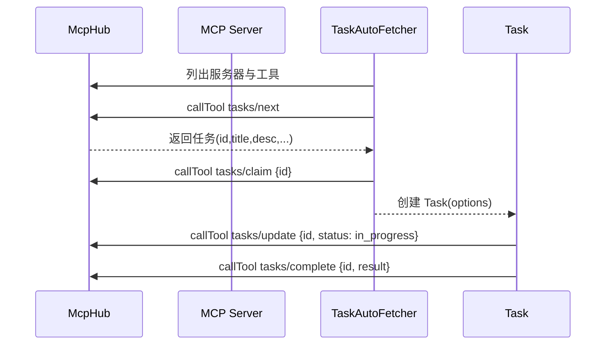
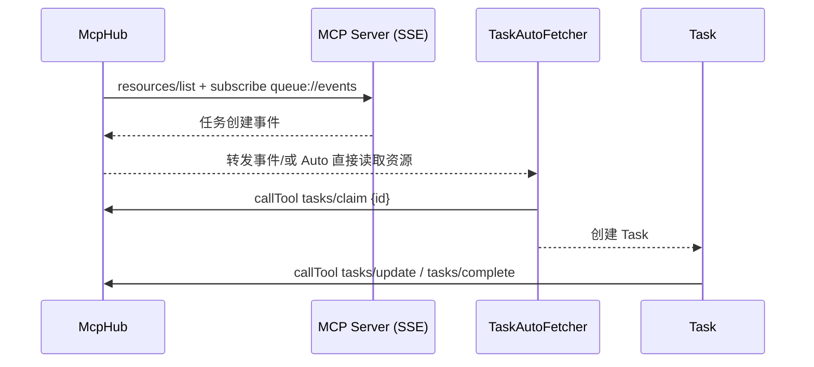

# 核心目标

- 让 Kilocode 作为 MCP 客户端，连接一个外挂 MCP 服务，自动获取/认领/更新/完成任务，并转化为 Kilocode 的 `Task` 实例驱动工作流。

- 保持用户主仓库与工作流安全：不污染主仓库；不自动切换 VSCode workspace；依赖当前 workspace 的检查点能力。

# 关键修订（针对先前文档的错误更正）

- 工作区一致性：Kilocode 不自动切换 workspace。当任务携带的 `workspacePath` 与 `getWorkspacePath()` 不一致时，提示用户选择/打开对应工作区后再创建 `Task`。检查点依赖当前 workspace 的 `core.worktree`。

- 客户端调用：自动任务获取应复用 `McpHub.callTool`/`readResource`，避免直接使用底层 `client.request`，以统一超时、禁用、错误处理与能力发现。

# 总体架构

- **Kilocode（客户端）**：

    - `McpHub`/`McpServerManager` 管理连接、能力发现（工具/资源/模板）、热更新与传输（stdio/sse/streamable-http）。

    - `TaskAutoFetcher`（新增）负责轮询或订阅事件，拉取任务、认领与回写状态；将任务映射为 `TaskOptions` 创建 `Task`。

    - 复用 `useMcpToolTool` 的审批/错误提示逻辑；自动模式通过配置白名单 `alwaysAllow` 绕过交互审批。

- **外挂 MCP 服务（服务端）**：

    - 工具契约 `tasks/*`（list/next/claim/update/complete/cancel/checkpoint）。

    - 资源契约 `task://{id}`（详情）与 `queue://events`（任务事件流）。

    - 支持 stdio/sse/streamable-http 传输与鉴权。

# MCP 服务端接口规范

- Tools（建议前缀 `tasks/*`）：

    - `tasks/list` → 请求：筛选/分页；响应：任务数组。

    - `tasks/next` → 请求：队列/标签/优先级；响应：下一个可认领任务（含幂等 key）。

    - `tasks/claim` → 请求：`{ id }`；响应：租约信息（失效时间）、幂等键。

    - `tasks/update` → 请求：`{ id, patch }`（状态/进度/owner/labels/notes）。

    - `tasks/complete` → 请求：`{ id, result }`（摘要、产出链接、日志）。

    - `tasks/cancel` → 请求：`{ id, reason }`。

    - `tasks/checkpoint`（可选）→ 请求：`{ id, commitHash, meta }`。

- Resources：

    - `task://{id}` → 返回完整任务详情（标题、描述、附件、工作区路径、约束）。

    - `queue://events`（SSE/streamable-http）→ 推送任务创建/更新/完成等事件。

- 错误码与幂等：所有 `tasks/*` 工具需返回结构化错误与幂等字段（如 `requestId`/`leaseId`）。

# Kilocode 客户端集成点

- 连接与发现：由 `McpHub.connectToServer` 完成，自动拉取 `tools/list`、`resources/list`、`resources/templates/list`。

- 自动获取任务：新增 `TaskAutoFetcher` 承担：

    - 事件订阅：通过 `resources/list` + 订阅 `queue://events`；或定时调用 `tasks/next` 轮询。

    - 认领任务：`McpHub.callTool('tasks/claim', { id })`；必要时 `McpHub.readResource('task://{id}')` 补全细节。

    - 创建 `Task`：将 MCP 任务映射到 `TaskOptions`（见数据映射）。若 `workspacePath` 不一致，走 UI 提示与用户确认打开对应工作区。

    - 生命周期钩子：在 `Task` 状态变化时回调 `tasks/update`；完成时调用 `tasks/complete`；可选择在检查点创建时调用 `tasks/checkpoint`。

- 审批与安全：自动模式下通过配置 `alwaysAllow` 白名单允许无交互调用；禁用工具通过 `disabledTools` 控制。

- UI 集成：通过 `ClineProvider.postMessageToWebview(...)` 通知“已自动创建任务/状态更新/错误”。

# 数据映射

- MCP `task` → Kilocode `TaskOptions`：

    - `id/title/description/labels/priority/assignee` → `task` 文本与 `metadata`。

    - `workspacePath/repo/path/hints` → `workspacePath`（若不同需提示切换）；可初始化 `todos`。

    - `attachments` → 以 `resource` 方式按需读取并注入上下文。

- 双向状态：`Task` 的 `in_progress/paused/completed`、`checkpoints` 事件写回 MCP 服务。

# 安全与可靠性

- 鉴权：

    - SSE/HTTP 使用 Header（`Authorization: Bearer ...`）；可选 mTLS。

    - stdio 使用 `env` 注入（`McpHub` 的 `injectVariables` 已支持）。

- 幂等与可见性超时：服务端须提供租约与可见性窗口；客户端本地去重（基于任务 `id`/`leaseId`）。

- 容错：SSE 使用 `ReconnectingEventSource` 自动重连；失败回退轮询；stdio 支持 `watchPaths` 自动重启。

- 隐私：最小化暴露任务元数据；附件/敏感信息通过资源按需读取。

# 流程图

## 轮询模式



## 事件推送模式



# 架构图

```mermaid
flowchart TD
    subgraph Kilocode
      Provider[ClineProvider] --> Hub[McpHub]
      Hub --> Manager[McpServerManager]
      Hub -->|callTool/readResource| Auto[TaskAutoFetcher]
      Auto --> Task[Task]
    end

    subgraph MCP Server
      API[tools: tasks/*]\nresources: task://{id}, queue://events
    end

    Hub == transport ==> Transport[stdio | sse | streamable-http]
    Transport == connects ==> API
```

# 配置示例（SSE）

```json
{
	"mcpServers": {
		"task-broker": {
			"type": "sse",
			"url": "https://mcp.example.com/sse",
			"headers": { "Authorization": "Bearer ${env:MCP_TOKEN}" },
			"timeout": 60,
			"alwaysAllow": ["tasks/next", "tasks/claim", "tasks/update", "tasks/complete"],
			"disabledTools": []
		}
	}
}
```

# 实施步骤

1. 定义服务端工具/资源契约与 JSON Schema（幂等/错误码/事件格式）。
2. 在 Kilocode 新增 `TaskAutoFetcher`：复用 `McpHub.callTool`/`readResource`，实现轮询与事件订阅两种模式。
3. 将任务自动创建与状态写回集成到 `Task` 生命周期，并通过 Webview 提示。
4. 增加全局/项目级配置与 UI 开关，支持 `alwaysAllow` 与 `disabledTools`。
5. 加入遥测与日志（吞吐/时延/错误），完善断线重连与回退策略测试。
6. 提供 `.kilocode/mcp.json` 模板与一个本地 `stdio` 样例服务脚手架。

# 验收标准

- 通过配置即可连接 MCP 服务，自动创建 `Task` 并驱动完整流程（保存/恢复/差异/状态写回），具备日志/遥测与断线重连；遇到工作区不一致时能正确提示用户并保持检查点的工作区一致性。
