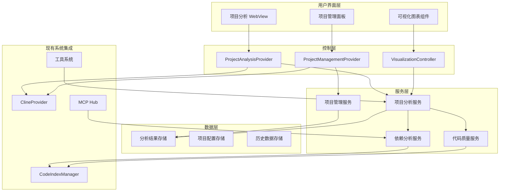
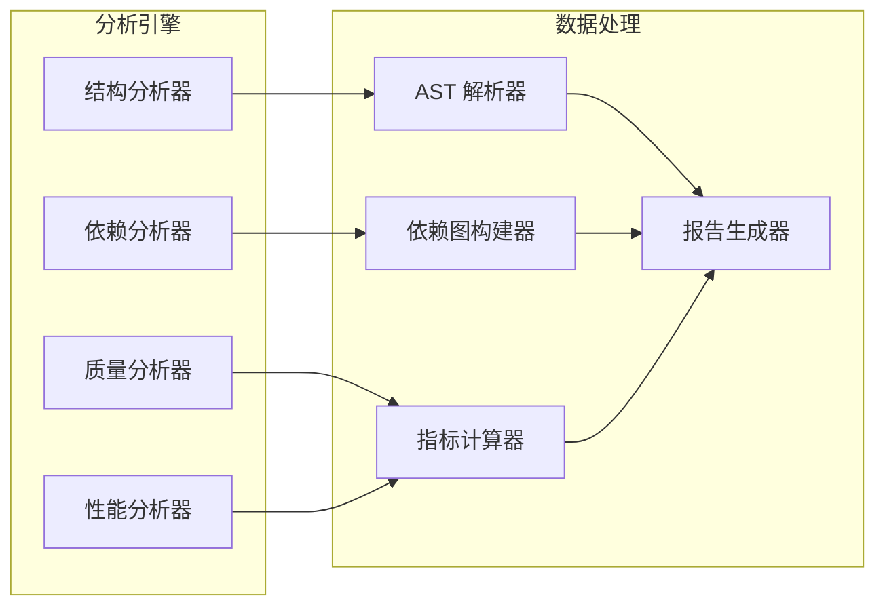
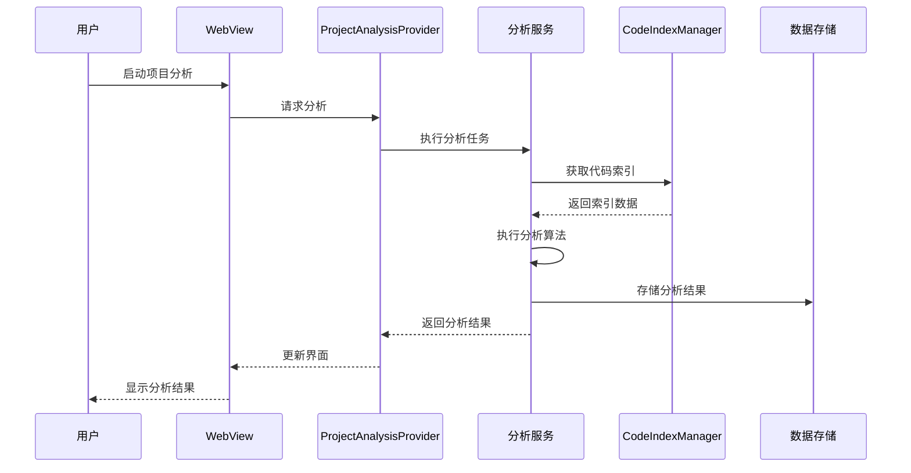

# Kilocode 逆向项目分析及项目管理功能设计方案

## 1. 功能需求分析

### 1.1 逆向项目分析功能需求

#### 1.1.1 项目结构分析

- **代码架构可视化**: 自动分析项目的模块结构、依赖关系，生成架构图
- **文件关系映射**: 分析文件间的引用关系，构建项目依赖图谱
- **API 接口分析**: 识别和分析项目中的 API 接口定义和调用关系
- **数据流分析**: 追踪数据在系统中的流转路径

#### 1.1.2 代码质量分析

- **复杂度分析**: 计算圈复杂度、认知复杂度等代码质量指标
- **重复代码检测**: 识别项目中的重复代码片段
- **技术债务评估**: 分析代码中的技术债务和潜在问题
- **性能热点识别**: 识别可能的性能瓶颈

#### 1.1.3 技术栈识别

- **框架和库识别**: 自动识别项目使用的技术栈
- **版本兼容性分析**: 检查依赖版本的兼容性问题
- **安全漏洞扫描**: 识别已知的安全漏洞

### 1.2 项目管理功能需求

#### 1.2.1 项目概览管理

- **项目仪表板**: 提供项目整体健康状况的可视化面板
- **进度跟踪**: 跟踪项目开发进度和里程碑
- **团队协作**: 支持多人协作的项目管理功能

#### 1.2.2 任务和工作流管理

- **任务分解**: 将大型功能分解为可管理的小任务
- **工作流自动化**: 基于项目分析结果自动生成优化建议
- **代码审查辅助**: 基于分析结果提供代码审查建议

### 1.3 与现有系统的集成点

- **ClineProvider 集成**: 扩展现有的 WebView 提供者，添加项目分析视图
- **工具系统集成**: 利用现有的工具架构，添加新的分析工具
- **代码索引集成**: 基于现有的 CodeIndexManager 进行深度分析
- **MCP 集成**: 通过 MCP 协议集成外部分析工具

## 2. 技术架构设计

### 2.1 整体架构



### 2.2 核心模块架构

#### 2.2.1 项目分析核心架构



### 2.3 数据流设计



## 3. 核心功能模块

### 3.1 项目结构分析模块

#### 3.1.1 文件结构

```
src/services/project-analysis/
├── structure-analyzer/
│   ├── index.ts
│   ├── ast-parser.ts
│   ├── dependency-mapper.ts
│   └── architecture-detector.ts
├── interfaces/
│   ├── analysis-result.ts
│   └── project-structure.ts
└── __tests__/
    └── structure-analyzer.spec.ts
```

#### 3.1.2 核心接口定义

```typescript
interface ProjectStructure {
	modules: ModuleInfo[]
	dependencies: DependencyGraph
	architecture: ArchitecturePattern
	entryPoints: string[]
	publicAPIs: APIDefinition[]
}

interface ModuleInfo {
	path: string
	type: "component" | "service" | "utility" | "config"
	exports: ExportInfo[]
	imports: ImportInfo[]
	complexity: ComplexityMetrics
}
```

### 3.2 依赖关系分析模块

#### 3.2.1 功能特性

- **静态依赖分析**: 分析 import/require 语句
- **动态依赖检测**: 检测运行时依赖关系
- **循环依赖检测**: 识别和报告循环依赖
- **依赖图可视化**: 生成交互式依赖关系图

#### 3.2.2 实现方案

```typescript
class DependencyAnalyzer {
	async analyzeDependencies(projectPath: string): Promise<DependencyGraph> {
		const staticDeps = await this.analyzeStaticDependencies(projectPath)
		const dynamicDeps = await this.analyzeDynamicDependencies(projectPath)
		const circularDeps = this.detectCircularDependencies(staticDeps)

		return {
			static: staticDeps,
			dynamic: dynamicDeps,
			circular: circularDeps,
			graph: this.buildDependencyGraph(staticDeps, dynamicDeps),
		}
	}
}
```

### 3.3 代码质量分析模块

#### 3.3.1 质量指标

- **复杂度指标**: 圈复杂度、认知复杂度、嵌套深度
- **可维护性指标**: 代码重复率、函数长度、类大小
- **可读性指标**: 命名规范、注释覆盖率
- **测试覆盖率**: 单元测试覆盖情况

#### 3.3.2 分析工具集成

```typescript
class CodeQualityAnalyzer {
	private analyzers = [
		new ComplexityAnalyzer(),
		new DuplicationAnalyzer(),
		new NamingAnalyzer(),
		new TestCoverageAnalyzer(),
	]

	async analyzeQuality(files: string[]): Promise<QualityReport> {
		const results = await Promise.all(this.analyzers.map((analyzer) => analyzer.analyze(files)))

		return this.aggregateResults(results)
	}
}
```

### 3.4 项目管理模块

#### 3.4.1 任务管理系统

```typescript
interface ProjectTask {
	id: string
	title: string
	description: string
	type: "refactor" | "feature" | "bugfix" | "optimization"
	priority: "low" | "medium" | "high" | "critical"
	estimatedEffort: number
	dependencies: string[]
	status: "pending" | "in-progress" | "completed"
	analysisContext?: AnalysisResult
}

class ProjectTaskManager {
	async generateTasksFromAnalysis(analysis: ProjectAnalysis): Promise<ProjectTask[]> {
		const tasks: ProjectTask[] = []

		// 基于分析结果生成重构任务
		if (analysis.codeQuality.duplications.length > 0) {
			tasks.push(...this.createDeduplicationTasks(analysis.codeQuality.duplications))
		}

		// 基于复杂度生成简化任务
		if (analysis.codeQuality.complexity.high.length > 0) {
			tasks.push(...this.createSimplificationTasks(analysis.codeQuality.complexity.high))
		}

		return tasks
	}
}
```

### 3.5 可视化展示模块

#### 3.5.1 图表组件

- **架构图**: 使用 D3.js 或 Cytoscape.js 绘制项目架构
- **依赖图**: 交互式依赖关系网络图
- **质量仪表板**: 实时质量指标展示
- **进度图表**: 项目进度和任务完成情况

#### 3.5.2 WebView 集成

```typescript
class ProjectVisualizationWebView {
	constructor(private context: vscode.ExtensionContext) {
		this.setupWebview()
	}

	private setupWebview() {
		// 扩展现有的 WebView 系统
		// 添加项目分析相关的视图和交互
	}

	async updateVisualization(data: VisualizationData) {
		await this.postMessage({
			type: "updateVisualization",
			data: data,
		})
	}
}
```

## 4. 实施计划

### 4.1 开发阶段划分

#### 阶段一：基础架构搭建（2-3周）

- [ ] 创建项目分析服务基础架构
- [ ] 集成现有的 CodeIndexManager
- [ ] 实现基础的 AST 解析功能
- [ ] 创建数据存储层

#### 阶段二：核心分析功能（4-5周）

- [ ] 实现项目结构分析器
- [ ] 开发依赖关系分析器
- [ ] 构建代码质量分析器
- [ ] 实现基础的可视化组件

#### 阶段三：项目管理功能（3-4周）

- [ ] 开发任务管理系统
- [ ] 实现基于分析的任务生成
- [ ] 创建项目仪表板
- [ ] 集成工作流自动化

#### 阶段四：界面集成和优化（2-3周）

- [ ] 扩展 WebView 界面
- [ ] 优化用户体验
- [ ] 性能优化和测试
- [ ] 文档编写

### 4.2 技术实现路径

#### 4.2.1 利用现有能力

1. **代码索引能力**: 基于现有的 `CodeIndexManager` 进行语义分析
2. **工具系统**: 扩展现有的工具架构，添加分析工具
3. **WebView 系统**: 在现有的 WebView 基础上添加新的视图
4. **任务系统**: 集成现有的任务管理能力

#### 4.2.2 新增技术栈

- **AST 解析**: 使用 TypeScript Compiler API 或 Babel
- **图形可视化**: D3.js、Cytoscape.js 或 vis.js
- **数据分析**: 自研算法结合开源工具
- **报告生成**: 支持多种格式的报告导出

### 4.3 文件和目录结构规划

```
src/
├── services/
│   ├── project-analysis/           # 项目分析服务
│   │   ├── analyzers/             # 各种分析器
│   │   │   ├── structure-analyzer.ts
│   │   │   ├── dependency-analyzer.ts
│   │   │   ├── quality-analyzer.ts
│   │   │   └── performance-analyzer.ts
│   │   ├── interfaces/            # 接口定义
│   │   ├── utils/                 # 工具函数
│   │   └── index.ts
│   ├── project-management/         # 项目管理服务
│   │   ├── task-manager.ts
│   │   ├── workflow-engine.ts
│   │   └── dashboard-service.ts
│   └── visualization/              # 可视化服务
│       ├── chart-generator.ts
│       ├── graph-builder.ts
│       └── report-generator.ts
├── core/
│   ├── tools/                     # 扩展工具
│   │   ├── projectAnalysisTool.ts
│   │   ├── dependencyAnalysisTool.ts
│   │   └── qualityAnalysisTool.ts
│   └── webview/                   # WebView 扩展
│       ├── ProjectAnalysisProvider.ts
│       └── ProjectManagementProvider.ts
└── webview-ui/
    └── src/
        ├── components/
        │   ├── project-analysis/   # 项目分析组件
        │   ├── project-management/ # 项目管理组件
        │   └── visualization/      # 可视化组件
        └── pages/
            ├── project-overview.tsx
            ├── dependency-graph.tsx
            └── quality-dashboard.tsx
```

## 5. 集成方案

### 5.1 与现有工具系统集成

#### 5.1.1 工具注册

```typescript
// 在 src/core/tools/index.ts 中注册新工具
export const PROJECT_ANALYSIS_TOOLS = [
	"project_analysis",
	"dependency_analysis",
	"quality_analysis",
	"generate_project_report",
] as const

// 在工具描述中添加新工具
export function getProjectAnalysisTools(): ToolDescription[] {
	return [
		{
			name: "project_analysis",
			description: "分析项目结构和架构模式",
			parameters: {
				type: "object",
				properties: {
					analysisType: {
						type: "string",
						enum: ["structure", "dependencies", "quality", "all"],
					},
					targetPath: {
						type: "string",
						description: "要分析的项目路径",
					},
				},
			},
		},
		// ... 其他工具定义
	]
}
```

#### 5.1.2 工具实现

```typescript
// src/core/tools/projectAnalysisTool.ts
export async function projectAnalysisTool(
	args: { analysisType: string; targetPath?: string },
	task: Task,
): Promise<ToolResult> {
	const analysisService = ProjectAnalysisService.getInstance()
	const projectPath = args.targetPath || task.cwd

	try {
		const result = await analysisService.analyzeProject(projectPath, args.analysisType)

		// 更新 WebView 显示结果
		await task.clineProvider.postMessageToWebview({
			type: "projectAnalysisResult",
			data: result,
		})

		return {
			type: "success",
			content: `项目分析完成。发现 ${result.modules.length} 个模块，${result.dependencies.length} 个依赖关系。`,
		}
	} catch (error) {
		return {
			type: "error",
			content: `项目分析失败: ${error.message}`,
		}
	}
}
```

### 5.2 WebView 界面扩展

#### 5.2.1 扩展 ClineProvider

```typescript
// 在 ClineProvider.ts 中添加项目分析相关方法
export class ClineProvider extends EventEmitter implements vscode.WebviewViewProvider {
	private projectAnalysisService?: ProjectAnalysisService

	constructor(context: vscode.ExtensionContext) {
		super()
		// ... 现有初始化代码
		this.initializeProjectAnalysis()
	}

	private async initializeProjectAnalysis() {
		this.projectAnalysisService = new ProjectAnalysisService(this.codeIndexManager, this.context)
	}

	async handleProjectAnalysisMessage(message: any) {
		switch (message.type) {
			case "startProjectAnalysis":
				return await this.startProjectAnalysis(message.data)
			case "getAnalysisHistory":
				return await this.getAnalysisHistory()
			// ... 其他消息处理
		}
	}
}
```

#### 5.2.2 前端组件集成

```typescript
// webview-ui/src/components/project-analysis/ProjectAnalysisPanel.tsx
import React, { useState, useEffect } from 'react'
import { VSCodeAPI } from '../../utils/vscode'

export const ProjectAnalysisPanel: React.FC = () => {
  const [analysisResult, setAnalysisResult] = useState(null)
  const [isAnalyzing, setIsAnalyzing] = useState(false)

  const startAnalysis = async (analysisType: string) => {
    setIsAnalyzing(true)
    VSCodeAPI.postMessage({
      type: 'startProjectAnalysis',
      data: { analysisType }
    })
  }

  useEffect(() => {
    const handleMessage = (event: MessageEvent) => {
      const message = event.data
      if (message.type === 'projectAnalysisResult') {
        setAnalysisResult(message.data)
        setIsAnalyzing(false)
      }
    }

    window.addEventListener('message', handleMessage)
    return () => window.removeEventListener('message', handleMessage)
  }, [])

  return (
    <div className="project-analysis-panel">
      {/* 分析控制面板 */}
      {/* 结果展示区域 */}
      {/* 可视化图表 */}
    </div>
  )
}
```

### 5.3 利用现有代码索引能力

#### 5.3.1 扩展 CodeIndexManager

```typescript
// 扩展现有的代码索引功能
export class EnhancedCodeIndexManager extends CodeIndexManager {
	async getProjectStructure(): Promise<ProjectStructure> {
		const indexData = await this.getIndexData()
		return this.buildProjectStructure(indexData)
	}

	async findRelatedFiles(filePath: string): Promise<RelatedFile[]> {
		// 利用语义搜索找到相关文件
		const searchResults = await this.searchIndex(`related to ${filePath}`)
		return this.processRelatedFiles(searchResults)
	}

	async analyzeDependencyPatterns(): Promise<DependencyPattern[]> {
		// 分析依赖模式
		const allFiles = await this.getAllIndexedFiles()
		return this.extractDependencyPatterns(allFiles)
	}
}
```

## 6. 预期效果和价值

### 6.1 用户价值

- **提高开发效率**: 快速理解复杂项目结构
- **降低维护成本**: 识别技术债务和优化机会
- **提升代码质量**: 基于数据的代码改进建议
- **增强团队协作**: 可视化的项目状态和进度跟踪

### 6.2 技术价值

- **智能化分析**: 结合 AI 能力进行深度项目分析
- **自动化管理**: 基于分析结果的自动化项目管理
- **可扩展架构**: 支持插件化的分析器扩展
- **数据驱动**: 基于量化指标的决策支持

### 6.3 生态价值

- **工具集成**: 与现有开发工具链无缝集成
- **标准化**: 建立项目分析和管理的标准化流程
- **知识沉淀**: 积累项目分析的最佳实践
- **社区贡献**: 为开源社区提供强大的项目分析工具

## 7. 风险评估和应对策略

### 7.1 技术风险

- **性能风险**: 大型项目分析可能耗时较长
    - 应对策略: 实现增量分析和后台处理
- **准确性风险**: 静态分析可能存在误判
    - 应对策略: 结合多种分析方法，提供置信度评分

### 7.2 集成风险

- **兼容性风险**: 与现有系统集成可能存在冲突
    - 应对策略: 充分的测试和渐进式集成
- **维护风险**: 新功能可能增加系统复杂度
    - 应对策略: 模块化设计，清晰的接口定义

### 7.3 用户接受度风险

- **学习成本**: 新功能可能增加用户学习负担
    - 应对策略: 提供详细文档和交互式教程
- **性能影响**: 新功能可能影响现有功能性能
    - 应对策略: 可选启用，性能监控和优化

## 8. 总结

这个逆向项目分析及项目管理功能的设计方案充分利用了 Kilocode 现有的技术架构和能力，通过模块化的设计实现了功能的无缝集成。该方案不仅能够提供强大的项目分析能力，还能基于分析结果提供智能化的项目管理建议，为开发者提供全方位的项目洞察和管理支持。

通过分阶段的实施计划，可以确保功能的稳定交付，同时通过充分的风险评估和应对策略，保证了项目的成功实施。这个功能的加入将显著提升 Kilocode 的竞争力和用户价值。
