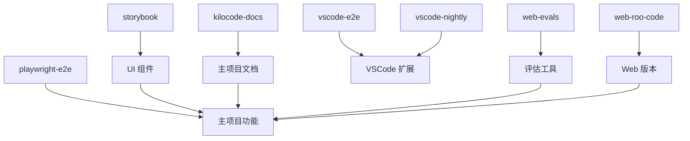

# Kilocode Apps 目录技术文档

## 概述

`apps/` 目录包含了 Kilocode 项目的各种应用程序和工具，涵盖了文档网站、测试框架、UI 组件库、Web 应用等多个方面。这些应用共同构成了 Kilocode 的完整生态系统。

## 目录结构

```
apps/
├── kilocode-docs/          # 基于 Docusaurus 的官方文档网站
├── playwright-e2e/         # Playwright 端到端测试框架
├── storybook/              # UI 组件开发和测试环境
├── vscode-e2e/             # VSCode 扩展端到端测试
├── vscode-nightly/         # VSCode 扩展夜间构建版本
├── web-evals/              # Web 评估和测试平台
└── web-roo-code/           # Roo Code Web 版本
```

## 应用分类

### 📚 文档和展示

- **kilocode-docs**: 官方文档网站，提供用户指南、API 参考和教程
- **storybook**: UI 组件库文档和演示环境

### 🧪 测试和质量保证

- **playwright-e2e**: 端到端自动化测试框架
- **vscode-e2e**: VSCode 扩展专用测试套件
- **web-evals**: Web 应用评估和测试平台

### 🚀 产品和发布

- **vscode-nightly**: VSCode 扩展的实验性夜间构建
- **web-roo-code**: Roo Code 的完整 Web 版本

## 技术栈概览

| 应用           | 主要技术栈                     | 用途     |
| -------------- | ------------------------------ | -------- |
| kilocode-docs  | Docusaurus, React, TypeScript  | 文档网站 |
| playwright-e2e | Playwright, TypeScript, Docker | E2E 测试 |
| storybook      | Storybook, React, TypeScript   | 组件开发 |
| vscode-e2e     | VSCode Test Runner, TypeScript | 扩展测试 |
| vscode-nightly | VSCode Extension API           | 夜间构建 |
| web-evals      | Next.js, React, TypeScript     | 评估平台 |
| web-roo-code   | Next.js, React, TypeScript     | Web 应用 |

## 开发工作流

### 本地开发

1. 安装依赖：`pnpm install`
2. 选择要开发的应用进入对应目录
3. 运行开发服务器（具体命令见各应用文档）

### 测试流程

1. **单元测试**: 在各应用目录运行 `pnpm test`
2. **E2E 测试**: 使用 `playwright-e2e` 和 `vscode-e2e`
3. **组件测试**: 使用 `storybook` 进行 UI 组件测试

### 部署流程

1. **文档部署**: `kilocode-docs` 自动部署到文档站点
2. **扩展发布**: `vscode-nightly` 用于测试，主版本通过 CI/CD 发布
3. **Web 应用**: `web-roo-code` 和 `web-evals` 部署到相应平台

## 依赖关系



## 配置和环境

### 通用要求

- Node.js 18+
- pnpm 包管理器
- TypeScript 支持

### 特殊要求

- **playwright-e2e**: Docker（可选）
- **web-evals**: 数据库连接配置
- **web-roo-code**: 外部 API 配置

## 维护指南

### 添加新应用

1. 在 `apps/` 目录创建新的子目录
2. 配置 `package.json` 和构建脚本
3. 更新根目录的 `turbo.json` 配置
4. 添加相应的文档

### 更新现有应用

1. 遵循各应用的版本控制策略
2. 更新相关测试用例
3. 同步更新文档

### 监控和日志

- 使用统一的日志格式
- 配置错误监控和报警
- 定期检查性能指标

## 相关链接

- [主项目文档](../README.md)
- [核心模块文档](../modules/core/README.md)
- [共享工具文档](../shared/README.md)
- [开发指南](../../DEVELOPMENT.md)

## 贡献指南

1. 遵循项目的代码规范和提交规范
2. 为新功能添加相应的测试
3. 更新相关文档
4. 通过 PR 流程进行代码审查

---

_最后更新: 2024年12月_
