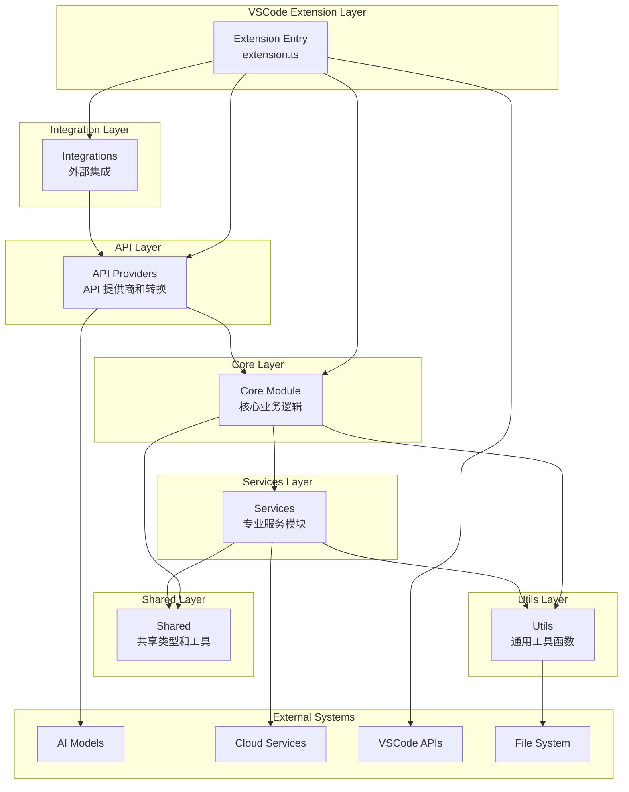
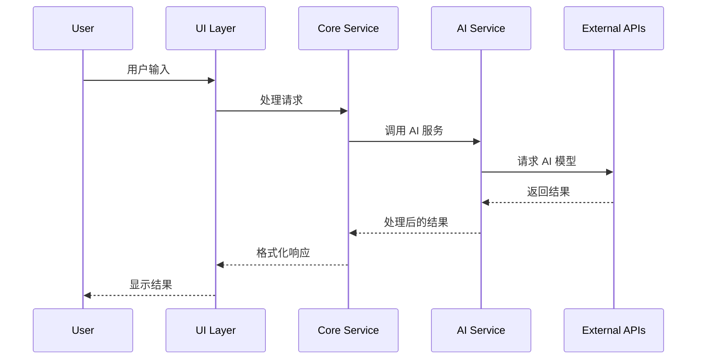
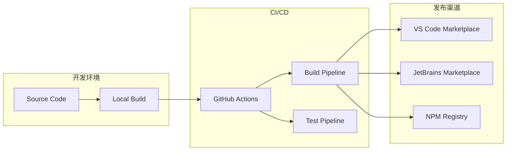

# Kilocode 项目总体架构

## 1. 项目概述

Kilocode 是一个基于 VSCode 的智能 AI 代码助手扩展，提供代码生成、任务自动化、智能重构等功能。项目采用分层模块化架构设计，支持多种 AI 模型和工具集成。

### 核心价值

- **智能代码生成**：基于 AI 模型的代码自动生成和补全
- **任务自动化**：自动化执行复杂的开发任务
- **多模型支持**：支持多种 AI 模型和 API 提供商
- **扩展性强**：分层模块化设计，易于扩展和维护

## 2. 架构设计

### 2.1 整体架构层次

### 2.2 详细架构组件

```mermaid
graph TB
    subgraph "Extension Layer"
        EXT[extension.ts<br/>扩展入口点]
    end

    subgraph "Core Layer"
        TASK[Task Management<br/>任务管理]
        TOOLS[Tool System<br/>工具系统]
        PROMPT[Prompt System<br/>提示系统]
        CONTEXT[Context Tracking<br/>上下文跟踪]
        DIFF[Diff Engine<br/>差异引擎]
        PROTECT[Protection<br/>保护机制]
    end

    subgraph "Services Layer"
        BROWSER[Browser Service<br/>浏览器服务]
        CHECKPOINT[Checkpoint Service<br/>检查点服务]
        CODEINDEX[Code Index Service<br/>代码索引服务]
        COMMAND[Command Service<br/>命令服务]
        COMMIT[Commit Message Service<br/>提交消息服务]
        GHOST[Ghost Completion<br/>代码补全服务]
        GLOB[File Search Service<br/>文件搜索服务]
        MARKET[Marketplace Service<br/>市场服务]
        MCP[MCP Protocol Service<br/>MCP 协议服务]
        MDM[MDM Service<br/>MDM 服务]
        MOCK[Mocking Service<br/>模拟服务]
        RIPGREP[Ripgrep Search<br/>搜索服务]
        ROOCONFIG[Roo Config Service<br/>配置服务]
        SEARCH[Search Service<br/>搜索服务]
        TERMINAL[Terminal Welcome<br/>终端欢迎服务]
        TREESITTER[Tree-sitter Parser<br/>语法解析服务]
    end

    subgraph "Utils Layer"
        CONFIG[Configuration<br/>配置管理]
        FS[File System<br/>文件系统操作]
        GIT[Git Operations<br/>Git 操作]
        PATH[Path Handling<br/>路径处理]
        LOGGING[Logging System<br/>日志系统]
        STORAGE[Storage Management<br/>存储管理]
        ERRORS[Error Handling<br/>错误处理]
        SHELL[Shell Operations<br/>Shell 操作]
        XML[XML Processing<br/>XML 处理]
    end

    subgraph "Shared Layer"
        TYPES[Shared Types<br/>共享类型]
        CONSTANTS[Constants<br/>常量定义]
        VALIDATORS[Validators<br/>验证器]
        MESSAGES[Message Types<br/>消息类型]
    end

    EXT --> TASK
    TASK --> TOOLS
    TASK --> PROMPT
    TASK --> CONTEXT
    TOOLS --> DIFF
    TOOLS --> PROTECT

    CORE --> BROWSER
    CORE --> CHECKPOINT
    CORE --> CODEINDEX
    CORE --> COMMAND
    CORE --> COMMIT
    CORE --> GHOST
    CORE --> GLOB
    CORE --> MARKET
    CORE --> MCP
    CORE --> MDM
    CORE --> MOCK
    CORE --> RIPGREP
    CORE --> ROOCONFIG
    CORE --> SEARCH
    CORE --> TERMINAL
    CORE --> TREESITTER

    CORE --> CONFIG
    CORE --> FS
    CORE --> GIT
    CORE --> PATH
    CORE --> LOGGING
    CORE --> STORAGE
    CORE --> ERRORS
    CORE --> SHELL
    CORE --> XML

    CORE --> TYPES
    CORE --> CONSTANTS
    CORE --> VALIDATORS
    CORE --> MESSAGES
```

## 3. 架构层次详解

### 3.1 Extension Layer (扩展层)

**位置**: `src/extension.ts`
**职责**: VSCode 扩展的入口点，负责扩展的激活、注册命令和初始化核心模块。

### 3.2 Core Layer (核心层)

**位置**: `src/core/`
**职责**: 包含项目的核心业务逻辑和主要功能模块。

#### 核心组件:

- **Task Management (任务管理)**: 处理 AI 任务的创建、执行和管理
- **Tool System (工具系统)**: 管理各种开发工具的集成和执行
- **Prompt System (提示系统)**: 处理 AI 提示的生成和管理
- **Context Tracking (上下文跟踪)**: 跟踪代码上下文和会话状态
- **Diff Engine (差异引擎)**: 处理代码差异比较和合并
- **Protection (保护机制)**: 提供安全保护和权限控制

### 3.3 Services Layer (服务层)

**位置**: `src/services/`
**职责**: 提供各种专业化的服务模块，支持核心功能的实现。

#### 主要服务:

- **Browser Service**: 浏览器集成和网页操作
- **Checkpoint Service**: 代码检查点和版本管理
- **Code Index Service**: 代码索引和搜索功能
- **Command Service**: 命令处理和执行
- **Commit Message Service**: Git 提交消息生成
- **Ghost Completion**: 智能代码补全服务
- **File Search Service**: 文件搜索和过滤
- **Marketplace Service**: 扩展市场集成
- **MCP Protocol Service**: MCP 协议支持
- **MDM Service**: 移动设备管理
- **Mocking Service**: 测试模拟服务
- **Ripgrep Search**: 高性能文本搜索
- **Roo Config Service**: 配置管理服务
- **Search Service**: 通用搜索功能
- **Terminal Welcome**: 终端欢迎界面
- **Tree-sitter Parser**: 语法解析服务

### 3.4 Utils Layer (工具层)

**位置**: `src/utils/`
**职责**: 提供通用的工具函数和实用程序，被其他层广泛使用。

#### 主要工具:

- **Configuration**: 配置文件读取和管理
- **File System**: 文件系统操作封装
- **Git Operations**: Git 命令和操作
- **Path Handling**: 路径处理和解析
- **Logging System**: 日志记录和管理
- **Storage Management**: 数据存储管理
- **Error Handling**: 错误处理和异常管理
- **Shell Operations**: Shell 命令执行
- **XML Processing**: XML 文件处理

### 3.5 Shared Layer (共享层)

**位置**: `src/shared/`
**职责**: 提供跨模块共享的类型定义、常量和通用工具。

#### 共享组件:

- **Shared Types**: 通用类型定义
- **Constants**: 系统常量和配置
- **Validators**: 数据验证器
- **Message Types**: 消息和通信类型

### 3.6 API Layer (API 层)

**位置**: `src/api/`
**职责**: 处理与外部 API 的集成和数据转换。

### 3.7 Integration Layer (集成层)

**位置**: `src/integrations/`
**职责**: 管理与外部系统和服务的集成。

## 4. 模块架构

### 3.1 主要模块

| 模块            | 路径          | 描述               | 技术栈                    |
| --------------- | ------------- | ------------------ | ------------------------- |
| VSCode 扩展核心 | `src/`        | 主要扩展功能实现   | TypeScript, VSCode API    |
| CLI 工具        | `cli/`        | 命令行接口         | Node.js, TypeScript       |
| Web UI          | `webview-ui/` | 前端用户界面       | React, TypeScript, Vite   |
| JetBrains 插件  | `jetbrains/`  | JetBrains IDE 支持 | Kotlin, IntelliJ Platform |
| 应用集合        | `apps/`       | 各种应用组件       | 多种技术栈                |
| 共享包          | `packages/`   | 公共库和工具       | TypeScript                |

### 3.2 核心服务

#### 3.2.1 AI 服务 (AI Service)

- **位置**: `src/core/kilocode/`
- **功能**: 处理 AI 模型调用和响应
- **特性**: 支持多种 AI 模型，智能上下文管理

#### 3.2.2 代码索引 (Code Index)

- **位置**: `src/services/code-index/`
- **功能**: 代码库索引和搜索
- **特性**: 实时索引，语义搜索

#### 3.2.3 终端服务 (Terminal Service)

- **位置**: `src/integrations/terminal/`
- **功能**: 终端命令执行和管理
- **特性**: 安全执行，结果捕获

#### 3.2.4 MCP 管理器 (MCP Manager)

- **位置**: `src/services/mcp/`
- **功能**: Model Context Protocol 服务器管理
- **特性**: 动态加载，扩展功能

## 4. 数据流架构

## 5. 技术架构

### 5.1 前端架构

- **框架**: React 18 + TypeScript
- **构建工具**: Vite
- **样式**: Tailwind CSS
- **状态管理**: Context API + Hooks

### 5.2 后端架构

- **运行时**: Node.js 20+
- **语言**: TypeScript
- **包管理**: pnpm
- **构建工具**: esbuild, Turbo

### 5.3 IDE 集成

- **VSCode**: Extension API
- **JetBrains**: IntelliJ Platform SDK
- **通信**: IPC, RPC Protocol

## 6. 部署架构

## 7. 安全架构

### 7.1 数据安全

- **本地存储**: 敏感数据加密存储
- **网络传输**: HTTPS/TLS 加密
- **API 密钥**: 安全管理和轮换

### 7.2 代码执行安全

- **沙箱执行**: 隔离环境执行代码
- **权限控制**: 最小权限原则
- **审计日志**: 完整的操作记录

## 8. 扩展性设计

### 8.1 插件系统

- **MCP 协议**: 标准化扩展接口
- **动态加载**: 运行时加载扩展
- **版本管理**: 兼容性检查

### 8.2 多语言支持

- **国际化**: i18n 框架
- **本地化**: 多语言资源文件
- **动态切换**: 运行时语言切换

## 9. 性能优化

### 9.1 前端优化

- **代码分割**: 按需加载
- **缓存策略**: 智能缓存
- **虚拟化**: 大列表优化

### 9.2 后端优化

- **异步处理**: 非阻塞操作
- **连接池**: 资源复用
- **缓存层**: 多级缓存

## 10. 监控和运维

### 10.1 遥测数据

- **使用统计**: PostHog 集成
- **错误追踪**: 异常监控
- **性能指标**: 关键指标监控

### 10.2 日志系统

- **结构化日志**: JSON 格式
- **日志级别**: 分级管理
- **日志轮转**: 自动清理

---

_本文档描述了 Kilocode 项目的总体架构设计，为开发者提供了系统性的架构理解。_
