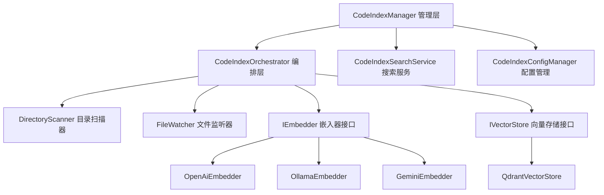

# Code-Index 开发者技术文档

## 1. 开发者概述

### 1.1 技术架构

Code-Index 是 Kilocode 项目中的智能代码索引和语义搜索模块，采用分层架构设计：



### 1.2 核心组件

- **CodeIndexManager**: 单例管理器，负责整个系统的生命周期管理
- **CodeIndexOrchestrator**: 编排器，协调索引流程和文件监听
- **CodeIndexSearchService**: 搜索服务，提供语义搜索功能
- **CodeIndexConfigManager**: 配置管理器，处理各种配置和验证
- **CodeIndexServiceFactory**: 服务工厂，创建和配置各种服务实例

### 1.3 开发环境要求

```typescript
// 依赖版本要求
"vscode": "^1.74.0"
"node": ">=18.0.0"
"typescript": "^5.0.0"

// 主要依赖包
"openai": "^4.0.0"
"@qdrant/js-client-rest": "^1.8.0"
"ignore": "^5.2.4"
```

## 2. API 接口文档

### 2.1 CodeIndexManager 单例模式使用

```typescript
import { CodeIndexManager } from "./services/code-index/manager"
import * as vscode from "vscode"

// 获取管理器实例
const manager = CodeIndexManager.getInstance(context, workspacePath)

// 检查功能状态
if (manager?.isFeatureEnabled && manager.isFeatureConfigured) {
	// 初始化管理器
	const { requiresRestart } = await manager.initialize(contextProxy)

	if (requiresRestart) {
		console.log("配置已更改，需要重启服务")
	}
}
```

### 2.2 初始化和配置管理

```typescript
// 配置管理器使用示例
import { CodeIndexConfigManager } from "./services/code-index/config-manager"

const configManager = new CodeIndexConfigManager(contextProxy)

// 加载配置
const { requiresRestart } = await configManager.loadConfiguration()

// 获取当前配置
const config = configManager.getConfig()
console.log("嵌入器提供商:", config.embedderProvider)
console.log("模型ID:", config.modelId)
console.log("Qdrant URL:", config.qdrantUrl)

// 检查功能状态
if (configManager.isFeatureEnabled && configManager.isFeatureConfigured) {
	console.log("Code-Index 功能已启用并配置完成")
}
```

### 2.3 搜索服务 API

```typescript
// 搜索服务使用示例
import { CodeIndexSearchService } from "./services/code-index/search-service"

// 创建搜索服务实例
const searchService = new CodeIndexSearchService(configManager, stateManager, embedder, vectorStore)

// 执行搜索
try {
	const results = await searchService.searchIndex(
		"如何实现用户认证", // 搜索查询
		"src/auth", // 可选：目录前缀过滤
	)

	results.forEach((result) => {
		console.log(`文件: ${result.payload.file_path}`)
		console.log(`相似度: ${result.score}`)
		console.log(`内容: ${result.payload.content}`)
	})
} catch (error) {
	console.error("搜索失败:", error.message)
}
```

### 2.4 状态管理和事件监听

```typescript
// 监听索引进度更新
manager.onProgressUpdate((update) => {
	console.log("系统状态:", update.systemStatus)
	console.log("消息:", update.message)
	console.log("已处理块数:", update.processedBlockCount)

	// 处理不同状态
	switch (update.systemStatus) {
		case "Indexing":
			console.log("正在索引...")
			break
		case "Indexed":
			console.log("索引完成")
			break
		case "Error":
			console.error("索引出错:", update.message)
			break
	}
})

// 获取当前状态
const status = manager.getCurrentStatus()
console.log("当前状态:", status)
```

## 3. 核心组件详解

### 3.1 CodeIndexConfigManager 配置管理

```typescript
export interface CodeIndexConfig {
	isConfigured: boolean
	embedderProvider: EmbedderProvider
	modelId?: string
	modelDimension?: number
	openAiOptions?: ApiHandlerOptions
	ollamaOptions?: ApiHandlerOptions
	openAiCompatibleOptions?: { baseUrl: string; apiKey: string }
	geminiOptions?: { apiKey: string }
	mistralOptions?: { apiKey: string }
	vercelAiGatewayOptions?: { apiKey: string }
	qdrantUrl?: string
	qdrantApiKey?: string
	searchMinScore?: number
	searchMaxResults?: number
}

// 配置验证示例
class CustomConfigManager extends CodeIndexConfigManager {
	public async validateCustomConfig(): Promise<boolean> {
		const config = this.getConfig()

		// 验证嵌入器配置
		if (config.embedderProvider === "openai" && !config.openAiOptions?.openAiNativeApiKey) {
			throw new Error("OpenAI API Key 未配置")
		}

		// 验证向量数据库配置
		if (!config.qdrantUrl) {
			throw new Error("Qdrant URL 未配置")
		}

		return true
	}
}
```

### 3.2 CodeIndexOrchestrator 编排器

```typescript
// 编排器核心方法
export class CodeIndexOrchestrator {
	// 开始索引流程
	public async startIndexing(): Promise<void> {
		try {
			// 1. 初始化向量存储
			await this.vectorStore.initialize()

			// 2. 执行初始扫描
			const summary = await this.directoryScanner.scanDirectory(this.workspacePath)

			// 3. 启动文件监听器
			this.fileWatcher.startWatching()

			this.stateManager.setSystemState("Indexed", "索引完成")
		} catch (error) {
			this.stateManager.setSystemState("Error", error.message)
			throw error
		}
	}

	// 停止文件监听
	public stopWatcher(): void {
		this.fileWatcher?.stopWatching()
	}

	// 取消索引操作
	public cancelIndexing(): void {
		this._cancelRequested = true
		this.directoryScanner?.cancel()
	}
}
```

### 3.3 嵌入器接口 (IEmbedder)

```typescript
export interface IEmbedder {
	createEmbeddings(texts: string[], model?: string): Promise<EmbeddingResponse>
	validateConfiguration(): Promise<{ valid: boolean; error?: string }>
	get embedderInfo(): EmbedderInfo
}

// 自定义嵌入器实现示例
export class CustomEmbedder implements IEmbedder {
	constructor(
		private apiKey: string,
		private modelId: string,
	) {}

	async createEmbeddings(texts: string[], model?: string): Promise<EmbeddingResponse> {
		const response = await fetch("https://api.custom-embedder.com/embeddings", {
			method: "POST",
			headers: {
				Authorization: `Bearer ${this.apiKey}`,
				"Content-Type": "application/json",
			},
			body: JSON.stringify({
				input: texts,
				model: model || this.modelId,
			}),
		})

		if (!response.ok) {
			throw new Error(`嵌入器请求失败: ${response.statusText}`)
		}

		const data = await response.json()
		return {
			embeddings: data.data.map((item: any) => item.embedding),
			usage: data.usage,
		}
	}

	async validateConfiguration(): Promise<{ valid: boolean; error?: string }> {
		try {
			// 测试连接和认证
			await this.createEmbeddings(["test"])
			return { valid: true }
		} catch (error) {
			return {
				valid: false,
				error: error instanceof Error ? error.message : "配置验证失败",
			}
		}
	}

	get embedderInfo(): EmbedderInfo {
		return {
			name: "custom-embedder",
			dimensions: 1536, // 根据实际模型维度设置
		}
	}
}
```

### 3.4 向量存储接口 (IVectorStore)

```typescript
export interface IVectorStore {
	initialize(expectedDimension?: number): Promise<boolean>
	upsertPoints(points: PointStruct[]): Promise<void>
	search(
		vector: number[],
		directoryPrefix?: string,
		minScore?: number,
		maxResults?: number,
	): Promise<VectorStoreSearchResult[]>
	deletePointsByFilePath(filePath: string): Promise<void>
	clearCollection(): Promise<void>
	collectionExists(): Promise<boolean>
}

// 自定义向量存储实现示例
export class CustomVectorStore implements IVectorStore {
	constructor(
		private workspacePath: string,
		private connectionUrl: string,
		private vectorSize: number,
	) {}

	async initialize(expectedDimension?: number): Promise<boolean> {
		// 初始化连接和集合
		const collectionName = this.getCollectionName()

		if (await this.collectionExists()) {
			// 检查维度是否匹配
			const existingDimension = await this.getCollectionDimension()
			if (expectedDimension && existingDimension !== expectedDimension) {
				// 维度不匹配，重新创建集合
				await this.deleteCollection()
				await this.createCollection(expectedDimension)
				return true // 表示创建了新集合
			}
			return false // 使用现有集合
		} else {
			await this.createCollection(expectedDimension || this.vectorSize)
			return true
		}
	}

	async upsertPoints(points: PointStruct[]): Promise<void> {
		// 批量插入或更新向量点
		const batchSize = 100
		for (let i = 0; i < points.length; i += batchSize) {
			const batch = points.slice(i, i + batchSize)
			await this.upsertBatch(batch)
		}
	}

	async search(
		vector: number[],
		directoryPrefix?: string,
		minScore?: number,
		maxResults?: number,
	): Promise<VectorStoreSearchResult[]> {
		const filter = directoryPrefix
			? {
					must: [
						{
							key: "file_path",
							match: { text: directoryPrefix },
						},
					],
				}
			: undefined

		const results = await this.performSearch(vector, filter, maxResults || 10)

		return results
			.filter((result) => !minScore || result.score >= minScore)
			.map((result) => ({
				id: result.id,
				score: result.score,
				payload: result.payload,
			}))
	}
}
```

## 4. 扩展开发指南

### 4.1 如何实现自定义嵌入器

```typescript
// 1. 实现 IEmbedder 接口
export class MyCustomEmbedder implements IEmbedder {
	constructor(private config: MyEmbedderConfig) {}

	async createEmbeddings(texts: string[], model?: string): Promise<EmbeddingResponse> {
		// 实现嵌入逻辑
	}

	async validateConfiguration(): Promise<{ valid: boolean; error?: string }> {
		// 实现配置验证
	}

	get embedderInfo(): EmbedderInfo {
		return { name: "my-custom", dimensions: 768 }
	}
}

// 2. 在 ServiceFactory 中注册
export class ExtendedServiceFactory extends CodeIndexServiceFactory {
	public createEmbedder(): IEmbedder {
		const config = this.configManager.getConfig()

		if (config.embedderProvider === "my-custom") {
			return new MyCustomEmbedder(config.myCustomOptions)
		}

		return super.createEmbedder()
	}
}

// 3. 更新配置接口
export interface ExtendedCodeIndexConfig extends CodeIndexConfig {
	myCustomOptions?: {
		apiKey: string
		endpoint: string
	}
}
```

### 4.2 如何扩展向量存储后端

```typescript
// 1. 实现 IVectorStore 接口
export class ElasticsearchVectorStore implements IVectorStore {
	constructor(
		private client: ElasticsearchClient,
		private indexName: string,
		private vectorSize: number,
	) {}

	async initialize(expectedDimension?: number): Promise<boolean> {
		// 创建或验证 Elasticsearch 索引
		const indexExists = await this.client.indices.exists({ index: this.indexName })

		if (!indexExists) {
			await this.client.indices.create({
				index: this.indexName,
				body: {
					mappings: {
						properties: {
							vector: {
								type: "dense_vector",
								dims: expectedDimension || this.vectorSize,
							},
							content: { type: "text" },
							file_path: { type: "keyword" },
						},
					},
				},
			})
			return true
		}
		return false
	}

	// 实现其他必需方法...
}

// 2. 在 ServiceFactory 中集成
export class ExtendedServiceFactory extends CodeIndexServiceFactory {
	public createVectorStore(): IVectorStore {
		const config = this.configManager.getConfig()

		if (config.vectorStoreProvider === "elasticsearch") {
			return new ElasticsearchVectorStore(
				this.createElasticsearchClient(config),
				this.getIndexName(),
				this.getVectorSize(),
			)
		}

		return super.createVectorStore()
	}
}
```

### 4.3 如何集成到 VSCode 扩展

```typescript
// 1. 在 extension.ts 中注册 Code-Index
export async function activate(context: vscode.ExtensionContext) {
	// 初始化 Code-Index 管理器
	const codeIndexManager = CodeIndexManager.getInstance(context)

	// 注册命令
	const commands = [
		vscode.commands.registerCommand("kilocode.codeIndex.start", async () => {
			await codeIndexManager?.startIndexing()
		}),

		vscode.commands.registerCommand("kilocode.codeIndex.search", async () => {
			const query = await vscode.window.showInputBox({
				prompt: "输入搜索查询",
			})

			if (query && codeIndexManager) {
				const results = await codeIndexManager.searchIndex(query)
				// 显示搜索结果
				showSearchResults(results)
			}
		}),

		vscode.commands.registerCommand("kilocode.codeIndex.clear", async () => {
			await codeIndexManager?.clearIndexData()
			vscode.window.showInformationMessage("索引数据已清除")
		}),
	]

	context.subscriptions.push(...commands)
}

// 2. 创建搜索结果面板
function showSearchResults(results: VectorStoreSearchResult[]) {
	const panel = vscode.window.createWebviewPanel("codeIndexResults", "Code-Index 搜索结果", vscode.ViewColumn.Two, {
		enableScripts: true,
	})

	panel.webview.html = generateResultsHtml(results)
}
```

### 4.4 命令注册和事件处理

```typescript
// 注册 Code-Index 相关命令
export function registerCodeIndexCommands(context: vscode.ExtensionContext) {
	const commands = {
		// 开始索引
		"kilocode.codeIndex.start": async () => {
			const manager = CodeIndexManager.getInstance(context)
			if (manager?.isFeatureEnabled) {
				await manager.startIndexing()
				vscode.window.showInformationMessage("代码索引已启动")
			} else {
				vscode.window.showWarningMessage("Code-Index 功能未启用")
			}
		},

		// 停止索引
		"kilocode.codeIndex.stop": () => {
			const manager = CodeIndexManager.getInstance(context)
			manager?.stopWatcher()
			vscode.window.showInformationMessage("代码索引已停止")
		},

		// 重建索引
		"kilocode.codeIndex.rebuild": async () => {
			const manager = CodeIndexManager.getInstance(context)
			if (manager) {
				await manager.clearIndexData()
				await manager.startIndexing()
				vscode.window.showInformationMessage("代码索引重建中...")
			}
		},

		// 搜索代码
		"kilocode.codeIndex.search": async () => {
			const manager = CodeIndexManager.getInstance(context)
			if (!manager?.isFeatureEnabled) {
				vscode.window.showWarningMessage("Code-Index 功能未启用")
				return
			}

			const query = await vscode.window.showInputBox({
				prompt: "输入搜索查询",
				placeHolder: "例如：用户认证逻辑",
			})

			if (query) {
				try {
					const results = await manager.searchIndex(query)
					if (results.length === 0) {
						vscode.window.showInformationMessage("未找到相关代码")
					} else {
						// 显示搜索结果
						await showSearchResultsQuickPick(results)
					}
				} catch (error) {
					vscode.window.showErrorMessage(`搜索失败: ${error.message}`)
				}
			}
		},
	}

	// 注册所有命令
	for (const [command, handler] of Object.entries(commands)) {
		context.subscriptions.push(vscode.commands.registerCommand(command, handler))
	}
}

// 显示搜索结果选择器
async function showSearchResultsQuickPick(results: VectorStoreSearchResult[]) {
	const items = results.map((result) => ({
		label: path.basename(result.payload.file_path),
		description: `相似度: ${(result.score * 100).toFixed(1)}%`,
		detail: result.payload.content.substring(0, 100) + "...",
		result: result,
	}))

	const selected = await vscode.window.showQuickPick(items, {
		placeHolder: "选择要打开的代码片段",
	})

	if (selected) {
		// 打开文件并跳转到相关位置
		const uri = vscode.Uri.file(selected.result.payload.file_path)
		const document = await vscode.workspace.openTextDocument(uri)
		const editor = await vscode.window.showTextDocument(document)

		// 如果有行号信息，跳转到对应位置
		if (selected.result.payload.start_line) {
			const position = new vscode.Position(selected.result.payload.start_line - 1, 0)
			editor.selection = new vscode.Selection(position, position)
			editor.revealRange(new vscode.Range(position, position))
		}
	}
}
```

## 5. 代码示例

### 5.1 基本使用示例

```typescript
import * as vscode from "vscode"
import { CodeIndexManager } from "./services/code-index/manager"
import { ContextProxy } from "./core/config/ContextProxy"

// 基本初始化和使用流程
export async function initializeCodeIndex(context: vscode.ExtensionContext) {
	try {
		// 1. 获取管理器实例
		const manager = CodeIndexManager.getInstance(context)
		if (!manager) {
			console.log("无法获取 CodeIndexManager 实例")
			return
		}

		// 2. 获取上下文代理
		const contextProxy = await ContextProxy.getInstance(context)

		// 3. 初始化管理器
		const { requiresRestart } = await manager.initialize(contextProxy)

		if (requiresRestart) {
			console.log("配置已更改，服务将重启")
		}

		// 4. 检查功能状态
		if (manager.isFeatureEnabled && manager.isFeatureConfigured) {
			console.log("Code-Index 功能已就绪")

			// 5. 监听进度更新
			manager.onProgressUpdate((update) => {
				console.log(`状态: ${update.systemStatus}, 消息: ${update.message}`)
			})

			// 6. 开始索引（异步执行）
			manager.startIndexing().catch((error) => {
				console.error("索引启动失败:", error)
			})
		} else {
			console.log("Code-Index 功能未启用或未配置")
		}
	} catch (error) {
		console.error("Code-Index 初始化失败:", error)
	}
}

// 搜索使用示例
export async function searchCode(query: string, directoryFilter?: string) {
	const manager = CodeIndexManager.getInstance(vscode.ExtensionContext)

	if (!manager?.isFeatureEnabled) {
		throw new Error("Code-Index 功能未启用")
	}

	try {
		const results = await manager.searchIndex(query, directoryFilter)

		console.log(`找到 ${results.length} 个相关结果:`)
		results.forEach((result, index) => {
			console.log(`${index + 1}. ${result.payload.file_path}`)
			console.log(`   相似度: ${(result.score * 100).toFixed(2)}%`)
			console.log(`   内容: ${result.payload.content.substring(0, 100)}...`)
		})

		return results
	} catch (error) {
		console.error("搜索失败:", error)
		throw error
	}
}
```

### 5.2 高级配置示例

```typescript
// 自定义配置管理
export class AdvancedCodeIndexSetup {
	private manager: CodeIndexManager
	private context: vscode.ExtensionContext

	constructor(context: vscode.ExtensionContext) {
		this.context = context
		this.manager = CodeIndexManager.getInstance(context)!
	}

	// 配置 OpenAI 嵌入器
	async setupOpenAIEmbedder(apiKey: string, model: string = "text-embedding-3-small") {
		const config = vscode.workspace.getConfiguration("kilocode")

		await config.update("codeIndex.enabled", true, vscode.ConfigurationTarget.Workspace)
		await config.update("codeIndex.embedderProvider", "openai", vscode.ConfigurationTarget.Workspace)
		await config.update("codeIndex.openAi.apiKey", apiKey, vscode.ConfigurationTarget.Workspace)
		await config.update("codeIndex.openAi.modelId", model, vscode.ConfigurationTarget.Workspace)

		console.log("OpenAI 嵌入器配置完成")
	}

	// 配置 Ollama 嵌入器
	async setupOllamaEmbedder(baseUrl: string = "http://localhost:11434", model: string = "nomic-embed-text") {
		const config = vscode.workspace.getConfiguration("kilocode")

		await config.update("codeIndex.enabled", true, vscode.ConfigurationTarget.Workspace)
		await config.update("codeIndex.embedderProvider", "ollama", vscode.ConfigurationTarget.Workspace)
		await config.update("codeIndex.ollama.baseUrl", baseUrl, vscode.ConfigurationTarget.Workspace)
		await config.update("codeIndex.ollama.modelId", model, vscode.ConfigurationTarget.Workspace)

		console.log("Ollama 嵌入器配置完成")
	}

	// 配置 Qdrant 向量数据库
	async setupQdrant(url: string = "http://localhost:6333", apiKey?: string) {
		const config = vscode.workspace.getConfiguration("kilocode")

		await config.update("codeIndex.qdrant.url", url, vscode.ConfigurationTarget.Workspace)
		if (apiKey) {
			await config.update("codeIndex.qdrant.apiKey", apiKey, vscode.ConfigurationTarget.Workspace)
		}

		console.log("Qdrant 配置完成")
	}

	// 配置搜索参数
	async setupSearchParameters(minScore: number = 0.7, maxResults: number = 20) {
		const config = vscode.workspace.getConfiguration("kilocode")

		await config.update("codeIndex.search.minScore", minScore, vscode.ConfigurationTarget.Workspace)
		await config.update("codeIndex.search.maxResults", maxResults, vscode.ConfigurationTarget.Workspace)

		console.log("搜索参数配置完成")
	}

	// 完整设置流程
	async setupComplete(options: {
		embedderProvider: "openai" | "ollama"
		apiKey?: string
		baseUrl?: string
		model?: string
		qdrantUrl?: string
		qdrantApiKey?: string
	}) {
		try {
			// 1. 配置嵌入器
			if (options.embedderProvider === "openai" && options.apiKey) {
				await this.setupOpenAIEmbedder(options.apiKey, options.model)
			} else if (options.embedderProvider === "ollama") {
				await this.setupOllamaEmbedder(options.baseUrl, options.model)
			}

			// 2. 配置 Qdrant
			await this.setupQdrant(options.qdrantUrl, options.qdrantApiKey)

			// 3. 配置搜索参数
			await this.setupSearchParameters()

			// 4. 初始化管理器
			const contextProxy = await ContextProxy.getInstance(this.context)
			await this.manager.initialize(contextProxy)

			// 5. 开始索引
			await this.manager.startIndexing()

			console.log("Code-Index 完整设置完成")
		} catch (error) {
			console.error("设置失败:", error)
			throw error
		}
	}
}

// 使用示例
const setup = new AdvancedCodeIndexSetup(context)
await setup.setupComplete({
	embedderProvider: "openai",
	apiKey: "your-openai-api-key",
	model: "text-embedding-3-small",
	qdrantUrl: "http://localhost:6333",
})
```

### 5.3 错误处理最佳实践

```typescript
// 错误处理和恢复机制
export class CodeIndexErrorHandler {
	private manager: CodeIndexManager
	private maxRetries: number = 3
	private retryDelay: number = 5000 // 5秒

	constructor(manager: CodeIndexManager) {
		this.manager = manager
		this.setupErrorHandling()
	}

	private setupErrorHandling() {
		// 监听状态变化
		this.manager.onProgressUpdate((update) => {
			if (update.systemStatus === "Error") {
				this.handleError(update.message || "未知错误")
			}
		})
	}

	private async handleError(errorMessage: string) {
		console.error("Code-Index 错误:", errorMessage)

		// 根据错误类型采取不同的恢复策略
		if (errorMessage.includes("network") || errorMessage.includes("connection")) {
			await this.handleNetworkError()
		} else if (errorMessage.includes("authentication") || errorMessage.includes("API key")) {
			await this.handleAuthError()
		} else if (errorMessage.includes("dimension") || errorMessage.includes("vector")) {
			await this.handleVectorError()
		} else {
			await this.handleGenericError()
		}
	}

	private async handleNetworkError() {
		console.log("检测到网络错误，尝试重连...")

		for (let i = 0; i < this.maxRetries; i++) {
			try {
				await new Promise((resolve) => setTimeout(resolve, this.retryDelay))

				// 尝试恢复
				await this.manager.recoverFromError()

				// 重新初始化
				const contextProxy = await ContextProxy.getInstance(vscode.ExtensionContext)
				await this.manager.initialize(contextProxy)

				console.log("网络错误恢复成功")
				return
			} catch (error) {
				console.log(`重试 ${i + 1}/${this.maxRetries} 失败:`, error.message)
			}
		}

		vscode.window.showErrorMessage("Code-Index 网络连接失败，请检查网络设置")
	}

	private async handleAuthError() {
		console.log("检测到认证错误")

		const action = await vscode.window.showErrorMessage(
			"Code-Index 认证失败，请检查 API 密钥配置",
			"打开设置",
			"重试",
		)

		if (action === "打开设置") {
			vscode.commands.executeCommand("workbench.action.openSettings", "kilocode.codeIndex")
		} else if (action === "重试") {
			await this.manager.recoverFromError()
		}
	}

	private async handleVectorError() {
		console.log("检测到向量维度错误，尝试重建索引...")

		try {
			// 清除现有索引数据
			await this.manager.clearIndexData()

			// 重新初始化
			const contextProxy = await ContextProxy.getInstance(vscode.ExtensionContext)
			await this.manager.initialize(contextProxy)

			console.log("向量错误恢复成功")
		} catch (error) {
			console.error("向量错误恢复失败:", error)
			vscode.window.showErrorMessage("Code-Index 向量配置错误，请检查模型设置")
		}
	}

	private async handleGenericError() {
		console.log("检测到通用错误，尝试重置服务...")

		try {
			await this.manager.recoverFromError()

			// 等待一段时间后重新初始化
			setTimeout(async () => {
				const contextProxy = await ContextProxy.getInstance(vscode.ExtensionContext)
				await this.manager.initialize(contextProxy)
			}, 3000)
		} catch (error) {
			console.error("通用错误恢复失败:", error)
			vscode.window.showErrorMessage("Code-Index 服务异常，请重启 VSCode")
		}
	}
}

// 使用错误处理器
const manager = CodeIndexManager.getInstance(context)
if (manager) {
	const errorHandler = new CodeIndexErrorHandler(manager)
}
```

### 5.4 性能优化技巧

```typescript
// 性能优化配置
export class CodeIndexPerformanceOptimizer {
	private manager: CodeIndexManager

	constructor(manager: CodeIndexManager) {
		this.manager = manager
	}

	// 优化批处理大小
	async optimizeBatchSize() {
		const config = vscode.workspace.getConfiguration("kilocode")

		// 根据系统资源调整批处理大小
		const totalMemory = process.memoryUsage().heapTotal
		const batchSize = totalMemory > 1024 * 1024 * 1024 ? 50 : 20 // 1GB 以上使用更大批次

		await config.update("codeIndex.embeddingBatchSize", batchSize, vscode.ConfigurationTarget.Workspace)
		console.log(`批处理大小优化为: ${batchSize}`)
	}

	// 优化搜索参数
	async optimizeSearchParameters() {
		const config = vscode.workspace.getConfiguration("kilocode")

		// 根据项目大小调整搜索参数
		const workspaceFolders = vscode.workspace.workspaceFolders
		if (workspaceFolders && workspaceFolders.length > 0) {
			const stats = await this.getWorkspaceStats(workspaceFolders[0].uri.fsPath)

			if (stats.fileCount > 10000) {
				// 大型项目：提高搜索阈值，减少结果数量
				await config.update("codeIndex.search.minScore", 0.8, vscode.ConfigurationTarget.Workspace)
				await config.update("codeIndex.search.maxResults", 15, vscode.ConfigurationTarget.Workspace)
			} else if (stats.fileCount < 1000) {
				// 小型项目：降低搜索阈值，增加结果数量
				await config.update("codeIndex.search.minScore", 0.6, vscode.ConfigurationTarget.Workspace)
				await config.update("codeIndex.search.maxResults", 30, vscode.ConfigurationTarget.Workspace)
			}
		}
	}

	// 内存使用监控
	startMemoryMonitoring() {
		setInterval(() => {
			const usage = process.memoryUsage()
			const heapUsedMB = Math.round(usage.heapUsed / 1024 / 1024)
			const heapTotalMB = Math.round(usage.heapTotal / 1024 / 1024)

			console.log(`Code-Index 内存使用: ${heapUsedMB}MB / ${heapTotalMB}MB`)

			// 内存使用过高时的处理
			if (heapUsedMB > 500) {
				console.warn("Code-Index 内存使用过高，建议重启服务")

				// 可以选择自动清理缓存或重启服务
				if (global.gc) {
					global.gc()
					console.log("执行垃圾回收")
				}
			}
		}, 30000) // 每30秒检查一次
	}

	// 获取工作区统计信息
	private async getWorkspaceStats(workspacePath: string): Promise<{ fileCount: number; totalSize: number }> {
		const fs = require("fs").promises
		const path = require("path")

		let fileCount = 0
		let totalSize = 0

		async function scanDirectory(dirPath: string) {
			try {
				const entries = await fs.readdir(dirPath, { withFileTypes: true })

				for (const entry of entries) {
					const fullPath = path.join(dirPath, entry.name)

					if (entry.isDirectory() && !entry.name.startsWith(".")) {
						await scanDirectory(fullPath)
					} else if (entry.isFile()) {
						const stats = await fs.stat(fullPath)
						fileCount++
						totalSize += stats.size
					}
				}
			} catch (error) {
				// 忽略无法访问的目录
			}
		}

		await scanDirectory(workspacePath)
		return { fileCount, totalSize }
	}
}

// 使用性能优化器
const optimizer = new CodeIndexPerformanceOptimizer(manager)
await optimizer.optimizeBatchSize()
await optimizer.optimizeSearchParameters()
optimizer.startMemoryMonitoring()
```

## 6. 调试和测试

### 6.1 日志记录和调试方法

```typescript
// 调试工具类
export class CodeIndexDebugger {
    private static instance: CodeIndexDebugger
    private debugMode: boolean = false
    private logLevel: 'debug' | 'info' | 'warn' | 'error' = 'info'

    static getInstance(): CodeIndexDebugger {
        if (!CodeIndexDebugger.instance) {
            CodeIndexDebugger.instance = new CodeIndexDebugger()
        }
        return CodeIndexDebugger.instance
    }

    enableDebugMode(level: 'debug' | 'info' | 'warn' | 'error' = 'debug') {
        this.debugMode = true
        this.logLevel = level
        console.log('Code-Index 调试模式已启用')
    }

    disableDebugMode() {
        this.debugMode = false
        console.log('Code-Index 调试模式已禁用')
    }

    log(level: 'debug' | 'info' | 'warn' | 'error', message: string, data?: any) {
        if (!this.debugMode) return

        const levels = { debug: 0, info: 1, warn: 2, error: 3 }
        if (levels[level] < levels[this.logLevel]) return

        const timestamp = new Date().toISOString()
        const prefix = `[${timestamp}] [Code-Index] [${level.toUpperCase()}]`

        if (data) {
            console.log(`${prefix} ${message}`, data)
        } else {
            console.log(`${prefix} ${message}`)
        }
    }

    // 调试管理器状态
    debugManagerState(manager: CodeIndexManager) {
        this.log('debug', '管理器状态检查', {
            isFeatureEnabled: manager.isFeatureEnabled,
            isFeatureConfigured: manager.isFeatureConfigured,
            isInitialized: manager.isInitialized,
            currentState: manager.state,
            status: manager.getCurrentStatus()
        })
    }

    // 调试配置信息
    debugConfiguration(configManager: CodeIndexConfigManager) {
        const config = configManager.getConfig()
        this.log('debug', '配置信息', {
            embedderProvider: config.embedderProvider,
            modelId: config.modelId,
            qdrantUrl: config.qdrantUrl,
            searchMinScore: config.searchMinScore,
            searchMaxResults: config.searchMaxResults,
            isConfigured: config.isConfigured
        })
    }

    // 调试搜索过程
    async debugSearch(manager: CodeIndexManager, query: string) {
        this.log('debug', `开始搜索: "${query}"`)

        const startTime = Date.now()
        try {
            const results = await manager.searchIndex(query)
            const endTime = Date.now()

            this.log('debug', '搜索完成', {
                query,
                resultCount: results.length,
                duration: `${endTime - startTime}ms`,
                results: results.map(r => ({
                    file: r.payload.file_path,
                    score: r.score,
                    contentPreview: r.payload.content.substring(0, 50) + '...'
                }))
            })

            return results
        } catch (error) {
            this.log('error', '搜索失败', { query, error: error.message })
            throw error
        }
    }

    // 调试索引过程
    debugIndexing(manager: CodeIndexManager) {
        manager.onProgressUpdate((update) => {
            this.log('debug', '索引进度更新', {
                systemStatus: update.systemStatus,
                message: update.message,
                processedBlockCount: update.processedBlockCount
            })
        })
    }
}

// 使用调试器
const debugger = CodeIndexDebugger.getInstance()
debugger.enableDebugMode('debug')

// 调试管理器
debugger.debugManagerState(manager)
debugger.debugIndexing(manager)

// 调试搜索
await debugger.debugSearch(manager, '用户认证')
```

### 6.2 单元测试编写指南

```typescript
// 测试工具和模拟对象
import { describe, it, expect, beforeEach, afterEach, vi } from "vitest"
import { CodeIndexManager } from "../manager"
import { CodeIndexConfigManager } from "../config-manager"
import { CodeIndexSearchService } from "../search-service"

// 模拟 VSCode API
vi.mock("vscode", () => ({
	workspace: {
		getConfiguration: vi.fn().mockReturnValue({
			get: vi.fn(),
			update: vi.fn(),
		}),
		workspaceFolders: [{ uri: { fsPath: "/test/workspace" } }],
	},
	window: {
		showErrorMessage: vi.fn(),
		showInformationMessage: vi.fn(),
	},
	ExtensionContext: vi.fn(),
}))

// 模拟遥测服务
vi.mock("@roo-code/telemetry", () => ({
	TelemetryService: {
		instance: {
			captureEvent: vi.fn(),
		},
	},
}))

describe("CodeIndexManager", () => {
	let manager: CodeIndexManager
	let mockContext: any
	let mockContextProxy: any

	beforeEach(() => {
		mockContext = {
			subscriptions: [],
			globalState: {
				get: vi.fn(),
				update: vi.fn(),
			},
		}

		mockContextProxy = {
			getGlobalState: vi.fn(),
			updateGlobalState: vi.fn(),
		}

		// 清除单例实例
		CodeIndexManager.disposeAll()
		manager = CodeIndexManager.getInstance(mockContext, "/test/workspace")!
	})

	afterEach(() => {
		CodeIndexManager.disposeAll()
	})

	describe("getInstance", () => {
		it("应该返回单例实例", () => {
			const instance1 = CodeIndexManager.getInstance(mockContext, "/test/workspace")
			const instance2 = CodeIndexManager.getInstance(mockContext, "/test/workspace")

			expect(instance1).toBe(instance2)
		})

		it("不同工作区应该返回不同实例", () => {
			const instance1 = CodeIndexManager.getInstance(mockContext, "/test/workspace1")
			const instance2 = CodeIndexManager.getInstance(mockContext, "/test/workspace2")

			expect(instance1).not.toBe(instance2)
		})
	})

	describe("initialize", () => {
		it("应该正确初始化管理器", async () => {
			const result = await manager.initialize(mockContextProxy)

			expect(result).toHaveProperty("requiresRestart")
			expect(typeof result.requiresRestart).toBe("boolean")
		})

		it("功能未启用时应该跳过初始化", async () => {
			// 模拟功能未启用
			vi.spyOn(manager, "isFeatureEnabled", "get").mockReturnValue(false)

			const result = await manager.initialize(mockContextProxy)

			expect(result.requiresRestart).toBe(false)
		})
	})

	describe("searchIndex", () => {
		it("功能未启用时应该返回空数组", async () => {
			vi.spyOn(manager, "isFeatureEnabled", "get").mockReturnValue(false)

			const results = await manager.searchIndex("test query")

			expect(results).toEqual([])
		})

		it("未初始化时应该抛出错误", async () => {
			vi.spyOn(manager, "isFeatureEnabled", "get").mockReturnValue(true)
			vi.spyOn(manager, "isInitialized", "get").mockReturnValue(false)

			await expect(manager.searchIndex("test query")).rejects.toThrow()
		})
	})
})

// 搜索服务测试
describe("CodeIndexSearchService", () => {
	let searchService: CodeIndexSearchService
	let mockConfigManager: any
	let mockStateManager: any
	let mockEmbedder: any
	let mockVectorStore: any

	beforeEach(() => {
		mockConfigManager = {
			isFeatureEnabled: true,
			isFeatureConfigured: true,
			currentSearchMinScore: 0.7,
			currentSearchMaxResults: 20,
		}

		mockStateManager = {
			getCurrentStatus: vi.fn().mockReturnValue({ systemStatus: "Indexed" }),
			setSystemState: vi.fn(),
		}

		mockEmbedder = {
			createEmbeddings: vi.fn().mockResolvedValue({
				embeddings: [[0.1, 0.2, 0.3]],
			}),
		}

		mockVectorStore = {
			search: vi.fn().mockResolvedValue([
				{
					id: "test-1",
					score: 0.8,
					payload: {
						file_path: "/test/file.ts",
						content: "test content",
					},
				},
			]),
		}

		searchService = new CodeIndexSearchService(mockConfigManager, mockStateManager, mockEmbedder, mockVectorStore)
	})

	describe("searchIndex", () => {
		it("应该正确执行搜索", async () => {
			const results = await searchService.searchIndex("test query")

			expect(mockEmbedder.createEmbeddings).toHaveBeenCalledWith(["test query"])
			expect(mockVectorStore.search).toHaveBeenCalled()
			expect(results).toHaveLength(1)
			expect(results[0].score).toBe(0.8)
		})

		it("功能未启用时应该抛出错误", async () => {
			mockConfigManager.isFeatureEnabled = false

			await expect(searchService.searchIndex("test query")).rejects.toThrow(
				"Code index feature is disabled or not configured.",
			)
		})

		it("系统未就绪时应该抛出错误", async () => {
			mockStateManager.getCurrentStatus.mockReturnValue({ systemStatus: "Error" })

			await expect(searchService.searchIndex("test query")).rejects.toThrow("Code index is not ready for search")
		})
	})
})

// 集成测试示例
describe("Code-Index Integration Tests", () => {
	let manager: CodeIndexManager
	let mockContext: any

	beforeEach(async () => {
		// 设置测试环境
		mockContext = {
			subscriptions: [],
			globalState: new Map(),
			workspaceState: new Map(),
		}

		manager = CodeIndexManager.getInstance(mockContext, "/test/workspace")!
	})

	it("完整的索引和搜索流程", async () => {
		// 1. 初始化
		const contextProxy = await createMockContextProxy()
		await manager.initialize(contextProxy)

		// 2. 启动索引
		await manager.startIndexing()

		// 3. 等待索引完成
		await waitForIndexingComplete(manager)

		// 4. 执行搜索
		const results = await manager.searchIndex("test function")

		// 5. 验证结果
		expect(results).toBeDefined()
		expect(Array.isArray(results)).toBe(true)
	})
})

// 测试辅助函数
async function createMockContextProxy() {
	return {
		getGlobalState: vi.fn(),
		updateGlobalState: vi.fn(),
	}
}

async function waitForIndexingComplete(manager: CodeIndexManager, timeout: number = 10000) {
	return new Promise((resolve, reject) => {
		const timer = setTimeout(() => {
			reject(new Error("索引超时"))
		}, timeout)

		const subscription = manager.onProgressUpdate((update) => {
			if (update.systemStatus === "Indexed") {
				clearTimeout(timer)
				subscription.dispose()
				resolve(undefined)
			} else if (update.systemStatus === "Error") {
				clearTimeout(timer)
				subscription.dispose()
				reject(new Error(`索引失败: ${update.message}`))
			}
		})
	})
}
```

### 6.3 集成测试策略

```typescript
// 集成测试配置
export class CodeIndexIntegrationTester {
	private testWorkspace: string
	private manager: CodeIndexManager
	private context: vscode.ExtensionContext

	constructor(testWorkspace: string) {
		this.testWorkspace = testWorkspace
		this.setupTestEnvironment()
	}

	private setupTestEnvironment() {
		// 创建测试上下文
		this.context = {
			subscriptions: [],
			globalState: {
				get: vi.fn(),
				update: vi.fn(),
			},
			workspaceState: {
				get: vi.fn(),
				update: vi.fn(),
			},
		} as any

		this.manager = CodeIndexManager.getInstance(this.context, this.testWorkspace)!
	}

	// 测试完整的索引流程
	async testFullIndexingFlow() {
		console.log("开始完整索引流程测试...")

		try {
			// 1. 配置测试环境
			await this.setupTestConfiguration()

			// 2. 初始化管理器
			const contextProxy = await this.createTestContextProxy()
			const { requiresRestart } = await this.manager.initialize(contextProxy)

			console.log("管理器初始化完成，需要重启:", requiresRestart)

			// 3. 验证初始状态
			expect(this.manager.isFeatureEnabled).toBe(true)
			expect(this.manager.isFeatureConfigured).toBe(true)
			expect(this.manager.isInitialized).toBe(true)

			// 4. 启动索引
			const indexingPromise = this.manager.startIndexing()

			// 5. 监听索引进度
			const progressUpdates: any[] = []
			const subscription = this.manager.onProgressUpdate((update) => {
				progressUpdates.push(update)
				console.log("索引进度:", update)
			})

			// 6. 等待索引完成
			await this.waitForIndexingComplete(30000) // 30秒超时

			subscription.dispose()

			// 7. 验证索引结果
			const finalStatus = this.manager.getCurrentStatus()
			expect(finalStatus.systemStatus).toBe("Indexed")

			console.log("索引流程测试完成")
			return { success: true, progressUpdates }
		} catch (error) {
			console.error("索引流程测试失败:", error)
			return { success: false, error: error.message }
		}
	}

	// 测试搜索功能
	async testSearchFunctionality() {
		console.log("开始搜索功能测试...")

		const testQueries = [
			"function definition",
			"class implementation",
			"error handling",
			"async await",
			"interface declaration",
		]

		const results = []

		for (const query of testQueries) {
			try {
				const startTime = Date.now()
				const searchResults = await this.manager.searchIndex(query)
				const endTime = Date.now()

				results.push({
					query,
					resultCount: searchResults.length,
					duration: endTime - startTime,
					topResult: searchResults[0]
						? {
								file: searchResults[0].payload.file_path,
								score: searchResults[0].score,
							}
						: null,
				})

				console.log(`查询 "${query}": ${searchResults.length} 个结果, ${endTime - startTime}ms`)
			} catch (error) {
				console.error(`查询 "${query}" 失败:`, error)
				results.push({
					query,
					error: error.message,
				})
			}
		}

		return results
	}

	// 测试错误恢复
	async testErrorRecovery() {
		console.log("开始错误恢复测试...")

		try {
			// 1. 模拟网络错误
			await this.simulateNetworkError()

			// 2. 验证错误状态
			const errorStatus = this.manager.getCurrentStatus()
			expect(errorStatus.systemStatus).toBe("Error")

			// 3. 执行错误恢复
			await this.manager.recoverFromError()

			// 4. 重新初始化
			const contextProxy = await this.createTestContextProxy()
			await this.manager.initialize(contextProxy)

			// 5. 验证恢复状态
			expect(this.manager.isInitialized).toBe(true)

			console.log("错误恢复测试完成")
			return { success: true }
		} catch (error) {
			console.error("错误恢复测试失败:", error)
			return { success: false, error: error.message }
		}
	}

	// 测试性能指标
	async testPerformanceMetrics() {
		console.log("开始性能测试...")

		const metrics = {
			indexingTime: 0,
			searchTimes: [],
			memoryUsage: [],
			fileCount: 0,
		}

		// 1. 测量索引时间
		const indexingStart = Date.now()
		await this.testFullIndexingFlow()
		metrics.indexingTime = Date.now() - indexingStart

		// 2. 测量搜索性能
		const searchQueries = Array.from({ length: 10 }, (_, i) => `test query ${i}`)

		for (const query of searchQueries) {
			const searchStart = Date.now()
			await this.manager.searchIndex(query)
			metrics.searchTimes.push(Date.now() - searchStart)
		}

		// 3. 监控内存使用
		const memoryInterval = setInterval(() => {
			const usage = process.memoryUsage()
			metrics.memoryUsage.push({
				timestamp: Date.now(),
				heapUsed: usage.heapUsed,
				heapTotal: usage.heapTotal,
			})
		}, 1000)

		// 运行5秒
		await new Promise((resolve) => setTimeout(resolve, 5000))
		clearInterval(memoryInterval)

		// 4. 计算统计信息
		const avgSearchTime = metrics.searchTimes.reduce((a, b) => a + b, 0) / metrics.searchTimes.length
		const maxMemory = Math.max(...metrics.memoryUsage.map((m) => m.heapUsed))

		console.log("性能测试结果:", {
			indexingTime: `${metrics.indexingTime}ms`,
			avgSearchTime: `${avgSearchTime.toFixed(2)}ms`,
			maxMemoryUsage: `${Math.round(maxMemory / 1024 / 1024)}MB`,
		})

		return metrics
	}

	// 辅助方法
	private async setupTestConfiguration() {
		// 设置测试配置
		const config = vscode.workspace.getConfiguration("kilocode")
		await config.update("codeIndex.enabled", true)
		await config.update("codeIndex.embedderProvider", "openai")
		await config.update("codeIndex.openAi.apiKey", "test-api-key")
		await config.update("codeIndex.qdrant.url", "http://localhost:6333")
	}

	private async createTestContextProxy() {
		return {
			getGlobalState: vi.fn(),
			updateGlobalState: vi.fn(),
		}
	}

	private async waitForIndexingComplete(timeout: number = 30000) {
		return new Promise((resolve, reject) => {
			const timer = setTimeout(() => {
				reject(new Error("索引超时"))
			}, timeout)

			const subscription = this.manager.onProgressUpdate((update) => {
				if (update.systemStatus === "Indexed") {
					clearTimeout(timer)
					subscription.dispose()
					resolve(undefined)
				} else if (update.systemStatus === "Error") {
					clearTimeout(timer)
					subscription.dispose()
					reject(new Error(`索引失败: ${update.message}`))
				}
			})
		})
	}

	private async simulateNetworkError() {
		// 模拟网络错误的实现
		// 这里可以通过修改配置或模拟网络请求失败来实现
	}
}

// 运行集成测试
export async function runIntegrationTests(testWorkspace: string) {
	const tester = new CodeIndexIntegrationTester(testWorkspace)

	console.log("开始 Code-Index 集成测试...")

	// 1. 测试完整索引流程
	const indexingResult = await tester.testFullIndexingFlow()
	console.log("索引流程测试结果:", indexingResult)

	// 2. 测试搜索功能
	const searchResult = await tester.testSearchFunctionality()
	console.log("搜索功能测试结果:", searchResult)

	// 3. 测试错误恢复
	const recoveryResult = await tester.testErrorRecovery()
	console.log("错误恢复测试结果:", recoveryResult)

	// 4. 测试性能指标
	const performanceResult = await tester.testPerformanceMetrics()
	console.log("性能测试结果:", performanceResult)

	console.log("Code-Index 集成测试完成")
}
```

## 7. 常见问题和解决方案

### 7.1 开发过程中的常见问题

#### 问题1：管理器初始化失败

**症状**：调用 `manager.initialize()` 时抛出异常或返回错误状态

**原因分析**：

- 配置文件缺失或格式错误
- 依赖服务未正确初始化
- 权限问题或文件系统访问限制

**解决方案**：

```typescript
// 诊断和修复初始化问题
async function diagnoseInitializationIssue(manager: CodeIndexManager) {
	try {
		// 1. 检查基本状态
		console.log("功能启用状态:", manager.isFeatureEnabled)
		console.log("配置完成状态:", manager.isFeatureConfigured)

		// 2. 验证配置
		const contextProxy = await ContextProxy.getInstance(context)
		const configManager = new CodeIndexConfigManager(contextProxy)
		await configManager.loadConfiguration()

		const config = configManager.getConfig()
		console.log("当前配置:", config)

		// 3. 验证依赖服务
		if (config.embedderProvider === "openai" && !config.openAiOptions?.openAiNativeApiKey) {
			throw new Error("OpenAI API Key 未配置")
		}

		if (!config.qdrantUrl) {
			throw new Error("Qdrant URL 未配置")
		}

		// 4. 测试网络连接
		await testNetworkConnectivity(config)

		console.log("初始化诊断完成，配置正常")
	} catch (error) {
		console.error("初始化诊断发现问题:", error.message)

		// 提供修复建议
		if (error.message.includes("API Key")) {
			console.log("修复建议: 请在 VSCode 设置中配置正确的 API Key")
		} else if (error.message.includes("Qdrant")) {
			console.log("修复建议: 请确保 Qdrant 服务正在运行并配置正确的 URL")
		}
	}
}

async function testNetworkConnectivity(config: CodeIndexConfig) {
	// 测试 Qdrant 连接
	if (config.qdrantUrl) {
		const response = await fetch(`${config.qdrantUrl}/health`)
		if (!response.ok) {
			throw new Error(`Qdrant 连接失败: ${response.statusText}`)
		}
	}

	// 测试嵌入器连接
	if (config.embedderProvider === "openai") {
		// 测试 OpenAI API 连接
		const response = await fetch("https://api.openai.com/v1/models", {
			headers: {
				Authorization: `Bearer ${config.openAiOptions?.openAiNativeApiKey}`,
			},
		})
		if (!response.ok) {
			throw new Error(`OpenAI API 连接失败: ${response.statusText}`)
		}
	}
}
```

#### 问题2：搜索结果质量差

**症状**：搜索返回不相关的结果或相关结果排名靠后

**原因分析**：

- 嵌入模型选择不当
- 搜索阈值设置过低
- 代码块分割策略不合理

**解决方案**：

```typescript
// 搜索质量优化工具
export class SearchQualityOptimizer {
	private manager: CodeIndexManager

	constructor(manager: CodeIndexManager) {
		this.manager = manager
	}

	// 分析搜索质量
	async analyzeSearchQuality(testQueries: string[]) {
		const results = []

		for (const query of testQueries) {
			const searchResults = await this.manager.searchIndex(query)

			const analysis = {
				query,
				totalResults: searchResults.length,
				highQualityResults: searchResults.filter((r) => r.score > 0.8).length,
				averageScore: searchResults.reduce((sum, r) => sum + r.score, 0) / searchResults.length,
				scoreDistribution: this.calculateScoreDistribution(searchResults),
			}

			results.push(analysis)
		}

		return results
	}

	// 优化搜索参数
	async optimizeSearchParameters() {
		const config = vscode.workspace.getConfiguration("kilocode")

		// 测试不同的阈值设置
		const thresholds = [0.6, 0.7, 0.75, 0.8, 0.85]
		const testQueries = ["用户认证", "数据库连接", "错误处理", "文件上传", "缓存机制"]

		let bestThreshold = 0.7
		let bestScore = 0

		for (const threshold of thresholds) {
			await config.update("codeIndex.search.minScore", threshold)

			let totalRelevantResults = 0
			for (const query of testQueries) {
				const results = await this.manager.searchIndex(query)
				totalRelevantResults += results.filter((r) => r.score > 0.8).length
			}

			const score = totalRelevantResults / testQueries.length
			if (score > bestScore) {
				bestScore = score
				bestThreshold = threshold
			}
		}

		// 应用最佳阈值
		await config.update("codeIndex.search.minScore", bestThreshold)
		console.log(`搜索阈值优化完成，最佳值: ${bestThreshold}`)
	}

	private calculateScoreDistribution(results: any[]) {
		const ranges = {
			"high (0.8-1.0)": 0,
			"medium (0.6-0.8)": 0,
			"low (0.4-0.6)": 0,
			"very_low (0-0.4)": 0,
		}

		results.forEach((result) => {
			if (result.score >= 0.8) ranges["high (0.8-1.0)"]++
			else if (result.score >= 0.6) ranges["medium (0.6-0.8)"]++
			else if (result.score >= 0.4) ranges["low (0.4-0.6)"]++
			else ranges["very_low (0-0.4)"]++
		})

		return ranges
	}
}
```

#### 问题3：内存使用过高

**症状**：Code-Index 运行时内存占用持续增长，可能导致 VSCode 卡顿

**原因分析**：

- 向量数据缓存过多
- 事件监听器未正确清理
- 大文件处理时内存泄漏

**解决方案**：

```typescript
// 内存管理工具
export class MemoryManager {
	private manager: CodeIndexManager
	private memoryThreshold: number = 500 * 1024 * 1024 // 500MB
	private monitoringInterval?: NodeJS.Timeout

	constructor(manager: CodeIndexManager) {
		this.manager = manager
	}

	startMemoryMonitoring() {
		this.monitoringInterval = setInterval(() => {
			this.checkMemoryUsage()
		}, 30000) // 每30秒检查一次
	}

	stopMemoryMonitoring() {
		if (this.monitoringInterval) {
			clearInterval(this.monitoringInterval)
			this.monitoringInterval = undefined
		}
	}

	private checkMemoryUsage() {
		const usage = process.memoryUsage()
		const heapUsed = usage.heapUsed

		console.log(`内存使用: ${Math.round(heapUsed / 1024 / 1024)}MB`)

		if (heapUsed > this.memoryThreshold) {
			console.warn("内存使用过高，执行清理操作")
			this.performMemoryCleanup()
		}
	}

	private async performMemoryCleanup() {
		try {
			// 1. 清理缓存
			if (this.manager.cacheManager) {
				await this.manager.cacheManager.clearCache()
			}

			// 2. 强制垃圾回收（如果可用）
			if (global.gc) {
				global.gc()
				console.log("执行垃圾回收")
			}

			// 3. 重启服务（如果内存仍然过高）
			const newUsage = process.memoryUsage().heapUsed
			if (newUsage > this.memoryThreshold * 0.8) {
				console.log("内存清理效果不佳，重启服务")
				await this.manager.recoverFromError()
			}
		} catch (error) {
			console.error("内存清理失败:", error)
		}
	}

	// 获取内存使用报告
	getMemoryReport() {
		const usage = process.memoryUsage()

		return {
			heapUsed: Math.round(usage.heapUsed / 1024 / 1024),
			heapTotal: Math.round(usage.heapTotal / 1024 / 1024),
			external: Math.round(usage.external / 1024 / 1024),
			rss: Math.round(usage.rss / 1024 / 1024),
			timestamp: new Date().toISOString(),
		}
	}
}

// 使用内存管理器
const memoryManager = new MemoryManager(manager)
memoryManager.startMemoryMonitoring()

// 在扩展停用时清理
context.subscriptions.push({
	dispose: () => {
		memoryManager.stopMemoryMonitoring()
	},
})
```

### 7.2 性能问题诊断

#### 索引速度慢

```typescript
// 索引性能分析器
export class IndexingPerformanceAnalyzer {
	private manager: CodeIndexManager
	private metrics: any[] = []

	constructor(manager: CodeIndexManager) {
		this.manager = manager
	}

	startPerformanceAnalysis() {
		this.manager.onProgressUpdate((update) => {
			this.metrics.push({
				timestamp: Date.now(),
				status: update.systemStatus,
				message: update.message,
				processedBlocks: update.processedBlockCount,
				memoryUsage: process.memoryUsage(),
			})
		})
	}

	generatePerformanceReport() {
		const report = {
			totalDuration: 0,
			averageBlockProcessingTime: 0,
			memoryPeakUsage: 0,
			bottlenecks: [],
			recommendations: [],
		}

		if (this.metrics.length < 2) {
			return report
		}

		// 计算总耗时
		const startTime = this.metrics[0].timestamp
		const endTime = this.metrics[this.metrics.length - 1].timestamp
		report.totalDuration = endTime - startTime

		// 分析处理速度
		const processingMetrics = this.metrics.filter((m) => m.processedBlocks > 0)
		if (processingMetrics.length > 1) {
			const totalBlocks = processingMetrics[processingMetrics.length - 1].processedBlocks
			report.averageBlockProcessingTime = report.totalDuration / totalBlocks
		}

		// 分析内存使用
		const memoryUsages = this.metrics.map((m) => m.memoryUsage.heapUsed)
		report.memoryPeakUsage = Math.max(...memoryUsages)

		// 识别瓶颈
		if (report.averageBlockProcessingTime > 1000) {
			report.bottlenecks.push("代码块处理速度慢")
			report.recommendations.push("考虑减少批处理大小或优化嵌入器配置")
		}

		if (report.memoryPeakUsage > 500 * 1024 * 1024) {
			report.bottlenecks.push("内存使用过高")
			report.recommendations.push("启用内存监控和清理机制")
		}

		return report
	}
}
```

### 7.3 内存管理注意事项

#### 最佳实践

1. **及时清理事件监听器**

```typescript
// 正确的事件监听器管理
export class ProperEventHandling {
	private subscriptions: vscode.Disposable[] = []

	setupEventListeners(manager: CodeIndexManager) {
		// 添加监听器并保存引用
		const progressSubscription = manager.onProgressUpdate((update) => {
			// 处理进度更新
		})

		this.subscriptions.push(progressSubscription)
	}

	dispose() {
		// 清理所有监听器
		this.subscriptions.forEach((sub) => sub.dispose())
		this.subscriptions = []
	}
}
```

2. **合理使用缓存**

```typescript
// 缓存管理最佳实践
export class CacheManager {
	private cache = new Map<string, any>()
	private maxCacheSize = 1000
	private cacheTimeout = 5 * 60 * 1000 // 5分钟

	set(key: string, value: any) {
		// 检查缓存大小
		if (this.cache.size >= this.maxCacheSize) {
			// 清理最旧的条目
			const firstKey = this.cache.keys().next().value
			this.cache.delete(firstKey)
		}

		// 设置过期时间
		const item = {
			value,
			timestamp: Date.now(),
		}

		this.cache.set(key, item)
	}

	get(key: string) {
		const item = this.cache.get(key)
		if (!item) return null

		// 检查是否过期
		if (Date.now() - item.timestamp > this.cacheTimeout) {
			this.cache.delete(key)
			return null
		}

		return item.value
	}

	clear() {
		this.cache.clear()
	}
}
```

3. **批处理优化**

```typescript
// 批处理大小动态调整
export class DynamicBatchProcessor {
	private currentBatchSize = 20
	private minBatchSize = 5
	private maxBatchSize = 100
	private performanceHistory: number[] = []

	async processBatch(items: any[], processor: (batch: any[]) => Promise<void>) {
		const startTime = Date.now()

		for (let i = 0; i < items.length; i += this.currentBatchSize) {
			const batch = items.slice(i, i + this.currentBatchSize)
			await processor(batch)

			// 监控内存使用
			const memoryUsage = process.memoryUsage().heapUsed
			if (memoryUsage > 400 * 1024 * 1024) {
				// 400MB
				this.adjustBatchSize("decrease")
			}
		}

		const duration = Date.now() - startTime
		this.recordPerformance(duration)
		this.optimizeBatchSize()
	}

	private adjustBatchSize(direction: "increase" | "decrease") {
		if (direction === "increase" && this.currentBatchSize < this.maxBatchSize) {
			this.currentBatchSize = Math.min(this.currentBatchSize * 1.2, this.maxBatchSize)
		} else if (direction === "decrease" && this.currentBatchSize > this.minBatchSize) {
			this.currentBatchSize = Math.max(this.currentBatchSize * 0.8, this.minBatchSize)
		}
	}

	private recordPerformance(duration: number) {
		this.performanceHistory.push(duration)
		if (this.performanceHistory.length > 10) {
			this.performanceHistory.shift()
		}
	}

	private optimizeBatchSize() {
		if (this.performanceHistory.length < 3) return

		const recentAvg = this.performanceHistory.slice(-3).reduce((a, b) => a + b) / 3
		const overallAvg = this.performanceHistory.reduce((a, b) => a + b) / this.performanceHistory.length

		if (recentAvg < overallAvg * 0.8) {
			this.adjustBatchSize("increase")
		} else if (recentAvg > overallAvg * 1.2) {
			this.adjustBatchSize("decrease")
		}
	}
}
```

## 总结

本技术文档详细介绍了 Code-Index 工具的开发使用方法，涵盖了从基础架构到高级扩展的各个方面。开发者可以根据具体需求选择合适的集成方式和优化策略。

### 关键要点

1. **架构理解**：掌握 Code-Index 的分层架构和核心组件
2. **API 使用**：熟练使用 CodeIndexManager 和相关服务接口
3. **扩展开发**：了解如何实现自定义嵌入器和向量存储
4. **性能优化**：注意内存管理和批处理优化
5. **错误处理**：实现健壮的错误恢复机制
6. **测试策略**：建立完善的单元测试和集成测试

通过遵循本文档的指导和最佳实践，开发者可以高效地集成和扩展 Code-Index 功能，为用户提供优质的代码搜索体验。
