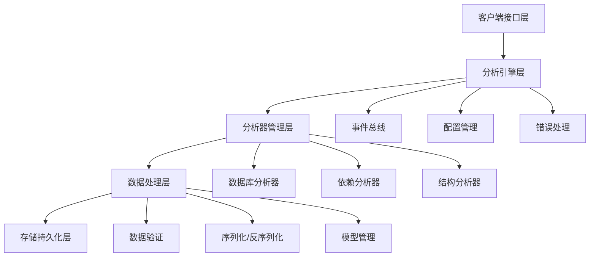
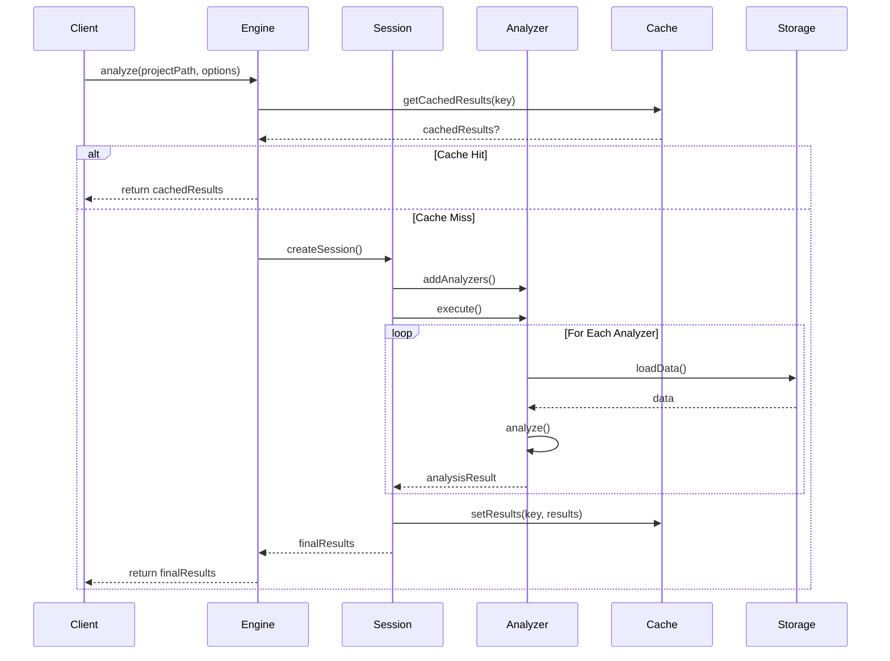
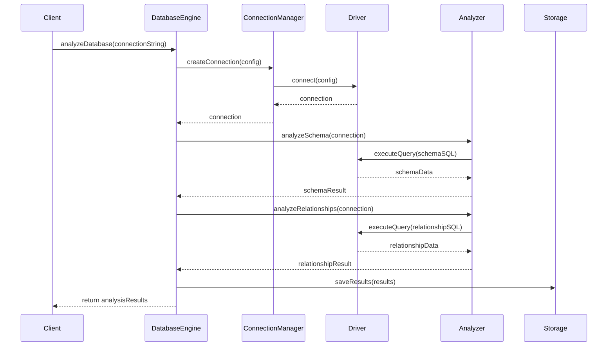

# Core/Analysis 模块技术架构文档

## 1. 架构概述

Core/Analysis 模块是 Kilocode 项目的核心逆向分析引擎，负责项目结构分析、依赖关系解析、数据库模式分析和代码质量评估。该模块采用分层架构设计，遵循依赖注入、事件驱动和插件化扩展的设计原则。

### 1.1 设计理念

- **模块化设计**: 将复杂功能拆分为独立、可复用的模块
- **插件化架构**: 支持动态加载和注册分析器
- **事件驱动**: 通过事件总线实现模块间松耦合通信
- **配置驱动**: 支持灵活的配置管理和运行时调整
- **性能优化**: 内置缓存机制和并发处理
- **错误处理**: 统一的错误处理和恢复机制

### 1.2 架构层次



## 2. 核心组件架构

### 2.1 架构管理模块 (architecture)

该模块提供整个分析引擎的基础设施支持：

#### 2.1.1 依赖注入容器 (DIContainer)

```typescript
interface DIContainer {
	register<T>(token: string, implementation: T): void
	resolve<T>(token: string): T
	createScope(): DIContainer
	dispose(): void
}
```

**职责**:

- 管理组件生命周期
- 实现控制反转 (IoC)
- 支持作用域隔离
- 提供依赖解析

#### 2.1.2 事件总线 (EventBus)

```typescript
interface EventBus {
	emit(event: string, data: any): void
	on(event: string, handler: EventHandler): void
	off(event: string, handler: EventHandler): void
	once(event: string, handler: EventHandler): void
}
```

**职责**:

- 实现发布-订阅模式
- 支持事件广播和单播
- 提供事件过滤和转换
- 管理事件监听器生命周期

#### 2.1.3 配置管理器 (ConfigManager)

```typescript
interface ConfigManager {
	get<T>(key: string, defaultValue?: T): T
	set(key: string, value: any): void
	merge(config: Record<string, any>): void
	validate(): ValidationResult
	watch(key: string, handler: ConfigChangeHandler): void
}
```

**职责**:

- 集中管理配置项
- 支持配置验证
- 提供配置变更通知
- 支持配置分层和覆盖

#### 2.1.4 错误处理器 (ErrorHandler)

```typescript
interface ErrorHandler {
	handle(error: Error, context?: ErrorContext): void
	registerHandler(type: string, handler: ErrorHandlerFunction): void
	createError(code: string, message: string, details?: any): AnalysisError
	wrap<T>(fn: () => T, context?: ErrorContext): T
}
```

**职责**:

- 统一错误处理
- 错误分类和分级
- 错误恢复机制
- 错误日志记录

### 2.2 分析引擎模块 (engine)

#### 2.2.1 分析引擎 (AnalysisEngine)

```typescript
class AnalysisEngine {
	constructor(
		private configManager: ConfigManager,
		private eventBus: EventBus,
		private analyzerRegistry: AnalyzerRegistry,
		private cache: AnalysisCache,
	) {}

	async analyze(projectPath: string, options?: AnalysisOptions): Promise<AnalysisResults>
	async analyzeDatabase(connectionString: string, options?: DatabaseAnalysisOptions): Promise<DatabaseAnalysisResult>
	createSession(): AnalysisSession
}
```

**职责**:

- 协调整个分析流程
- 管理分析会话
- 处理并发分析请求
- 集成缓存机制

#### 2.2.2 分析会话 (AnalysisSession)

```typescript
class AnalysisSession {
	readonly id: string
	readonly startTime: Date
	private state: SessionState

	async addAnalyzer(analyzer: IAnalyzer): void
	async removeAnalyzer(analyzerId: string): void
	async execute(): Promise<AnalysisResults>
	getProgress(): SessionProgress
	cancel(): void
}
```

**职责**:

- 管理单次分析生命周期
- 跟踪分析进度
- 支持分析取消
- 维护分析状态

#### 2.2.3 分析缓存 (AnalysisCache)

```typescript
class AnalysisCache {
	constructor(
		private storage: IStorage,
		private config: CacheConfig,
	) {}

	get<T>(key: string): Promise<T | null>
	set(key: string, value: T, ttl?: number): Promise<void>
	invalidate(pattern: string): Promise<void>
	clear(): Promise<void>
	getStats(): CacheStats
}
```

**职责**:

- 缓存分析结果
- 管理缓存生命周期
- 支持缓存失效策略
- 提供缓存统计

#### 2.2.4 数据库引擎 (DatabaseEngine)

```typescript
class DatabaseEngine {
	constructor(
		private connectionManager: ConnectionManager,
		private driverRegistry: DriverRegistry,
	) {}

	async connect(config: DatabaseConfig): Promise<DatabaseConnection>
	async analyzeSchema(connection: DatabaseConnection): Promise<DatabaseSchema>
	async analyzeRelationships(connection: DatabaseConnection): Promise<RelationshipMap>
	disconnect(connection: DatabaseConnection): Promise<void>
}
```

**职责**:

- 管理数据库连接
- 执行数据库分析
- 处理不同数据库类型
- 提供连接池管理

### 2.3 分析器管理模块 (analyzers)

#### 2.3.1 分析器注册表 (AnalyzerRegistry)

```typescript
class AnalyzerRegistry {
	private analyzers: Map<string, IAnalyzer>

	register(analyzer: IAnalyzer): void
	unregister(analyzerId: string): void
	get(analyzerId: string): IAnalyzer | undefined
	getAll(): IAnalyzer[]
	getByType(type: AnalyzerType): IAnalyzer[]
	validate(analyzer: IAnalyzer): ValidationResult
}
```

**职责**:

- 管理分析器生命周期
- 提供分析器发现机制
- 支持分析器依赖管理
- 验证分析器配置

#### 2.3.2 基础分析器 (BaseAnalyzer)

```typescript
abstract class BaseAnalyzer implements IAnalyzer {
	readonly id: string
	readonly name: string
	readonly version: string
	readonly type: AnalyzerType

	protected config: AnalysisConfig
	protected eventBus: EventBus
	protected validator: DataValidator

	abstract analyze(context: AnalysisContext): Promise<AnalysisResult>
	abstract validate(): ValidationResult

	protected emitProgress(progress: number, message: string): void
	protected emitError(error: Error): void
	protected emitWarning(warning: string): void
}
```

**职责**:

- 提供分析器基础实现
- 标准化分析器接口
- 实现通用功能
- 支持事件通知

#### 2.3.3 分析器接口 (IAnalyzer)

```typescript
interface IAnalyzer {
	readonly id: string
	readonly name: string
	readonly version: string
	readonly type: AnalyzerType
	readonly description: string

	analyze(context: AnalysisContext): Promise<AnalysisResult>
	validate(): ValidationResult
	getConfigSchema(): ConfigSchema
	supports(context: AnalysisContext): boolean
}
```

### 2.4 数据模型模块 (models)

#### 2.4.1 核心数据模型

**AnalysisConfig**: 分析配置模型

```typescript
class AnalysisConfig extends EventEmitter {
	private data: ConfigData
	private validator: DataValidator

	get<T>(key: string, defaultValue?: T): T
	set(key: string, value: any): void
	merge(config: Partial<ConfigData>): void
	validate(): ValidationResult
	toJSON(): ConfigData
	clone(): AnalysisConfig
}
```

**AnalysisResults**: 分析结果模型

```typescript
class AnalysisResults {
	readonly id: string
	readonly timestamp: Date
	readonly duration: number
	readonly projectPath: string

	projectStructure: ProjectStructure
	dependencyGraph: DependencyGraph
	databaseSchema?: DatabaseSchema
	metrics: AnalysisMetrics
	issues: AnalysisIssue[]

	merge(other: AnalysisResults): AnalysisResults
	filter(predicate: (issue: AnalysisIssue) => boolean): AnalysisResults
	toJSON(): SerializedResults
}
```

**ProjectStructure**: 项目结构模型

```typescript
class ProjectStructure {
	readonly rootPath: string
	private files: Map<string, FileInfo>
	private directories: Map<string, DirectoryInfo>

	addFile(file: FileInfo): void
	removeFile(path: string): void
	getFile(path: string): FileInfo | undefined
	getFiles(pattern?: string): FileInfo[]
	getDirectories(): DirectoryInfo[]
	buildTree(): FileTree
}
```

**DependencyGraph**: 依赖关系图模型

```typescript
class DependencyGraph {
	private nodes: Map<string, DependencyNode>
	private edges: Map<string, DependencyEdge[]>

	addNode(node: DependencyNode): void
	addEdge(from: string, to: string, type: DependencyType): void
	getDependencies(nodeId: string): DependencyNode[]
	getDependents(nodeId: string): DependencyNode[]
	detectCycles(): Cycle[]
	topologicalSort(): string[]
	toMermaid(): string
}
```

#### 2.4.2 数据库模型

**DatabaseSchema**: 数据库模式模型

```typescript
class DatabaseSchema {
	readonly databaseName: string
	readonly tables: Map<string, TableStructure>
	readonly relationships: RelationshipMap
	readonly indexes: Map<string, IndexInfo>

	addTable(table: TableStructure): void
	removeTable(name: string): void
	getTable(name: string): TableStructure | undefined
	getTables(): TableStructure[]
	validate(): ValidationResult
}
```

**TableStructure**: 表结构模型

```typescript
class TableStructure {
	readonly name: string
	readonly columns: ColumnInfo[]
	readonly constraints: ConstraintInfo[]
	readonly indexes: IndexInfo[]

	addColumn(column: ColumnInfo): void
	removeColumn(name: string): void
	getColumn(name: string): ColumnInfo | undefined
	getPrimaryKey(): ColumnInfo[]
	getForeignKeys(): ForeignKeyInfo[]
	validate(): ValidationResult
}
```

#### 2.4.3 数据验证模块

**DataValidator**: 数据验证器

```typescript
class DataValidator {
	private rules: Map<string, ValidationRule>
	private cache: Map<string, ValidationResult>

	validate(data: any, schema: ValidationSchema): ValidationResult
	addRule(name: string, rule: ValidationRule): void
	removeRule(name: string): void
	validateField(field: string, value: any, rules: string[]): FieldValidationResult
}
```

**ValidationRules**: 验证规则管理器

```typescript
class ValidationRules {
	static required(value: any): ValidationResult
	static string(value: any): ValidationResult
	static number(value: any): ValidationResult
	static array(value: any): ValidationResult
	static object(value: any): ValidationResult
	static pattern(value: string, pattern: RegExp): ValidationResult
	static range(value: number, min: number, max: number): ValidationResult
	static custom(value: any, validator: Function): ValidationResult
}
```

#### 2.4.4 序列化模块

**Serializer**: 序列化器

```typescript
class Serializer {
	constructor(
		private format: SerializationFormat,
		private versionManager: VersionManager,
	) {}

	serialize<T>(data: T): string
	deserialize<T>(text: string): T
	validate(data: any): ValidationResult
	getFormat(): SerializationFormat
}
```

**VersionManager**: 版本管理器

```typescript
class VersionManager extends EventEmitter {
	private versions: Map<string, VersionInfo>
	private migrations: Map<string, Migration[]>

	registerVersion(version: VersionInfo): void
	unregisterVersion(version: string): void
	compare(v1: string, v2: string): number
	isCompatible(version: string, target: string): boolean
	migrate(data: any, from: string, to: string): any
	getLatestVersion(): string
	getVersions(): string[]
}
```

#### 2.4.5 存储模块

**IStorage**: 存储接口

```typescript
interface IStorage {
	initialize(): Promise<void>
	connect(): Promise<void>
	disconnect(): Promise<void>
	destroy(): Promise<void>

	create(key: string, value: any): Promise<void>
	read(key: string): Promise<any>
	update(key: string, value: any): Promise<void>
	delete(key: string): Promise<void>
	exists(key: string): Promise<boolean>

	batch(operations: BatchOperation[]): Promise<void>
	query(filter: QueryFilter): Promise<any[]>
	keys(pattern?: string): Promise<string[]>
	clear(): Promise<void>
}
```

**FileStorage**: 文件存储实现

```typescript
class FileStorage extends BaseStorage {
	constructor(
		private basePath: string,
		private options: FileStorageOptions,
	) {}

	async initialize(): Promise<void>
	async read(key: string): Promise<any>
	async write(key: string, value: any): Promise<void>
	async delete(key: string): Promise<void>
	async backup(): Promise<string>
	async restore(backupPath: string): Promise<void>
}
```

**DatabaseStorage**: 数据库存储实现

```typescript
class DatabaseStorage extends BaseStorage {
	constructor(
		private connection: DatabaseConnection,
		private options: DatabaseStorageOptions,
	) {}

	async initialize(): Promise<void>
	async query(sql: string, params?: any[]): Promise<any[]>
	async transaction<T>(fn: (tx: Transaction) => Promise<T>): Promise<T>
	async createTable(schema: TableSchema): Promise<void>
	async migrate(migrations: Migration[]): Promise<void>
}
```

**MemoryStorage**: 内存存储实现

```typescript
class MemoryStorage extends BaseStorage {
	private data: Map<string, any>
	private metadata: Map<string, StorageMetadata>

	async initialize(): Promise<void>
	async read(key: string): Promise<any>
	async write(key: string, value: any): Promise<void>
	async clear(): Promise<void>
	getStats(): MemoryStats
}
```

### 2.5 数据库连接模块 (database)

#### 2.5.1 连接管理器 (ConnectionManager)

```typescript
class ConnectionManager {
	private connections: Map<string, DatabaseConnection>
	private pools: Map<string, ConnectionPool>

	createConnection(config: ConnectionConfig): Promise<DatabaseConnection>
	getConnection(id: string): DatabaseConnection | undefined
	releaseConnection(connection: DatabaseConnection): Promise<void>
	createPool(config: PoolConfig): ConnectionPool
	closePool(poolId: string): Promise<void>
	getStats(): ConnectionStats
}
```

#### 2.5.2 连接池 (ConnectionPool)

```typescript
class ConnectionPool {
	constructor(
		private config: PoolConfig,
		private driver: IDriver,
	) {}

	async acquire(): Promise<DatabaseConnection>
	async release(connection: DatabaseConnection): Promise<void>
	async close(): Promise<void>
	getStats(): PoolStats
	resize(size: number): Promise<void>
}
```

#### 2.5.3 驱动注册表 (DriverRegistry)

```typescript
class DriverRegistry {
	private drivers: Map<DatabaseType, IDriver>

	register(type: DatabaseType, driver: IDriver): void
	unregister(type: DatabaseType): void
	get(type: DatabaseType): IDriver | undefined
	getSupportedTypes(): DatabaseType[]
	createConnection(config: ConnectionConfig): Promise<DatabaseConnection>
}
```

#### 2.5.4 驱动接口 (IDriver)

```typescript
interface IDriver {
	readonly type: DatabaseType
	readonly version: string

	connect(config: ConnectionConfig): Promise<DatabaseConnection>
	disconnect(connection: DatabaseConnection): Promise<void>
	validateConfig(config: ConnectionConfig): ValidationResult
	getFeatures(): DriverFeature[]
	createQueryBuilder(): QueryBuilder
}
```

## 3. 数据流架构

### 3.1 分析流程数据流



### 3.2 数据库分析数据流



## 4. 设计模式

### 4.1 依赖注入模式

使用 DI 容器管理组件依赖，实现松耦合和可测试性：

```typescript
// 服务注册
container.register("IStorage", FileStorage)
container.register("IAnalyzer", DatabaseAnalyzer)
container.register("AnalysisEngine", AnalysisEngine)

// 依赖解析
const engine = container.resolve<AnalysisEngine>("AnalysisEngine")
```

### 4.2 观察者模式

通过事件总线实现组件间通信：

```typescript
// 事件发布
eventBus.emit("analysis.started", { sessionId, projectPath })

// 事件订阅
eventBus.on("analysis.completed", (data) => {
	console.log(`Analysis completed: ${data.duration}ms`)
})
```

### 4.3 策略模式

不同的分析器实现统一的分析策略：

```typescript
interface IAnalyzer {
	analyze(context: AnalysisContext): Promise<AnalysisResult>
}

class DatabaseAnalyzer implements IAnalyzer {
	async analyze(context: AnalysisContext): Promise<AnalysisResult> {
		// 数据库分析逻辑
	}
}

class DependencyAnalyzer implements IAnalyzer {
	async analyze(context: AnalysisContext): Promise<AnalysisResult> {
		// 依赖分析逻辑
	}
}
```

### 4.4 工厂模式

创建不同类型的存储实例：

```typescript
class StorageFactory {
	static create(type: StorageType, config: StorageConfig): IStorage {
		switch (type) {
			case StorageType.File:
				return new FileStorage(config)
			case StorageType.Database:
				return new DatabaseStorage(config)
			case StorageType.Memory:
				return new MemoryStorage(config)
			default:
				throw new Error(`Unsupported storage type: ${type}`)
		}
	}
}
```

### 4.5 装饰器模式

使用装饰器增强类功能：

```typescript
@Injectable()
@EventDriven()
@Loggable()
class AnalysisEngine {
	@Cacheable({ ttl: 3600 })
	async analyze(projectPath: string): Promise<AnalysisResults> {
		// 分析逻辑
	}

	@Retryable({ maxAttempts: 3 })
	async connectDatabase(config: DatabaseConfig): Promise<DatabaseConnection> {
		// 连接逻辑
	}
}
```

## 5. 技术规范

### 5.1 编码规范

- **命名规范**: 使用 PascalCase 类名，camelCase 方法和变量名
- **接口定义**: 使用 I 前缀标识接口，如 `IAnalyzer`, `IStorage`
- **类型安全**: 严格使用 TypeScript 类型系统，避免 any 类型
- **错误处理**: 使用自定义错误类，提供详细的错误上下文
- **文档注释**: 使用 TSDoc 标准，为公共 API 提供完整文档

### 5.2 性能规范

- **内存管理**: 及时清理不再使用的对象，避免内存泄漏
- **异步处理**: 使用 async/await，避免回调地狱
- **并发控制**: 使用信号量和连接池控制并发数量
- **缓存策略**: 实现多级缓存，包括内存缓存和持久化缓存
- **资源释放**: 确保数据库连接、文件句柄等资源正确释放

### 5.3 安全规范

- **输入验证**: 对所有外部输入进行严格验证
- **SQL 注入**: 使用参数化查询，避免字符串拼接 SQL
- **数据加密**: 对敏感数据进行加密存储
- **访问控制**: 实现基于角色的访问控制
- **审计日志**: 记录关键操作的审计日志

### 5.4 测试规范

- **单元测试**: 每个类和方法都要有对应的单元测试
- **集成测试**: 测试模块间的集成和交互
- **性能测试**: 验证系统在高负载下的表现
- **Mock 数据**: 使用 Mock 数据隔离外部依赖
- **测试覆盖**: 确保代码覆盖率达到 80% 以上

## 6. 扩展机制

### 6.1 插件系统

支持动态加载自定义分析器：

```typescript
interface Plugin {
	readonly name: string
	readonly version: string
	activate(context: PluginContext): void
	deactivate(): void
}

interface PluginContext {
	registerAnalyzer(analyzer: IAnalyzer): void
	registerDriver(driver: IDriver): void
	registerStorage(storage: IStorage): void
	getConfig(): PluginConfig
}
```

### 6.2 钩子系统

提供扩展点供外部代码介入：

```typescript
interface Hooks {
	beforeAnalysis: (context: AnalysisContext) => Promise<void>
	afterAnalysis: (results: AnalysisResults) => Promise<AnalysisResults>
	beforeDatabaseConnection: (config: DatabaseConfig) => Promise<DatabaseConfig>
	afterDatabaseDisconnection: (connection: DatabaseConnection) => Promise<void>
}
```

### 6.3 自定义规则

支持自定义验证规则：

```typescript
interface ValidationRule {
	name: string
	validate(value: any, context: ValidationContext): ValidationResult
	getErrorMessage(): string
}

class CustomValidationRule implements ValidationRule {
	validate(value: any, context: ValidationContext): ValidationResult {
		// 自定义验证逻辑
	}
}
```

## 7. 错误处理和恢复

### 7.1 错误分类

- **系统错误**: 内存不足、文件系统错误等
- **网络错误**: 数据库连接失败、超时等
- **配置错误**: 无效的配置参数、缺失必要配置等
- **数据错误**: 数据格式错误、验证失败等
- **业务错误**: 分析逻辑错误、不支持的功能等

### 7.2 错误处理策略

```typescript
class ErrorHandler {
	async handle(error: Error, context: ErrorContext): Promise<void> {
		// 错误分类
		const errorType = this.classifyError(error)

		// 选择处理策略
		const strategy = this.getStrategy(errorType)

		// 执行处理
		await strategy.handle(error, context)

		// 记录日志
		this.logError(error, context)

		// 发送通知
		await this.notify(error, context)
	}

	private getStrategy(type: ErrorType): ErrorHandlingStrategy {
		switch (type) {
			case ErrorType.System:
				return new SystemErrorStrategy()
			case ErrorType.Network:
				return new NetworkErrorStrategy()
			case ErrorType.Configuration:
				return new ConfigurationErrorStrategy()
			default:
				return new DefaultErrorStrategy()
		}
	}
}
```

### 7.3 恢复机制

- **重试机制**: 对临时性错误进行自动重试
- **降级处理**: 在部分功能失败时提供降级服务
- **状态恢复**: 从检查点恢复分析状态
- **资源清理**: 确保错误发生后正确清理资源

## 8. 性能优化

### 8.1 缓存策略

- **多级缓存**: 内存缓存 + 磁盘缓存 + 分布式缓存
- **缓存预热**: 预加载常用数据到缓存
- **缓存失效**: 基于时间和事件的缓存失效策略
- **缓存统计**: 监控缓存命中率和性能指标

### 8.2 并发控制

- **连接池**: 数据库连接池管理
- **线程池**: 分析任务线程池
- **信号量**: 控制并发数量
- **异步处理**: 使用异步 I/O 和 Promise

### 8.3 内存优化

- **流式处理**: 大文件使用流式读取
- **分页查询**: 数据库查询使用分页
- **对象池**: 重用频繁创建的对象
- **垃圾回收**: 及时清理不再使用的对象

### 8.4 数据库优化

- **索引优化**: 为常用查询字段创建索引
- **查询优化**: 使用优化的 SQL 查询
- **连接优化**: 使用连接池和连接复用
- **事务优化**: 合理使用事务隔离级别

## 9. 监控和诊断

### 9.1 性能监控

```typescript
interface PerformanceMonitor {
	startTimer(name: string): Timer
	recordMetric(name: string, value: number, tags?: Record<string, string>): void
	getMetrics(): PerformanceMetrics
	exportMetrics(): Promise<string>
}

class PerformanceMonitorImpl implements PerformanceMonitor {
	private metrics: Map<string, Metric[]>
	private timers: Map<string, Timer>

	startTimer(name: string): Timer {
		const timer = new Timer(name)
		this.timers.set(name, timer)
		return timer
	}

	recordMetric(name: string, value: number, tags?: Record<string, string>): void {
		const metric = new Metric(name, value, tags)
		const metrics = this.metrics.get(name) || []
		metrics.push(metric)
		this.metrics.set(name, metrics)
	}
}
```

### 9.2 健康检查

```typescript
interface HealthCheck {
	name: string
	check(): Promise<HealthStatus>
	getSeverity(): HealthSeverity
}

class DatabaseHealthCheck implements HealthCheck {
	constructor(private connectionManager: ConnectionManager) {}

	async check(): Promise<HealthStatus> {
		try {
			const connection = await this.connectionManager.createConnection(testConfig)
			await connection.ping()
			return { status: "healthy", message: "Database connection OK" }
		} catch (error) {
			return { status: "unhealthy", message: `Database connection failed: ${error.message}` }
		}
	}
}
```

### 9.3 日志管理

```typescript
interface Logger {
	debug(message: string, meta?: any): void
	info(message: string, meta?: any): void
	warn(message: string, meta?: any): void
	error(message: string, error?: Error, meta?: any): void
}

class StructuredLogger implements Logger {
	private transports: LogTransport[]

	constructor(config: LoggerConfig) {
		this.transports = config.transports.map((t) => this.createTransport(t))
	}

	info(message: string, meta?: any): void {
		const entry = this.createLogEntry("info", message, meta)
		this.transports.forEach((t) => t.write(entry))
	}
}
```

## 10. 部署和运维

### 10.1 容器化部署

```dockerfile
FROM node:18-alpine

WORKDIR /app

COPY package*.json ./
RUN npm ci --only=production

COPY dist/ ./dist/
COPY config/ ./config/

EXPOSE 3000

HEALTHCHECK --interval=30s --timeout=3s --start-period=5s --retries=3 \
  CMD node dist/healthcheck.js

USER node

CMD ["node", "dist/index.js"]
```

### 10.2 配置管理

支持多种配置源：

- **环境变量**: 容器化部署时的主要配置方式
- **配置文件**: JSON、YAML、TOML 格式支持
- **配置中心**: 集成 Consul、Etcd 等配置中心
- **命令行参数**: 启动时的临时配置覆盖

### 10.3 服务发现

集成服务发现机制：

```typescript
interface ServiceDiscovery {
	register(service: ServiceInstance): Promise<void>
	unregister(serviceId: string): Promise<void>
	discover(serviceName: string): Promise<ServiceInstance[]>
	watch(serviceName: string, callback: ServiceChangeCallback): void
}
```

### 10.4 负载均衡

支持多种负载均衡策略：

- **轮询**: 平均分配请求到各个实例
- **权重**: 根据实例性能分配不同权重
- **最少连接**: 将请求分配到连接数最少的实例
- **一致性哈希**: 保证相同请求路由到相同实例

## 11. 总结

Core/Analysis 模块采用现代化的架构设计，具备以下特点：

1. **模块化设计**: 清晰的模块划分和职责分离
2. **插件化扩展**: 支持动态扩展和自定义功能
3. **高性能**: 多级缓存、并发控制和性能优化
4. **高可用**: 完善的错误处理和恢复机制
5. **可观测**: 全面的监控、日志和诊断能力
6. **易部署**: 容器化支持和自动化运维

该架构能够支撑大规模项目的逆向分析需求，为 Kilocode 项目提供强大的分析能力基础。
