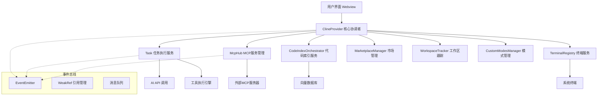
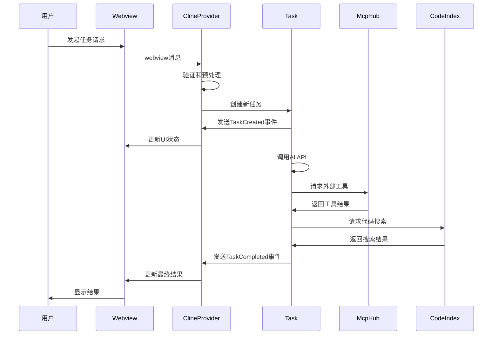

# Kilocode Agent协同机制技术文档

## 1. 架构概述

### 1.1 服务协同架构设计

Kilocode 采用的不是传统意义上的多Agent系统，而是一个以 **ClineProvider** 为核心协调者的服务协同架构。这种设计模式更类似于微服务架构中的服务编排（Service Orchestration）模式，通过中央协调者统一管理和协调各个专业化服务。



### 1.2 核心组件角色定位

| 组件                      | 角色           | 职责                                           |
| ------------------------- | -------------- | ---------------------------------------------- |
| **ClineProvider**         | 中央协调者     | 统一管理所有服务，处理用户交互，协调服务间通信 |
| **Task**                  | 任务执行器     | 管理AI交互，执行具体任务，协调工具调用         |
| **McpHub**                | 外部集成管理器 | 管理MCP服务器，提供外部工具和资源访问          |
| **CodeIndexOrchestrator** | 代码智能服务   | 提供代码索引、搜索和语义分析能力               |
| **TerminalRegistry**      | 系统集成服务   | 管理终端访问和命令执行                         |
| **MarketplaceManager**    | 扩展管理服务   | 管理插件和扩展的安装、更新                     |
| **WorkspaceTracker**      | 状态监控服务   | 跟踪工作区变化和文件状态                       |

### 1.3 与传统多Agent系统的区别

**传统多Agent系统特征：**

- 每个Agent都是独立的智能体
- Agent间通过消息传递进行协商
- 分布式决策和执行
- 复杂的协商和冲突解决机制

**Kilocode服务协同架构特征：**

- 单一智能核心（AI通过Task服务）
- 专业化服务组件
- 中央协调和统一决策
- 事件驱动的服务通信
- 清晰的服务边界和职责分工

## 2. 核心协调者：ClineProvider

### 2.1 ClineProvider的核心职责

ClineProvider 继承自 EventEmitter，作为整个系统的中央协调者，承担以下关键职责：

```typescript
export class ClineProvider extends EventEmitter implements TaskProviderLike {
	// 核心服务引用
	private clineStack: Task[] = []
	private mcpHub?: McpHub
	private marketplaceManager: MarketplaceManager
	private codeIndexManager?: CodeIndexManager
	private _workspaceTracker?: WorkspaceTracker

	// 事件监听器管理
	private taskEventListeners: WeakMap<Task, Array<() => void>> = new WeakMap()

	// 生命周期管理
	private disposables: vscode.Disposable[] = []
	private webviewDisposables: vscode.Disposable[] = []
}
```

**主要职责包括：**

1. **服务生命周期管理**：初始化、启动、停止各个服务
2. **事件协调**：作为事件总线，协调服务间的通信
3. **状态管理**：维护全局状态，确保状态一致性
4. **用户界面交互**：处理Webview消息，更新UI状态
5. **资源管理**：管理内存、连接等系统资源

### 2.2 事件驱动的通信机制

ClineProvider 使用事件驱动模式协调各个服务：

```typescript
// 任务事件转发机制
this.taskCreationCallback = (instance: Task) => {
	this.emit(RooCodeEventName.TaskCreated, instance)

	// 创建事件监听器
	const onTaskStarted = () => this.emit(RooCodeEventName.TaskStarted, instance.taskId)
	const onTaskCompleted = (taskId: string, tokenUsage: any, toolUsage: any) =>
		this.emit(RooCodeEventName.TaskCompleted, taskId, tokenUsage, toolUsage)

	// 注册事件监听
	instance.on(RooCodeEventName.TaskStarted, onTaskStarted)
	instance.on(RooCodeEventName.TaskCompleted, onTaskCompleted)

	// 存储清理函数，用于后续移除
	this.taskEventListeners.set(instance, [
		() => instance.off(RooCodeEventName.TaskStarted, onTaskStarted),
		() => instance.off(RooCodeEventName.TaskCompleted, onTaskCompleted),
	])
}
```

### 2.3 服务初始化和管理

```typescript
constructor(
    readonly context: vscode.ExtensionContext,
    private readonly outputChannel: vscode.OutputChannel,
    private readonly renderContext: "sidebar" | "editor" = "sidebar",
    public readonly contextProxy: ContextProxy,
    mdmService?: MdmService,
) {
    super()

    // 初始化各个服务
    this.initializeServices()
}

private async initializeServices() {
    // 1. 初始化MCP Hub
    McpServerManager.getInstance(this.context, this)
        .then((hub) => {
            this.mcpHub = hub
            this.mcpHub.registerClient()
        })

    // 2. 初始化市场管理器
    this.marketplaceManager = new MarketplaceManager(this.context, this.customModesManager)

    // 3. 初始化工作区跟踪器
    this._workspaceTracker = new WorkspaceTracker(this.context)

    // 4. 初始化代码索引管理器
    this.codeIndexManager = CodeIndexManager.getInstance(context, workspacePath)
}
```

## 3. 主要服务组件协同

### 3.1 Task服务：任务执行和AI交互管理

Task服务是系统的执行核心，负责：

- **AI交互管理**：与Claude API进行对话
- **工具调用协调**：执行各种开发工具
- **上下文管理**：维护对话上下文和项目状态
- **错误处理**：处理执行过程中的异常

```typescript
export class Task extends EventEmitter {
	constructor(options: {
		provider: WeakRef<ClineProvider>
		apiConfiguration: ApiConfiguration
		task: string
		// ... 其他配置
	}) {
		// 与ClineProvider建立弱引用关系
		this.providerRef = options.provider

		// 初始化工具系统
		this.initializeTools()

		// 设置消息队列
		this.messageQueueService = new MessageQueueService()
	}

	// 任务执行主循环
	async execute() {
		while (!this.isCompleted) {
			const response = await this.callAI()
			await this.processResponse(response)
			this.emit(RooCodeEventName.TaskProgress, this.taskId)
		}
	}
}
```

### 3.2 McpHub：MCP服务器管理和工具集成

McpHub管理外部MCP（Model Context Protocol）服务器，提供工具和资源的动态集成：

```typescript
export class McpHub {
	private connections: McpConnection[] = []
	private refCount: number = 0 // 引用计数管理

	// 注册客户端（通常是ClineProvider）
	public registerClient(): void {
		this.refCount++
	}

	// 注销客户端，当引用计数为0时自动销毁
	public async unregisterClient(): Promise<void> {
		this.refCount--
		if (this.refCount <= 0) {
			await this.dispose()
		}
	}

	// 管理MCP服务器连接
	private async connectToServer(server: McpServer): Promise<McpConnection> {
		const client = new Client({
			name: "kilocode",
			version: "1.0.0",
		})

		// 建立连接并注册事件监听
		await client.connect(transport)

		return {
			type: "connected",
			server,
			client,
			transport,
		}
	}
}
```

### 3.3 CodeIndexOrchestrator：代码索引和搜索服务

代码索引服务提供智能的代码搜索和语义分析能力：

```typescript
export class CodeIndexOrchestrator {
	constructor(
		private readonly configManager: CodeIndexConfigManager,
		private readonly stateManager: CodeIndexStateManager,
		private readonly workspacePath: string,
		private readonly cacheManager: CacheManager,
		private readonly vectorStore: IVectorStore,
		private readonly scanner: DirectoryScanner,
		private readonly fileWatcher: IFileWatcher,
	) {}

	// 启动索引过程
	public async startIndexing(): Promise<void> {
		this._isProcessing = true
		this.stateManager.setSystemState("Indexing", "Initializing services...")

		// 初始化向量存储
		await this.vectorStore.initialize()

		// 启动文件监听器
		await this._startWatcher()

		// 扫描工作区
		await this.scanner.scanDirectory(this.workspacePath)
	}
}
```

### 3.4 其他关键服务

**TerminalRegistry：终端集成服务**

```typescript
export class TerminalRegistry {
	private static terminals: Map<string, Terminal> = new Map()

	static initialize() {
		// 初始化终端管理
	}

	static getTerminal(id: string): Terminal | undefined {
		return this.terminals.get(id)
	}
}
```

**MarketplaceManager：扩展市场管理**

```typescript
export class MarketplaceManager {
	constructor(
		private context: vscode.ExtensionContext,
		private customModesManager: CustomModesManager,
	) {}

	async installExtension(extensionId: string): Promise<void> {
		// 安装扩展逻辑
	}
}
```

## 4. 服务间通信机制

### 4.1 事件发布/订阅模式

系统采用事件驱动架构，通过EventEmitter实现松耦合的服务通信：

```typescript
// 事件类型定义
export interface TaskProviderEvents {
	[RooCodeEventName.TaskCreated]: [Task]
	[RooCodeEventName.TaskStarted]: [string]
	[RooCodeEventName.TaskCompleted]: [string, TokenUsage, ToolUsage]
	[RooCodeEventName.TaskAborted]: [string]
	// ... 更多事件类型
}

// ClineProvider作为事件总线
export class ClineProvider extends EventEmitter implements TaskProviderLike {
	// 重写事件方法以提供类型安全
	override on<K extends keyof TaskProviderEvents>(
		event: K,
		listener: (...args: TaskProviderEvents[K]) => void | Promise<void>,
	): this {
		return super.on(event, listener as any)
	}
}
```

### 4.2 WeakRef引用管理

为了避免循环引用和内存泄漏，系统大量使用WeakRef：

```typescript
export class Task extends EventEmitter {
	private providerRef: WeakRef<ClineProvider>

	constructor(options: { provider: WeakRef<ClineProvider> }) {
		this.providerRef = options.provider
	}

	// 安全地获取provider引用
	private getProvider(): ClineProvider | undefined {
		return this.providerRef.deref()
	}
}

export class McpHub {
	private providerRef: WeakRef<ClineProvider>

	constructor(provider: ClineProvider) {
		this.providerRef = new WeakRef(provider)
	}
}
```

### 4.3 消息队列和状态同步

```typescript
export class MessageQueueService {
	private messages: QueuedMessage[] = []
	private isProcessing: boolean = false

	async enqueue(message: QueuedMessage): Promise<void> {
		this.messages.push(message)
		if (!this.isProcessing) {
			await this.processQueue()
		}
	}

	private async processQueue(): Promise<void> {
		this.isProcessing = true
		while (this.messages.length > 0) {
			const message = this.messages.shift()!
			await this.processMessage(message)
		}
		this.isProcessing = false
	}
}
```

### 4.4 错误处理和恢复机制

```typescript
// 任务中止后的恢复机制
const onTaskAborted = async () => {
	this.emit(RooCodeEventName.TaskAborted, instance.taskId)

	try {
		// 只在真正的流式传输失败时重新水化
		if (instance.abortReason === "streaming_failed") {
			// 防御性保护：如果另一个路径已经替换了这个实例，跳过
			const current = this.getCurrentTask()
			if (current && current.instanceId !== instance.instanceId) {
				this.log(
					`[onTaskAborted] Skipping rehydrate: current instance ${current.instanceId} != aborted ${instance.instanceId}`,
				)
				return
			}

			// 从历史记录重新创建任务
			const { historyItem } = await this.getTaskWithId(instance.taskId)
			const rootTask = instance.rootTask
			const parentTask = instance.parentTask
			await this.createTaskWithHistoryItem({ ...historyItem, rootTask, parentTask })
		}
	} catch (error) {
		this.log(
			`[onTaskAborted] Failed to rehydrate after streaming failure: ${error instanceof Error ? error.message : String(error)}`,
		)
	}
}
```

## 5. 协同工作流程

### 5.1 用户请求处理流程



### 5.2 服务间协调和数据流

**数据流向：**

1. **用户输入** → Webview → ClineProvider
2. **任务创建** → ClineProvider → Task
3. **AI交互** → Task → AI API
4. **工具调用** → Task → McpHub → 外部服务
5. **代码搜索** → Task → CodeIndexOrchestrator → 向量数据库
6. **结果返回** → Task → ClineProvider → Webview → 用户

### 5.3 并发控制和资源管理

```typescript
export class ClineProvider {
	private _isProcessing: boolean = false
	private _cancelRequested: boolean = false

	async processRequest(request: WebviewMessage): Promise<void> {
		// 防止并发处理
		if (this._isProcessing) {
			throw new Error("Another request is being processed")
		}

		this._isProcessing = true
		this._cancelRequested = false

		try {
			await this.handleRequest(request)
		} finally {
			this._isProcessing = false
		}
	}

	// 资源清理
	async dispose(): Promise<void> {
		// 清理所有disposables
		while (this.disposables.length) {
			const x = this.disposables.pop()
			if (x) {
				x.dispose()
			}
		}

		// 注销MCP客户端
		await this.mcpHub?.unregisterClient()

		// 清理工作区跟踪器
		this._workspaceTracker?.dispose()
	}
}
```

### 5.4 状态一致性保证

```typescript
// 状态同步机制
async postStateToWebview(): Promise<void> {
    const state = await this.getState()
    await this.postMessageToWebview({
        type: "state",
        state: state
    })
}

// 全局状态管理
async getState(): Promise<ExtensionState> {
    return {
        // 收集所有服务的状态
        apiConfiguration: await this.getApiConfiguration(),
        currentTask: this.getCurrentTask()?.getState(),
        mcpServers: this.mcpHub?.getServerStates(),
        codeIndexStatus: this.codeIndexManager?.getStatus(),
        // ... 其他状态
    }
}
```

## 6. 扩展性设计

### 6.1 新服务集成方式

添加新服务的标准流程：

1. **创建服务类**：实现必要的接口
2. **在ClineProvider中注册**：添加到构造函数
3. **设置事件监听**：如果需要与其他服务通信
4. **添加生命周期管理**：确保正确的初始化和清理
5. **更新状态管理**：在getState()中包含新服务状态

```typescript
// 新服务示例
export class NewService extends EventEmitter {
    private providerRef: WeakRef<ClineProvider>

    constructor(provider: ClineProvider) {
        super()
        this.providerRef = new WeakRef(provider)
    }

    async initialize(): Promise<void> {
        // 初始化逻辑
        this.emit('initialized')
    }

    dispose(): void {
        // 清理逻辑
    }
}

// 在ClineProvider中集成
export class ClineProvider {
    private newService?: NewService

    constructor(...) {
        // 初始化新服务
        this.newService = new NewService(this)
        this.newService.on('initialized', () => {
            this.log('NewService initialized')
        })
    }
}
```

### 6.2 插件化架构支持

```typescript
// 插件接口定义
export interface KilocodePlugin {
	name: string
	version: string
	initialize(context: PluginContext): Promise<void>
	dispose(): Promise<void>
}

export interface PluginContext {
	provider: ClineProvider
	registerTool(tool: ToolDefinition): void
	registerCommand(command: CommandDefinition): void
}

// 插件管理器
export class PluginManager {
	private plugins: Map<string, KilocodePlugin> = new Map()

	async loadPlugin(pluginPath: string): Promise<void> {
		const plugin = await import(pluginPath)
		await plugin.initialize(this.createPluginContext())
		this.plugins.set(plugin.name, plugin)
	}
}
```

### 6.3 配置管理和热更新

```typescript
// 配置监听和热更新
export class ConfigManager {
	private watchers: vscode.FileSystemWatcher[] = []

	watchConfiguration(configPath: string, callback: (config: any) => void): void {
		const watcher = vscode.workspace.createFileSystemWatcher(configPath)

		watcher.onDidChange(async () => {
			const newConfig = await this.loadConfig(configPath)
			callback(newConfig)
		})

		this.watchers.push(watcher)
	}

	dispose(): void {
		this.watchers.forEach((watcher) => watcher.dispose())
	}
}
```

## 7. 实际代码示例

### 7.1 ClineProvider的事件监听和分发

```typescript
// 完整的任务事件处理示例
this.taskCreationCallback = (instance: Task) => {
	// 发送任务创建事件
	this.emit(RooCodeEventName.TaskCreated, instance)

	// 创建具名监听器函数，便于后续移除
	const onTaskStarted = () => this.emit(RooCodeEventName.TaskStarted, instance.taskId)
	const onTaskCompleted = (taskId: string, tokenUsage: any, toolUsage: any) =>
		this.emit(RooCodeEventName.TaskCompleted, taskId, tokenUsage, toolUsage)
	const onTaskAborted = async () => {
		this.emit(RooCodeEventName.TaskAborted, instance.taskId)

		try {
			// 处理任务中止后的恢复逻辑
			if (instance.abortReason === "streaming_failed") {
				const current = this.getCurrentTask()
				if (current && current.instanceId !== instance.instanceId) {
					return // 防止重复恢复
				}

				const { historyItem } = await this.getTaskWithId(instance.taskId)
				await this.createTaskWithHistoryItem(historyItem)
			}
		} catch (error) {
			this.log(`Failed to rehydrate after streaming failure: ${error}`)
		}
	}

	// 注册所有事件监听器
	instance.on(RooCodeEventName.TaskStarted, onTaskStarted)
	instance.on(RooCodeEventName.TaskCompleted, onTaskCompleted)
	instance.on(RooCodeEventName.TaskAborted, onTaskAborted)
	// ... 更多事件监听器

	// 存储清理函数，用于任务销毁时移除监听器
	this.taskEventListeners.set(instance, [
		() => instance.off(RooCodeEventName.TaskStarted, onTaskStarted),
		() => instance.off(RooCodeEventName.TaskCompleted, onTaskCompleted),
		() => instance.off(RooCodeEventName.TaskAborted, onTaskAborted),
		// ... 对应的清理函数
	])
}
```

### 7.2 服务注册和生命周期管理

```typescript
// ClineProvider构造函数中的服务初始化
constructor(
    readonly context: vscode.ExtensionContext,
    private readonly outputChannel: vscode.OutputChannel,
    private readonly renderContext: "sidebar" | "editor" = "sidebar",
    public readonly contextProxy: ContextProxy,
    mdmService?: MdmService,
) {
    super()
    this.currentWorkspacePath = getWorkspacePath()

    // 1. 初始化自定义模式管理器
    this.customModesManager = new CustomModesManager(context)

    // 2. 异步初始化MCP Hub
    McpServerManager.getInstance(this.context, this)
        .then((hub) => {
            this.mcpHub = hub
            this.mcpHub.registerClient() // 注册客户端引用
        })
        .catch((error) => {
            this.log(`Failed to initialize MCP Hub: ${error}`)
        })

    // 3. 初始化市场管理器
    this.marketplaceManager = new MarketplaceManager(this.context, this.customModesManager)

    // 4. 设置任务创建回调
    this.taskCreationCallback = (instance: Task) => {
        // 任务事件转发逻辑（见上面示例）
    }

    // 5. 初始化云服务同步（如果可用）
    if (CloudService.hasInstance()) {
        this.initializeCloudProfileSync().catch((error) => {
            this.log(`Failed to initialize cloud profile sync: ${error}`)
        })
    }
}

// 资源清理和服务销毁
async dispose(): Promise<void> {
    // 清理所有一次性资源
    while (this.disposables.length) {
        const x = this.disposables.pop()
        if (x) {
            x.dispose()
        }
    }

    // 清理webview相关资源
    while (this.webviewDisposables.length) {
        const x = this.webviewDisposables.pop()
        if (x) {
            x.dispose()
        }
    }

    // 销毁工作区跟踪器
    this._workspaceTracker?.dispose()
    this._workspaceTracker = undefined

    // 注销MCP客户端（使用引用计数）
    await this.mcpHub?.unregisterClient()

    // 清理代码索引订阅
    this.codeIndexStatusSubscription?.dispose()

    // 清理任务事件监听器
    for (const task of this.clineStack) {
        const cleanupFunctions = this.taskEventListeners.get(task)
        if (cleanupFunctions) {
            cleanupFunctions.forEach(cleanup => cleanup())
        }
    }

    // 从活动实例集合中移除
    ClineProvider.activeInstances.delete(this)
}
```

### 7.3 跨服务通信的具体实现

```typescript
// Task与ClineProvider的通信示例
export class Task extends EventEmitter {
	async executeWithProvider(): Promise<void> {
		// 获取provider引用
		const provider = this.providerRef.deref()
		if (!provider) {
			throw new Error("Provider reference is no longer valid")
		}

		// 通过provider获取其他服务
		const mcpHub = provider.getMcpHub()
		const codeIndexManager = provider.getCodeIndexManager()

		// 请求代码搜索服务
		if (codeIndexManager) {
			const searchResults = await codeIndexManager.search(query)
			this.addContext(searchResults)
		}

		// 请求MCP工具
		if (mcpHub) {
			const tools = await mcpHub.listTools()
			this.availableTools.push(...tools)
		}

		// 发送状态更新事件
		this.emit(RooCodeEventName.TaskProgress, {
			taskId: this.taskId,
			progress: 0.5,
			status: "Processing",
		})
	}
}

// McpHub的客户端管理示例
export class McpHub {
	private refCount: number = 0
	private connections: McpConnection[] = []

	// 注册客户端（通常是ClineProvider）
	public registerClient(): void {
		this.refCount++
		console.log(`McpHub: Client registered. Ref count: ${this.refCount}`)
	}

	// 注销客户端，使用引用计数管理生命周期
	public async unregisterClient(): Promise<void> {
		this.refCount--
		console.log(`McpHub: Client unregistered. Ref count: ${this.refCount}`)

		// 当没有客户端时自动销毁
		if (this.refCount <= 0) {
			console.log("McpHub: Last client unregistered. Disposing hub.")
			await this.dispose()
		}
	}

	// 为Task提供工具调用服务
	async callTool(serverName: string, toolName: string, args: any): Promise<any> {
		const connection = this.connections.find((conn) => conn.type === "connected" && conn.server.name === serverName)

		if (!connection || connection.type !== "connected") {
			throw new Error(`Server ${serverName} not connected`)
		}

		return await connection.client.callTool({
			name: toolName,
			arguments: args,
		})
	}
}
```

## 8. 总结

Kilocode的服务协同机制具有以下特点：

### 8.1 架构优势

1. **清晰的职责分工**：每个服务都有明确的职责边界
2. **松耦合设计**：通过事件和WeakRef实现服务间的松耦合
3. **中央协调**：ClineProvider作为统一的协调者，简化了系统复杂性
4. **资源管理**：通过引用计数和生命周期管理，确保资源的正确释放
5. **扩展性**：新服务可以轻松集成到现有架构中

### 8.2 关键设计模式

- **服务编排模式**：ClineProvider作为编排者协调各个服务
- **事件驱动架构**：通过EventEmitter实现异步通信
- **弱引用模式**：避免循环引用和内存泄漏
- **引用计数**：自动管理服务生命周期
- **观察者模式**：服务间通过事件进行状态同步

### 8.3 最佳实践

1. **使用WeakRef**：避免服务间的强引用循环
2. **事件命名规范**：使用枚举定义事件名称，确保类型安全
3. **错误边界**：每个服务都应该有适当的错误处理机制
4. **资源清理**：实现dispose方法，确保资源正确释放
5. **状态一致性**：通过中央状态管理确保UI和服务状态同步

这种架构设计使得Kilocode能够高效地协调多个专业化服务，为用户提供统一、流畅的开发体验。
