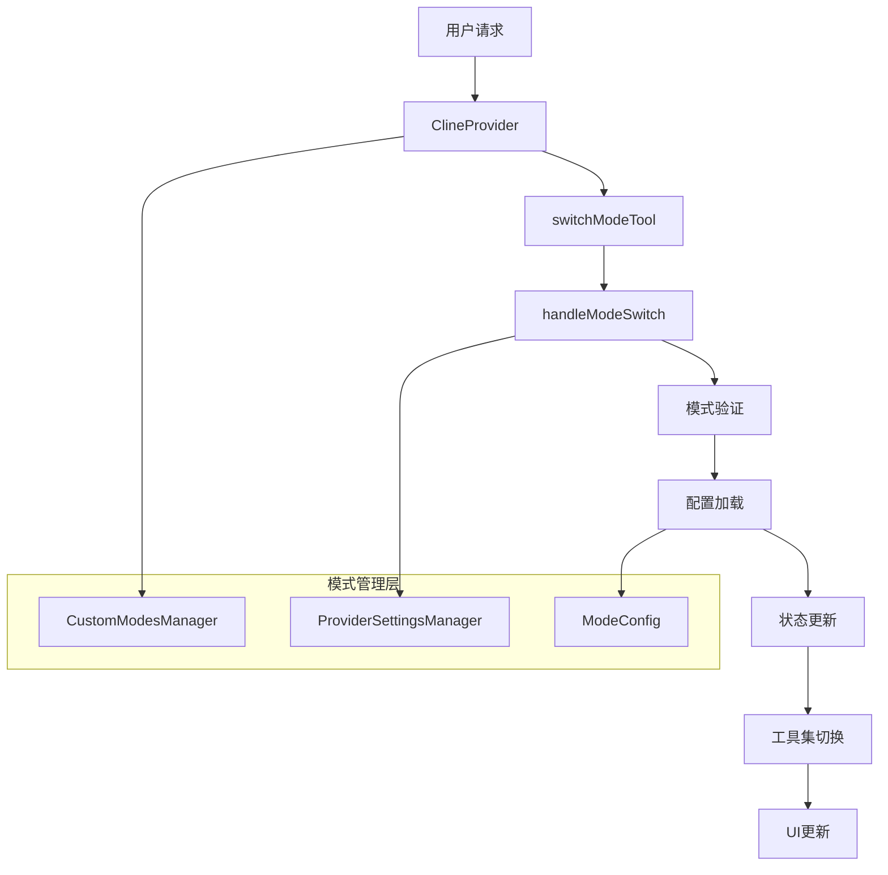
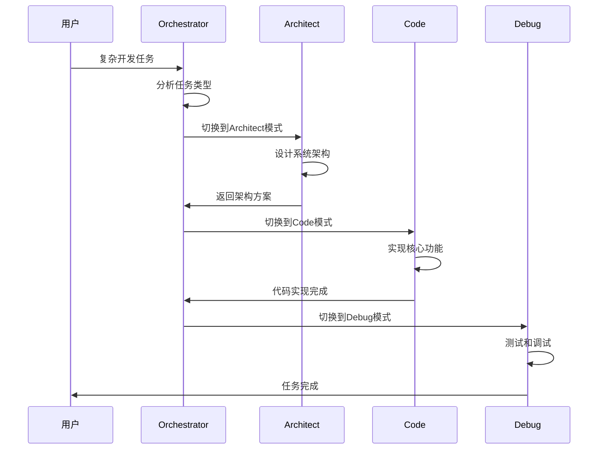

# Kilocode 模式切换与协同机制技术文档

## 1. 模式系统概述

Kilocode 采用了一个灵活的模式系统架构，允许用户在不同的工作模式之间无缝切换。该系统的核心设计理念是为不同类型的开发任务提供专门优化的AI助手行为。

### 1.1 架构设计



### 1.2 核心组件

- **ClineProvider**: 模式切换的协调中心
- **switchModeTool**: 模式切换工具的实现
- **CustomModesManager**: 自定义模式管理器
- **ProviderSettingsManager**: 提供商设置管理器
- **Task**: 任务执行实体，承载模式状态

## 2. 各模式详细说明

### 2.1 Code 模式

**用途**: 专注于代码编写、重构和优化
**特点**:

- 默认模式，具备完整的代码编辑能力
- 支持文件创建、修改、删除操作
- 集成代码分析和优化建议

**工具集**:

```typescript
// Code模式可用工具组
groups: ["read", "edit", "create", "terminal", "browser"]
```

### 2.2 Ask 模式

**用途**: 纯问答和咨询，不进行代码修改
**特点**:

- 只读模式，专注于提供建议和解答
- 不能修改文件或执行危险操作
- 适合代码审查和架构讨论

**工具集**:

```typescript
// Ask模式限制性工具组
groups: ["read", "browser"]
```

### 2.3 Debug 模式

**用途**: 专门用于调试和问题诊断
**特点**:

- 增强的错误分析能力
- 集成调试工具和日志分析
- 支持断点设置和变量检查

**工具集**:

```typescript
// Debug模式调试工具组
groups: ["read", "edit", "terminal", "debug"]
```

### 2.4 Architect 模式

**用途**: 系统架构设计和高层次规划
**特点**:

- 专注于架构设计和系统规划
- 提供技术选型建议
- 生成架构文档和设计图

**角色定义**:

```typescript
roleDefinition: "You are Kilo Code, a software architect specializing in system design..."
```

### 2.5 Orchestrator 模式

**用途**: 智能任务编排和模式协调
**特点**:

- 自动分析任务类型并选择最适合的模式
- 协调多个模式完成复杂任务
- 提供任务分解和执行计划

## 3. 模式切换机制

### 3.1 switchModeTool 实现

```typescript
export async function switchModeTool(
	cline: Task,
	block: ToolUse,
	askApproval: AskApproval,
	handleError: HandleError,
	pushToolResult: PushToolResult,
	removeClosingTag: RemoveClosingTag,
) {
	const mode_slug: string | undefined = block.params.mode_slug
	const reason: string | undefined = block.params.reason

	try {
		// 验证目标模式
		const targetMode = getModeBySlug(mode_slug, customModes)
		if (!targetMode) {
			throw new Error(`Unknown mode: ${mode_slug}`)
		}

		// 请求用户批准
		const completeMessage = JSON.stringify({
			tool: "switchMode",
			mode: mode_slug,
			reason,
		})
		const didApprove = await askApproval("tool", completeMessage)

		if (!didApprove) {
			return
		}

		// 执行模式切换
		await cline.providerRef.deref()?.handleModeSwitch(mode_slug)

		pushToolResult(`Successfully switched to ${targetMode.name} mode${reason ? ` because: ${reason}` : ""}.`)

		await delay(500) // 等待模式切换生效
	} catch (error) {
		// 错误处理逻辑
	}
}
```

### 3.2 ClineProvider.handleModeSwitch 方法

```typescript
async handleModeSwitch(newMode: string) {
    const currentTask = this.getCurrentTask()

    // 1. 更新任务模式
    if (currentTask) {
        // 记录遥测数据
        TelemetryService.instance.captureModeSwitch(currentTask.taskId, newMode)
        currentTask.emit(RooCodeEventName.TaskModeSwitched, currentTask.taskId, newMode)

        try {
            // 更新任务历史
            const history = this.getGlobalState("taskHistory") ?? []
            const taskHistoryItem = history.find((item) => item.id === currentTask.taskId)

            if (taskHistoryItem) {
                taskHistoryItem.mode = newMode
                await this.updateTaskHistory(taskHistoryItem)
            }

            // 更新任务内存状态
            (currentTask as any)._taskMode = newMode
        } catch (error) {
            this.log(`Failed to persist mode switch: ${error}`)
            throw error
        }
    }

    // 2. 更新全局模式状态
    await this.updateGlobalState("mode", newMode)
    this.emit(RooCodeEventName.ModeChanged, newMode)

    // 3. 加载模式专用配置
    const savedConfigId = await this.providerSettingsManager.getModeConfigId(newMode)
    const listApiConfig = await this.providerSettingsManager.listConfig()

    // 4. 应用配置
    if (savedConfigId) {
        const profile = listApiConfig.find(({ id }) => id === savedConfigId)
        if (profile?.name) {
            await this.activateProviderProfile({ name: profile.name })
        }
    } else {
        // 保存当前配置为新模式的默认配置
        const currentApiConfigName = this.getGlobalState("currentApiConfigName")
        if (currentApiConfigName) {
            const config = listApiConfig.find((c) => c.name === currentApiConfigName)
            if (config?.id) {
                await this.providerSettingsManager.setModeConfig(newMode, config.id)
            }
        }
    }

    // 5. 更新UI状态
    await this.postStateToWebview()
}
```

## 4. 模式协同工作流程

### 4.1 任务分解协同



### 4.2 智能模式选择

Orchestrator模式具备智能分析能力，能够根据任务特征自动选择最适合的模式：

```typescript
// 模式选择逻辑示例
function selectOptimalMode(taskDescription: string, context: TaskContext): string {
	if (taskDescription.includes("架构") || taskDescription.includes("设计")) {
		return "architect"
	}
	if (taskDescription.includes("调试") || taskDescription.includes("错误")) {
		return "debug"
	}
	if (taskDescription.includes("问题") && !taskDescription.includes("修改")) {
		return "ask"
	}
	return "code" // 默认模式
}
```

## 5. 配置管理

### 5.1 模式独立配置

每个模式都可以保存独立的API配置和提示词设置：

```typescript
// 模式配置结构
interface ModeConfig {
	slug: string // 模式标识符
	name: string // 显示名称
	description?: string // 描述
	roleDefinition: string // 角色定义
	customInstructions?: string // 自定义指令
	groups: readonly GroupEntry[] // 工具组
	whenToUse?: string // 使用场景
	source?: "built-in" | "custom" | "organization"
}
```

### 5.2 配置持久化

```typescript
// 保存模式配置
async setModeConfig(mode: string, configId: string) {
    const key = `modeConfig_${mode}`
    await this.context.globalState.update(key, configId)
}

// 加载模式配置
async getModeConfigId(mode: string): Promise<string | undefined> {
    const key = `modeConfig_${mode}`
    return this.context.globalState.get(key)
}
```

## 6. 技术实现细节

### 6.1 状态管理

模式切换涉及多层状态管理：

1. **全局状态**: 当前激活模式
2. **任务状态**: 任务级别的模式信息
3. **UI状态**: 界面显示和工具可用性
4. **配置状态**: 模式专用的API和提示词配置

### 6.2 事件系统

```typescript
// 模式切换事件
enum RooCodeEventName {
	ModeChanged = "modeChanged",
	TaskModeSwitched = "taskModeSwitched",
}

// 事件发布
this.emit(RooCodeEventName.ModeChanged, newMode)
task.emit(RooCodeEventName.TaskModeSwitched, task.taskId, newMode)
```

### 6.3 工具验证

```typescript
export function isToolAllowedForMode(
	tool: string,
	modeSlug: string,
	customModes: ModeConfig[],
	toolRequirements?: Record<string, boolean>,
	toolParams?: Record<string, any>,
): boolean {
	// 始终允许的工具
	if (ALWAYS_AVAILABLE_TOOLS.includes(tool as any)) {
		return true
	}

	// 获取模式配置
	const mode = getModeBySlug(modeSlug, customModes)
	if (!mode) {
		return false
	}

	// 检查工具是否在模式的工具组中
	return mode.groups.some((group) => {
		const groupName = getGroupName(group)
		const groupConfig = TOOL_GROUPS[groupName]
		return groupConfig.tools.includes(tool)
	})
}
```

### 6.4 文件访问控制

某些模式对文件操作有特殊限制：

```typescript
// 文件访问验证
export class FileRestrictionError extends Error {
	constructor(mode: string, pattern: string, description: string | undefined, filePath: string, tool?: string) {
		const toolInfo = tool ? `Tool '${tool}' in mode '${mode}'` : `This mode (${mode})`
		super(
			`${toolInfo} can only edit files matching pattern: ${pattern}${
				description ? ` (${description})` : ""
			}. Got: ${filePath}`,
		)
		this.name = "FileRestrictionError"
	}
}
```

## 7. 实际应用场景

### 7.1 场景一：全栈应用开发

```
1. Orchestrator 分析需求 → 制定开发计划
2. Architect 设计系统架构 → 确定技术栈
3. Code 实现前端界面 → 编写React组件
4. Code 开发后端API → 实现业务逻辑
5. Debug 测试和调试 → 修复问题
6. Ask 代码审查 → 提供优化建议
```

### 7.2 场景二：Bug修复流程

```
1. Debug 分析错误日志 → 定位问题根源
2. Ask 讨论解决方案 → 评估修复策略
3. Code 实施修复 → 修改相关代码
4. Debug 验证修复 → 确保问题解决
```

### 7.3 场景三：架构重构

```
1. Architect 评估现有架构 → 识别问题点
2. Architect 设计新架构 → 制定迁移计划
3. Code 逐步重构 → 实现新架构
4. Debug 测试兼容性 → 确保功能正常
```

## 8. 最佳实践

### 8.1 模式选择原则

- **明确任务类型**: 根据任务性质选择合适的模式
- **渐进式切换**: 复杂任务可以分阶段使用不同模式
- **配置复用**: 为常用模式保存专用配置

### 8.2 协同工作建议

- **利用Orchestrator**: 让AI自动选择最适合的模式
- **保持上下文**: 模式切换时保持任务连续性
- **及时切换**: 当前模式不适合时及时切换

### 8.3 性能优化

- **配置缓存**: 避免重复加载模式配置
- **状态同步**: 确保各层状态一致性
- **资源管理**: 及时清理不需要的模式资源

## 9. 总结

Kilocode的模式系统通过精心设计的切换机制和协同流程，为用户提供了灵活而强大的AI辅助开发体验。每个模式都有其专门的优势和适用场景，通过智能的模式切换和协同工作，能够高效地完成各种复杂的开发任务。

该系统的核心优势在于：

- **专业化**: 每个模式针对特定任务类型优化
- **灵活性**: 支持动态切换和自定义配置
- **智能化**: Orchestrator模式提供智能任务编排
- **一致性**: 统一的状态管理和事件系统
- **可扩展性**: 支持自定义模式和组织级配置

通过深入理解这些机制，开发者可以更好地利用Kilocode的强大功能，提升开发效率和代码质量。
