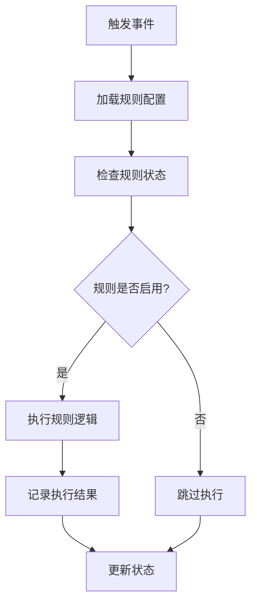

# Kilocode 平台规则引擎和工作流引擎技术文档

## 目录

1. [文档概述](#文档概述)
2. [版本历史](#版本历史)
3. [规则引擎](#规则引擎)
4. [工作流引擎](#工作流引擎)
5. [系统集成](#系统集成)
6. [API 文档](#api-文档)
7. [安全和权限控制](#安全和权限控制)
8. [性能优化](#性能优化)
9. [故障排除](#故障排除)
10. [已知问题和限制](#已知问题和限制)

## 文档概述

本文档详细介绍了 Kilocode 平台中规则引擎和工作流引擎的技术实现、使用方法和集成指南。Kilocode 平台提供了强大的规则和工作流管理系统，支持全局和项目级别的配置，帮助开发者自动化代码质量检查、翻译管理和开发流程。

### 核心特性

- **双层级管理**：支持全局和项目级别的规则/工作流

- **灵活格式**：支持 Markdown (.md) 和文本 (.txt) 格式

- **状态管理**：提供启用/禁用状态控制

- **VSCode 集成**：深度集成 VSCode 扩展生态

- **实时同步**：支持配置的实时更新和同步

## 版本历史

| 版本  | 日期    | 更新内容                       |
| ----- | ------- | ------------------------------ |
| 1.0.0 | 2024-01 | 初始版本，基础规则和工作流功能 |
| 1.1.0 | 2024-02 | 增加全局/项目级别支持          |
| 1.2.0 | 2024-03 | 优化状态管理和持久化           |

## 规则引擎

### 规则定义语法和格式规范

#### 支持的文件格式

Kilocode 规则引擎支持以下文件格式：

- **Markdown 格式** (`.md`)：推荐用于复杂规则定义

- **文本格式** (`.txt`)：适用于简单规则配置

#### Markdown 规则格式规范

````markdown
# 规则名称

## 描述

规则的详细描述和用途说明

## 触发条件

- 条件1：具体的触发场景
- 条件2：相关的文件类型或操作

## 执行动作

- 动作1：具体的执行步骤
- 动作2：相关的处理逻辑

## 示例

```javascript
// 示例代码
console.log("规则执行示例")
```
````

## 配置参数

- `parameter1`: 参数说明

- `parameter2`: 参数说明

````

#### 文本规则格式规范

```text
规则名称: [规则名称]
描述: [规则描述]
触发条件: [触发条件]
执行动作: [执行动作]
优先级: [1-10]
状态: [enabled/disabled]
````

### 规则文件存储位置和命名约定

#### 存储位置

**全局规则目录**：

```
~/.kilocode/rules/
```

**项目规则目录**：

```
[项目根目录]/.kilocode/rules/
```

#### 命名约定

- **文件命名**：使用小写字母和连字符，如 `code-quality.md`

- **规则标识**：文件名即为规则标识符

- **分类前缀**：可使用前缀进行分类，如 `lint-`, `test-`, `i18n-`

#### 目录结构示例

```
.kilocode/
├── rules/
│   ├── code-quality.md          # 代码质 量规则
│   ├── test-coverage.md         # 测试覆盖率规则
│   ├── lint-typescript.md       # TypeScript 检查规则
│   └── i18n-translation.txt     # 国际化翻译规则
└── workflows/
    ├── add-missing-translations.md
    └── code-review-process.md
```

### 规则触发条件和执行流程

#### 触发机制

1. **文件变更触发**：监听文件系统变更事件
2. **命令触发**：通过 VSCode 命令面板手动触发
3. **定时触发**：基于配置的定时执行
4. **事件触发**：响应特定的编辑器事件

#### 执行流程



#### 规则优先级

- **全局规则**：优先级 1-5

- **项目规则**：优先级 6-10

- **用户自定义**：优先级 11-15

### 规则调试和测试方法

#### 调试模式

启用调试模式：

```json
{
	"kilocode.rules.debug": true,
	"kilocode.rules.verbose": true
}
```

#### 测试工具

```javascript
// 规则测试示例
const { testRule } = require("@kilocode/rule-engine")

describe("代码质量规则测试", () => {
	test("应该检测到未使用的变量", async () => {
		const result = await testRule("code-quality", {
			file: "test.ts",
			content: "const unusedVar = 123;",
		})

		expect(result.violations).toHaveLength(1)
		expect(result.violations[0].type).toBe("unused-variable")
	})
})
```

## 工作流引擎

### 工作流设计和配置方法

#### 工作流定义格式

````markdown
# 工作流名称

## 描述

工作流的用途和执行场景

## 触发条件

- 手动触发
- 文件变更触发
- 定时触发

## 执行步骤

### 步骤1：初始化

- 检查环境配置
- 加载必要的依赖

### 步骤2：执行主逻辑

- 具体的处理逻辑
- 调用相关工具

### 步骤3：结果处理

- 生成执行报告
- 更新相关状态

## 配置参数

```json
{
	"timeout": 30000,
	"retryCount": 3,
	"parallel": false
}
```
````

## 依赖工具

- `scripts/find-missing-translations.js`

- 其他相关脚本或工具

````

#### 配置示例：翻译缺失检查工作流

```markdown
# 添加缺失翻译

## 描述
自动检测和添加项目中缺失的翻译条目

## 触发条件
- 手动触发：通过命令面板执行
- 文件变更：i18n 相关文件修改时

## 执行步骤

### 步骤1：扫描缺失翻译
使用 `scripts/find-missing-translations.js` 脚本扫描项目

### 步骤2：生成翻译任务
为每个语言和 JSON 文件创建翻译子任务

### 步骤3：执行翻译
切换到 Translate 模式执行翻译任务

## 配置参数
```json
{
  "languages": ["en", "zh", "ja", "ko"],
  "excludeFiles": ["test/**", "node_modules/**"],
  "autoTranslate": false
}
````

````

### 节点类型及其功能说明

#### 基础节点类型

1. **开始节点 (Start)**
   - 功能：工作流入口点
   - 配置：触发条件、初始参数
   - 输出：初始化上下文

2. **处理节点 (Process)**
   - 功能：执行具体的业务逻辑
   - 配置：处理脚本、参数映射
   - 输出：处理结果和状态

3. **条件节点 (Condition)**
   - 功能：基于条件进行流程分支
   - 配置：判断条件、分支路径
   - 输出：分支选择结果

4. **并行节点 (Parallel)**
   - 功能：并行执行多个子流程
   - 配置：并行度、同步策略
   - 输出：合并后的结果

5. **结束节点 (End)**
   - 功能：工作流结束点
   - 配置：结果处理、清理操作
   - 输出：最终执行结果

#### 专用节点类型

1. **脚本执行节点 (Script)**
   ```json
   {
     "type": "script",
     "config": {
       "scriptPath": "scripts/find-missing-translations.js",
       "args": ["--format", "json"],
       "timeout": 30000
     }
   }
````

1. **模式切换节点 (ModeSwitch)**

    ```json
    {
    	"type": "modeSwitch",
    	"config": {
    		"targetMode": "Translate",
    		"context": "translation-task"
    	}
    }
    ```

2. **文件操作节点 (FileOperation)**

    ```json
    {
    	"type": "fileOperation",
    	"config": {
    		"operation": "read|write|delete",
    		"path": "src/i18n/en.json",
    		"encoding": "utf8"
    	}
    }
    ```

### 流程变量和上下文传递机制

#### 上下文结构

```typescript
interface WorkflowContext {
	// 全局变量
	global: Record<string, any>

	// 步骤间传递的变量
	stepData: Record<string, any>

	// 执行环境信息
	environment: {
		workspaceRoot: string
		currentFile?: string
		selectedText?: string
	}

	// 执行状态
	execution: {
		startTime: number
		currentStep: string
		errors: Error[]
	}
}
```

#### 变量传递示例

```javascript
// 步骤1：扫描缺失翻译
const scanResult = await executeScript("find-missing-translations.js")
context.stepData.missingTranslations = scanResult

// 步骤2：处理每个语言
for (const language of context.stepData.missingTranslations.languages) {
	context.stepData.currentLanguage = language
	await executeNextStep(context)
}
```

### 异常处理和重试策略

#### 异常处理配置

```json
{
	"errorHandling": {
		"strategy": "retry|skip|abort",
		"retryCount": 3,
		"retryDelay": 1000,
		"fallbackAction": "log|notify|rollback"
	}
}
```

#### 重试策略实现

```javascript
async function executeWithRetry(action, config) {
	let lastError

	for (let i = 0; i < config.retryCount; i++) {
		try {
			return await action()
		} catch (error) {
			lastError = error

			if (i < config.retryCount - 1) {
				await delay(config.retryDelay * Math.pow(2, i)) // 指数退避
			}
		}
	}

	throw lastError
}
```

## 系统集成

### 规则和工作流代码调用接口

#### 核心 API 接口

```typescript
// 规则管理接口
interface RuleManager {
	// 获取启用的规则
	getEnabledRules(scope: "global" | "workspace"): Promise<Rule[]>

	// 切换规则状态
	toggleRule(ruleId: string, enabled: boolean): Promise<void>

	// 创建新规则
	createRule(template: RuleTemplate): Promise<string>

	// 删除规则
	deleteRule(ruleId: string): Promise<void>
}

// 工作流管理接口
interface WorkflowManager {
	// 获取启用的工作流
	getEnabledWorkflows(scope: "global" | "workspace"): Promise<Workflow[]>

	// 执行工作流
	executeWorkflow(workflowId: string, context?: any): Promise<WorkflowResult>

	// 切换工作流状态
	toggleWorkflow(workflowId: string, enabled: boolean): Promise<void>

	// 创建新工作流
	createWorkflow(template: WorkflowTemplate): Promise<string>
}
```

#### 使用示例

```typescript
import { getRuleManager, getWorkflowManager } from "@kilocode/engine"

// 获取管理器实例
const ruleManager = getRuleManager()
const workflowManager = getWorkflowManager()

// 获取启用的规则
const enabledRules = await ruleManager.getEnabledRules("workspace")

// 执行工作流
const result = await workflowManager.executeWorkflow("add-missing-translations", {
	targetLanguages: ["en", "zh"],
})
```

### 依赖库和版本要求

#### 核心依赖

```json
{
	"dependencies": {
		"@types/vscode": "^1.74.0",
		"vscode": "^1.74.0",
		"typescript": "^4.9.0",
		"node": ">=16.0.0"
	},
	"devDependencies": {
		"@types/node": "^18.0.0",
		"vitest": "^0.28.0",
		"eslint": "^8.0.0"
	}
}
```

#### 运行时要求

- **Node.js**: >= 16.0.0

- **VSCode**: >= 1.74.0

- **TypeScript**: >= 4.9.0

- **操作系统**: Windows 10+, macOS 10.15+, Linux (Ubuntu 18.04+)

### 与现有系统的集成方式

#### VSCode 扩展集成

```typescript
// extension.ts
import * as vscode from "vscode"
import { initializeRuleEngine, initializeWorkflowEngine } from "./engines"

export function activate(context: vscode.ExtensionContext) {
	// 初始化引擎
	const ruleEngine = initializeRuleEngine(context)
	const workflowEngine = initializeWorkflowEngine(context)

	// 注册命令
	const disposables = [
		vscode.commands.registerCommand("kilocode.rules.toggle", async (ruleId) => {
			await ruleEngine.toggleRule(ruleId)
		}),

		vscode.commands.registerCommand("kilocode.workflows.execute", async (workflowId) => {
			await workflowEngine.executeWorkflow(workflowId)
		}),
	]

	context.subscriptions.push(...disposables)
}
```

#### 配置文件集成

```json
// .vscode/settings.json
{
	"kilocode.rules.enabled": true,
	"kilocode.rules.globalPath": "~/.kilocode/rules",
	"kilocode.rules.workspacePath": ".kilocode/rules",
	"kilocode.workflows.enabled": true,
	"kilocode.workflows.autoExecute": false,
	"kilocode.workflows.timeout": 30000
}
```

## API 文档

### 规则引擎 API

#### getRulesFromDirectory

获取指定目录下的所有规则文件。

```typescript
function getRulesFromDirectory(directory: string, allowedExtensions: string[] = [".md", ".txt"]): Promise<string[]>
```

**参数**：

- `directory`: 规则文件目录路径

- `allowedExtensions`: 允许的文件扩展名

**返回值**：规则文件路径数组

**示例**：

```typescript
const rules = await getRulesFromDirectory(".kilocode/rules")
console.log(rules) // ['.kilocode/rules/code-quality.md', ...]
```

#### getEnabledRules

获取启用状态的规则列表。

```typescript
function getEnabledRules(context: vscode.ExtensionContext, scope: "global" | "workspace" = "workspace"): Promise<Rule[]>
```

**参数**：

- `context`: VSCode 扩展上下文

- `scope`: 规则作用域

**返回值**：启用的规则对象数组

#### toggleRuleEnabled

切换规则的启用状态。

```typescript
function toggleRuleEnabled(context: vscode.ExtensionContext, ruleId: string, enabled: boolean): Promise<void>
```

### 工作流引擎 API

#### getEnabledWorkflows

获取启用状态的工作流列表。

```typescript
function getEnabledWorkflows(
	context: vscode.ExtensionContext,
	scope: "global" | "workspace" = "workspace",
): Promise<Workflow[]>
```

#### executeWorkflow

执行指定的工作流。

```typescript
function executeWorkflow(workflowId: string, context: WorkflowContext): Promise<WorkflowResult>
```

**参数**：

- `workflowId`: 工作流标识符

- `context`: 执行上下文

**返回值**：工作流执行结果

```typescript
interface WorkflowResult {
	success: boolean
	duration: number
	steps: StepResult[]
	errors: Error[]
	output: any
}
```

### 文件操作 API

#### createRuleFile

创建新的规则文件。

```typescript
function createRuleFile(filePath: string, template: RuleTemplate): Promise<void>
```

#### createWorkflowFile

创建新的工作流文件。

```typescript
function createWorkflowFile(filePath: string, template: WorkflowTemplate): Promise<void>
```

## 安全和权限控制

### 文件系统权限

- **读取权限**：规则和工作流文件需要读取权限

- **写入权限**：创建和修改配置文件需要写入权限

- **执行权限**：执行脚本和命令需要相应权限

### 安全策略

1. **路径验证**：严格验证文件路径，防止路径遍历攻击
2. **内容过滤**：过滤危险的脚本内容和命令
3. **权限隔离**：不同作用域的规则和工作流权限隔离
4. **审计日志**：记录所有规则和工作流的执行日志

### 配置安全

```json
{
	"kilocode.security.allowedPaths": [".kilocode/**", "scripts/**"],
	"kilocode.security.blockedCommands": ["rm -rf", "del /f", "format"],
	"kilocode.security.sandboxMode": true
}
```

## 性能优化

### 缓存策略

1. **规则缓存**：缓存已解析的规则配置
2. **执行结果缓存**：缓存工作流执行结果
3. **文件监听优化**：使用高效的文件变更监听机制

### 并发控制

```typescript
// 并发执行控制
const concurrencyLimit = 3
const semaphore = new Semaphore(concurrencyLimit)

async function executeWorkflowWithLimit(workflowId: string) {
	await semaphore.acquire()
	try {
		return await executeWorkflow(workflowId)
	} finally {
		semaphore.release()
	}
}
```

### 内存管理

- **及时清理**：执行完成后及时清理临时数据

- **内存监控**：监控内存使用情况，防止内存泄漏

- **分页加载**：大量规则和工作流采用分页加载

## 故障排除

### 常见问题

#### 规则不生效

**症状**：规则配置正确但不执行

**排查步骤**：

1. 检查规则是否启用：`kilocode.rules.list`
2. 验证文件路径和权限
3. 查看执行日志：`kilocode.logs.show`
4. 检查触发条件是否满足

#### 工作流执行失败

**症状**：工作流执行中断或报错

**排查步骤**：

1. 检查依赖脚本是否存在
2. 验证执行权限
3. 查看详细错误信息
4. 检查超时配置

### 调试工具

#### 日志查看

```bash
# 查看规则引擎日志
kilocode logs --component=rules --level=debug

# 查看工作流引擎日志
kilocode logs --component=workflows --level=info
```

#### 状态检查

```bash
# 检查规则状态
kilocode rules status

# 检查工作流状态
kilocode workflows status
```

## 已知问题和限制

### 当前限制

1. **文件格式限制**：仅支持 `.md` 和 `.txt` 格式
2. **并发限制**：同时执行的工作流数量有限制
3. **内存限制**：大型项目可能遇到内存使用限制
4. **平台限制**：某些功能在不同操作系统上表现不一致

### 已知问题

1. **Issue #001**：Windows 路径分隔符兼容性问题

    - **影响**：Windows 系统下路径解析可能失败

    - **临时解决方案**：使用正斜杠作为路径分隔符

    - **计划修复版本**：v1.3.0

2. **Issue #002**：大文件处理性能问题

    - **影响**：处理大型翻译文件时可能超时

    - **临时解决方案**：增加超时时间配置

    - **计划修复版本**：v1.4.0

3. **Issue #003**：并发执行时的状态同步问题

    - **影响**：多个工作流同时执行时可能出现状态不一致

    - **临时解决方案**：避免同时执行相关工作流

    - **计划修复版本**：v1.3.1

### 功能路线图

- **v1.3.0**：增加更多文件格式支持，优化 Windows 兼容性

- **v1.4.0**：性能优化，支持大文件处理

- **v1.5.0**：增加可视化工作流编辑器

- **v2.0.0**：支持自定义节点类型和插件系统

---

## 联系和支持

如有问题或建议，请通过以下方式联系：

- **GitHub Issues**: \[项目 Issues 页面]

- **文档更新**: 请提交 Pull Request

- **技术支持**: 查看项目 Wiki 或讨论区

---

_本文档最后更新时间：2024年3月_
