# Kilocode 工作原理文档

## 1. Kilocode 概述

### 1.1 什么是 Kilocode

Kilocode 是一个基于 VSCode 的智能代码助手扩展，它集成了 Claude AI 模型，为开发者提供全方位的编程辅助服务。与传统的代码补全工具不同，Kilocode 能够理解复杂的开发任务，自主执行代码编写、文件操作、终端命令等操作，真正实现了"AI 驱动的开发工作流"。

### 1.2 核心功能和特性

- **智能任务理解**：通过自然语言描述复杂的开发需求
- **自主代码生成**：基于上下文生成高质量的代码
- **多模态支持**：支持文本、图像等多种输入形式
- **工具系统**：内置丰富的开发工具，支持文件编辑、终端操作、代码搜索等
- **检查点机制**：支持任务状态保存和恢复
- **上下文管理**：智能管理代码上下文，提供精准的代码建议
- **安全控制**：细粒度的权限控制和组织级别限制

### 1.3 与传统代码助手的区别

| 特性       | 传统代码助手       | Kilocode         |
| ---------- | ------------------ | ---------------- |
| 交互方式   | 代码补全、简单问答 | 自然语言任务描述 |
| 执行能力   | 仅提供建议         | 自主执行操作     |
| 上下文理解 | 局部代码片段       | 全项目上下文     |
| 任务复杂度 | 简单代码片段       | 复杂开发任务     |
| 持久化     | 无状态             | 支持任务状态保存 |

## 2. 整体架构和工作流程

### 2.1 扩展激活流程

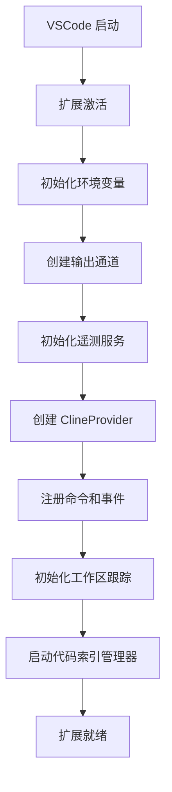

### 2.2 主要组件交互关系

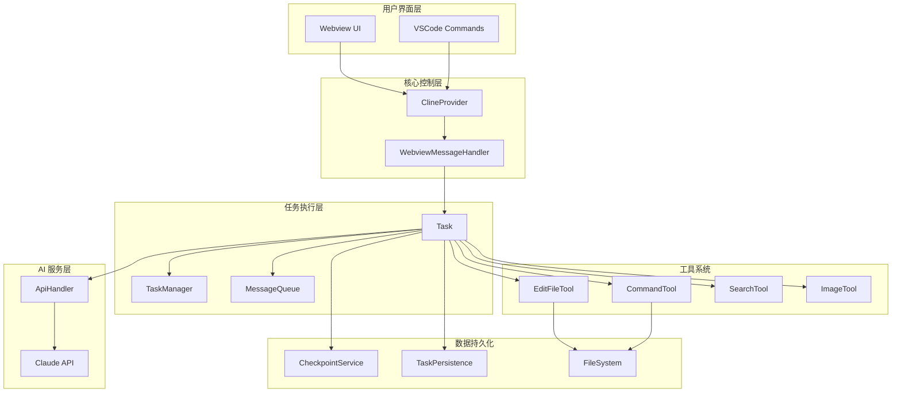

### 2.3 任务生命周期管理

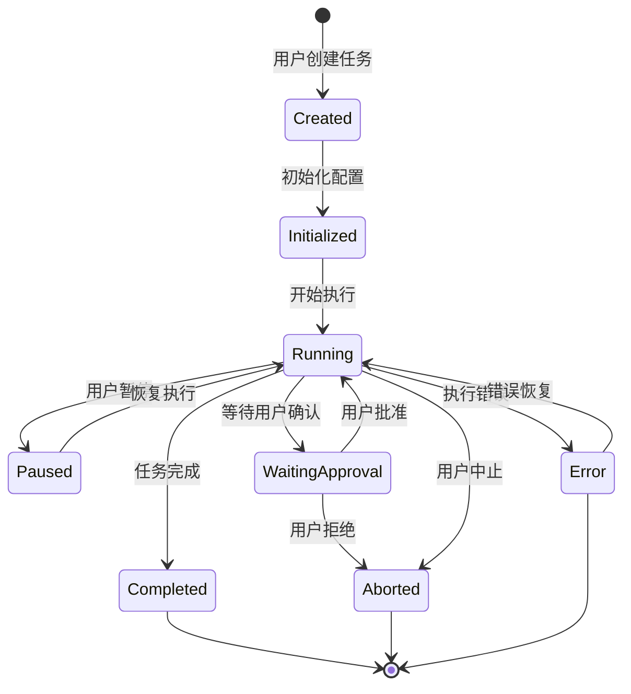

## 3. 核心工作原理

### 3.1 任务创建和管理（Task 类）

Task 类是 Kilocode 的核心执行单元，负责管理单个开发任务的完整生命周期：

#### 3.1.1 Task 类结构

```typescript
export class Task extends EventEmitter<TaskEvents> implements TaskLike {
	// 任务标识
	readonly taskId: string
	readonly rootTaskId?: string
	readonly parentTaskId?: string

	// 任务状态
	abort: boolean = false
	isPaused: boolean = false
	isInitialized = false

	// AI 交互
	api: ApiHandler
	apiConversationHistory: ApiMessage[] = []
	clineMessages: ClineMessage[] = []

	// 工具系统
	toolUsage: ToolUsage = {}
	consecutiveMistakeCount: number = 0

	// 上下文管理
	fileContextTracker: FileContextTracker
	urlContentFetcher: UrlContentFetcher

	// 检查点系统
	enableCheckpoints: boolean
	checkpointService?: RepoPerTaskCheckpointService
}
```

#### 3.1.2 任务执行流程

1. **任务初始化**：设置 API 配置、工具注册、上下文准备
2. **消息处理**：解析用户输入，构建 AI 对话上下文
3. **AI 交互**：调用 Claude API 获取响应和工具调用
4. **工具执行**：根据 AI 响应执行相应的工具操作
5. **结果反馈**：将执行结果反馈给 AI 和用户
6. **状态更新**：更新任务状态，保存检查点

### 3.2 AI 交互机制（Claude API 集成）

#### 3.2.1 API 处理流程

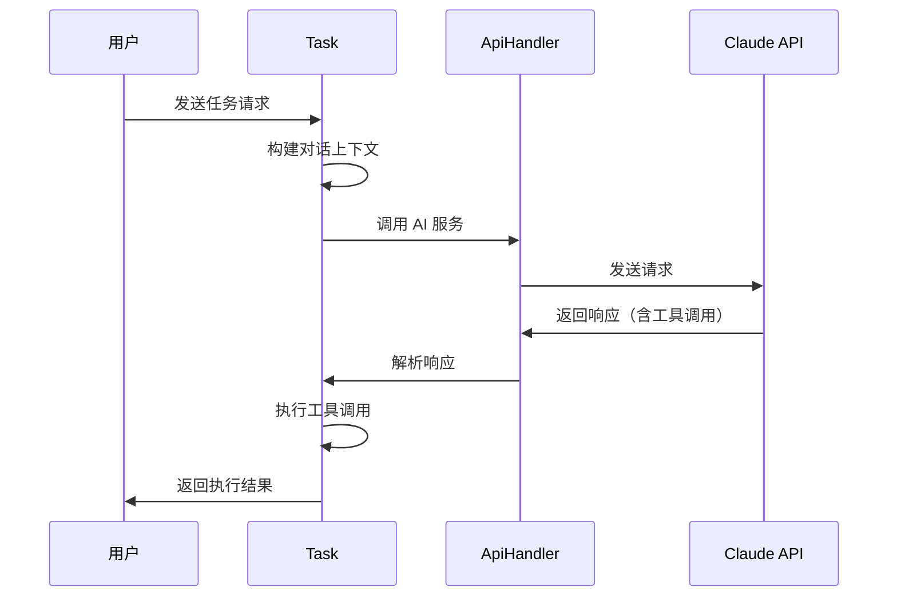

#### 3.2.2 上下文管理策略

- **智能压缩**：当上下文超出限制时，自动压缩历史对话
- **相关性过滤**：只保留与当前任务相关的上下文信息
- **分层存储**：区分系统提示、用户输入、AI 响应等不同层级

### 3.3 工具系统（Tools）

Kilocode 内置了丰富的工具系统，每个工具都有特定的功能和安全控制：

#### 3.3.1 核心工具类型

- **文件操作工具**：`editFileTool`、`readFileTool`、`createFileTool`
- **终端工具**：`executeCommandTool`、`terminalTool`
- **搜索工具**：`searchFilesTool`、`regexSearchTool`
- **多媒体工具**：`generateImageTool`、`computerTool`
- **任务管理工具**：`newTaskTool`、`attemptCompletionTool`

#### 3.3.2 工具执行机制

```typescript
// 工具验证和执行流程
async function executeToolUse(toolUse: ToolUse, task: Task): Promise<ToolResult> {
	// 1. 工具验证
	const validation = await validateToolUse(toolUse, task)
	if (!validation.isValid) {
		return { error: validation.error }
	}

	// 2. 权限检查
	const hasPermission = await checkToolPermission(toolUse, task)
	if (!hasPermission) {
		return { error: "Permission denied" }
	}

	// 3. 执行工具
	const result = await tools[toolUse.name].execute(toolUse.input, task)

	// 4. 结果处理
	return processToolResult(result, task)
}
```

### 3.4 代码生成和编辑

#### 3.4.1 文件编辑流程

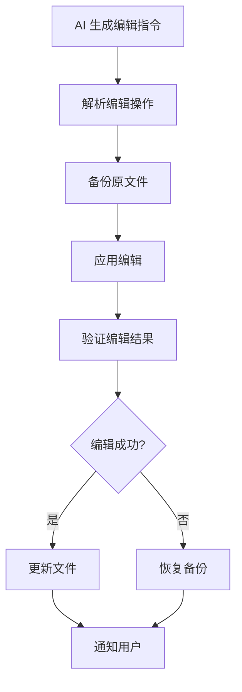

#### 3.4.2 编辑策略

- **精确编辑**：基于行号和内容匹配的精确替换
- **模糊匹配**：当精确匹配失败时，使用模糊匹配算法
- **差异预览**：在应用编辑前显示差异预览
- **回滚机制**：支持编辑操作的撤销和恢复

### 3.5 上下文管理

#### 3.5.1 上下文收集

- **文件上下文**：当前编辑的文件内容
- **项目上下文**：项目结构、配置文件、依赖关系
- **历史上下文**：之前的对话历史和操作记录
- **环境上下文**：开发环境信息、终端状态等

#### 3.5.2 上下文优化

```typescript
class FileContextTracker {
	// 跟踪文件访问模式
	trackFileAccess(filePath: string, accessType: "read" | "write" | "execute")

	// 计算文件相关性得分
	calculateRelevanceScore(filePath: string, currentTask: string): number

	// 智能选择相关文件
	selectRelevantFiles(maxTokens: number): string[]
}
```

### 3.6 检查点和持久化

#### 3.6.1 检查点机制

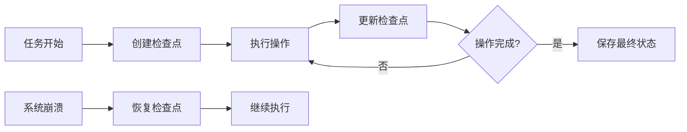

#### 3.6.2 持久化策略

- **增量保存**：只保存变更的部分，减少存储开销
- **压缩存储**：对历史数据进行压缩存储
- **版本管理**：支持多版本检查点，便于回滚
- **自动清理**：定期清理过期的检查点数据

## 4. 关键技术实现

### 4.1 Webview 通信机制

#### 4.1.1 通信架构

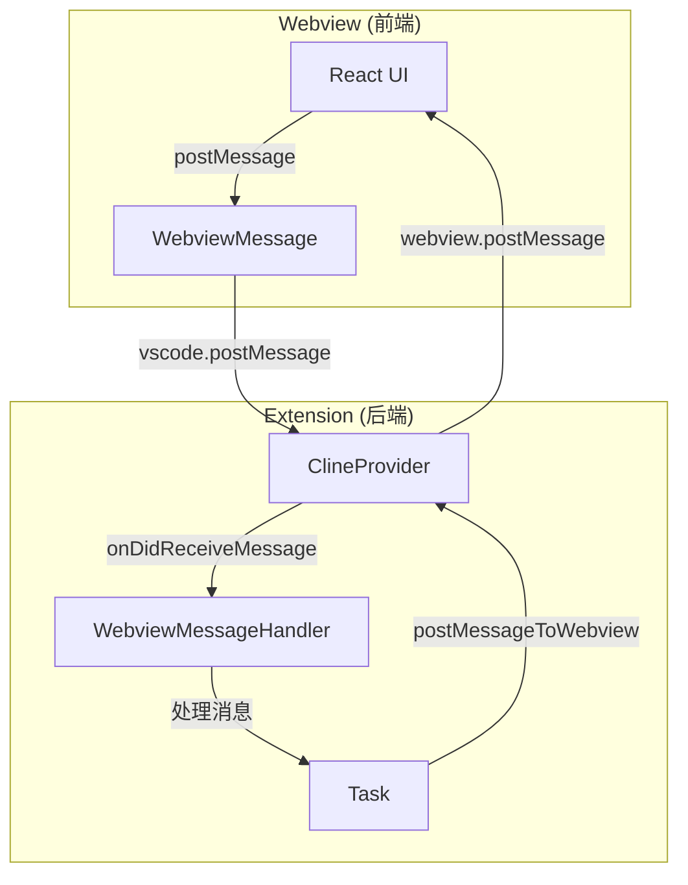

#### 4.1.2 消息类型

```typescript
type WebviewMessage =
	| { type: "newTask"; text: string; images?: string[] }
	| { type: "askResponse"; askResponse: ClineAskResponse }
	| { type: "clearTask" }
	| { type: "didShowAnnouncement"; announcementId: string }
	| { type: "selectImages"; images?: string[] }
	| { type: "exportCurrentTask" }
// ... 更多消息类型
```

### 4.2 终端集成

#### 4.2.1 终端管理

```typescript
class TerminalRegistry {
	private static terminals: Map<string, Terminal> = new Map()

	static createTerminal(name: string, cwd?: string): Terminal {
		const terminal = new Terminal(name, cwd)
		this.terminals.set(terminal.id, terminal)
		return terminal
	}

	static executeCommand(command: string, cwd?: string): Promise<CommandResult> {
		// 执行终端命令并返回结果
	}
}
```

#### 4.2.2 命令执行安全

- **命令白名单**：只允许执行预定义的安全命令
- **权限验证**：检查用户对特定命令的执行权限
- **沙盒执行**：在受限环境中执行潜在危险命令
- **审计日志**：记录所有命令执行历史

### 4.3 文件系统操作

#### 4.3.1 文件操作抽象

```typescript
interface FileOperations {
	readFile(path: string): Promise<string>
	writeFile(path: string, content: string): Promise<void>
	createFile(path: string, content: string): Promise<void>
	deleteFile(path: string): Promise<void>
	listDirectory(path: string): Promise<string[]>
}
```

#### 4.3.2 安全控制

- **路径验证**：防止路径遍历攻击
- **权限检查**：验证文件访问权限
- **备份机制**：重要文件操作前自动备份
- **操作日志**：记录所有文件操作历史

### 4.4 代码索引和搜索

#### 4.4.1 索引构建

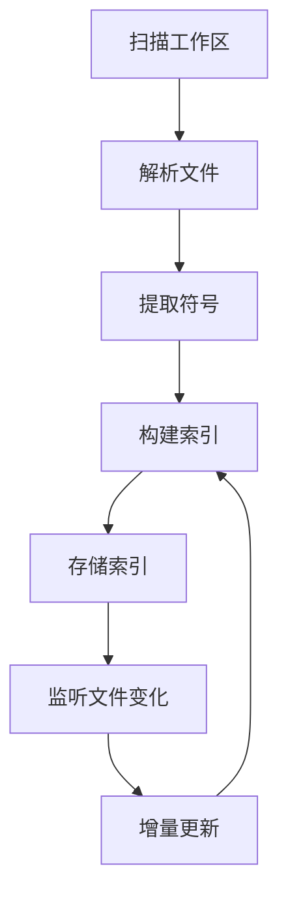

#### 4.4.2 搜索优化

- **语义搜索**：基于代码语义的智能搜索
- **模糊匹配**：支持拼写错误和部分匹配
- **相关性排序**：根据上下文相关性排序结果
- **缓存机制**：缓存常用搜索结果

### 4.5 多模态支持（文本、图像）

#### 4.5.1 图像处理

```typescript
class ImageProcessor {
	// 图像编码为 base64
	encodeImage(imagePath: string): Promise<string>

	// 图像压缩和优化
	optimizeImage(imageData: string, maxSize: number): Promise<string>

	// 图像内容分析
	analyzeImage(imageData: string): Promise<ImageAnalysis>
}
```

#### 4.5.2 多模态交互

- **图像理解**：AI 可以理解和分析图像内容
- **图像生成**：根据描述生成图像
- **混合输入**：支持文本和图像的混合输入
- **上下文关联**：图像与代码上下文的智能关联

## 5. 用户交互流程

### 5.1 用户发起任务

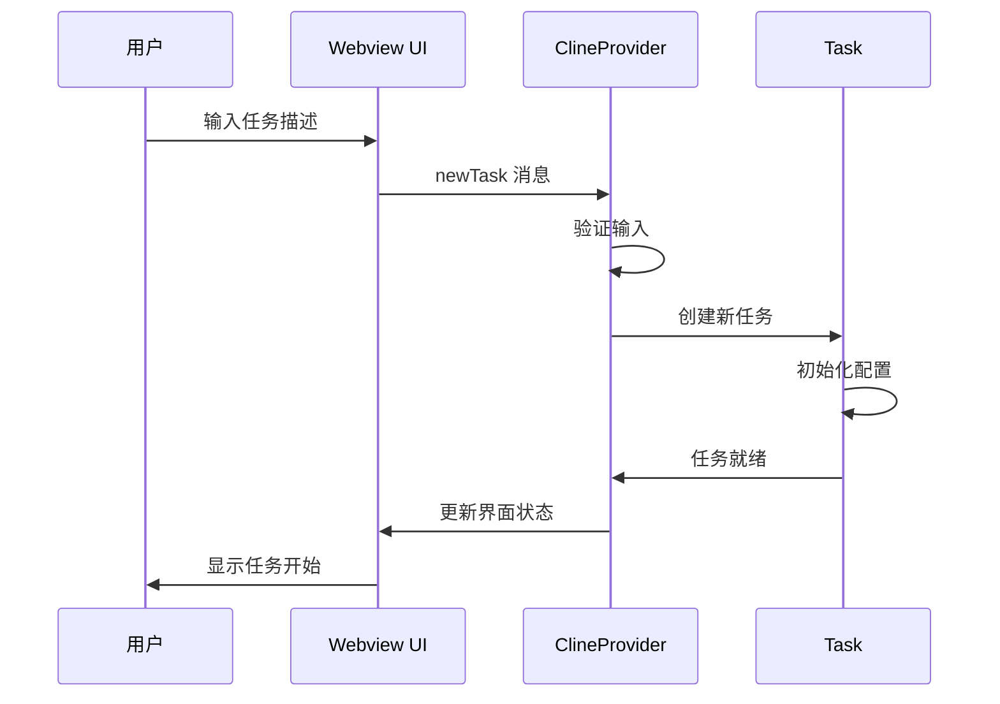

### 5.2 AI 理解和规划

1. **需求分析**：解析用户的自然语言描述
2. **任务分解**：将复杂任务分解为可执行的步骤
3. **工具选择**：选择合适的工具来完成每个步骤
4. **执行计划**：制定详细的执行计划

### 5.3 工具执行和反馈

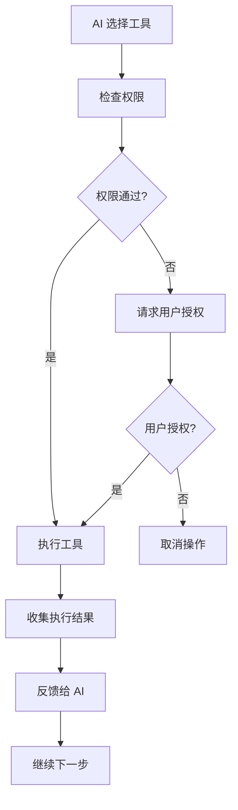

### 5.4 结果展示和确认

- **实时反馈**：实时显示执行进度和结果
- **差异预览**：显示代码变更的差异
- **确认机制**：重要操作需要用户确认
- **撤销支持**：支持操作的撤销和重做

## 6. 安全和权限控制

### 6.1 命令执行权限

#### 6.1.1 权限层级

```typescript
enum PermissionLevel {
	DENIED = 0, // 拒绝执行
	ASK_USER = 1, // 需要用户确认
	ALLOWED = 2, // 允许执行
	AUTO_APPROVED = 3, // 自动批准
}
```

#### 6.1.2 权限检查流程

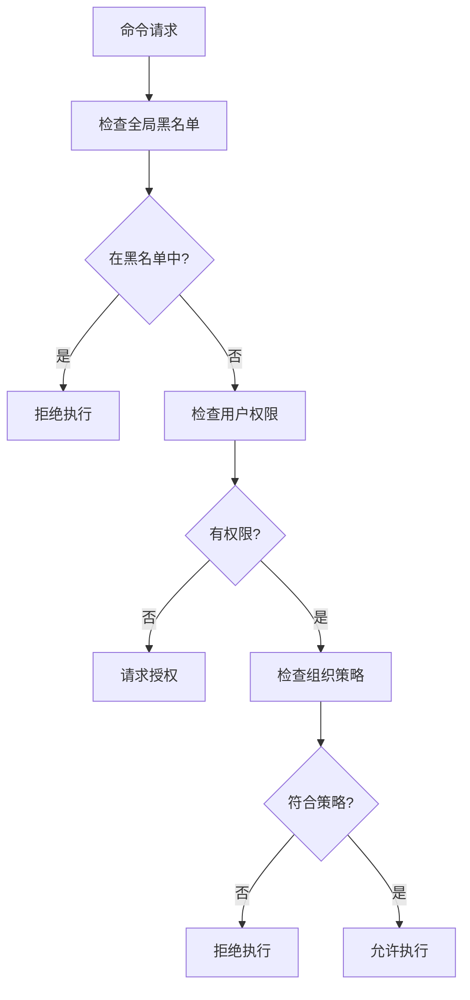

### 6.2 文件访问控制

- **工作区限制**：只能访问当前工作区内的文件
- **敏感文件保护**：保护系统文件和配置文件
- **读写权限分离**：区分读取和写入权限
- **备份保护**：重要文件修改前自动备份

### 6.3 组织级别限制

```typescript
interface OrganizationPolicy {
	allowedCommands: string[] // 允许的命令列表
	blockedPaths: string[] // 禁止访问的路径
	requireApproval: string[] // 需要审批的操作
	maxTokensPerTask: number // 单任务最大 token 数
	maxTasksPerDay: number // 每日最大任务数
}
```

## 7. 核心组件详解

### 7.1 ClineProvider - 核心提供者

ClineProvider 是整个系统的核心控制器，负责：

#### 7.1.1 主要职责

- **Webview 管理**：创建和管理用户界面
- **任务调度**：管理任务的创建、执行和销毁
- **状态同步**：在前端和后端之间同步状态
- **事件处理**：处理用户交互和系统事件
- **资源管理**：管理扩展资源和生命周期

#### 7.1.2 关键方法

```typescript
class ClineProvider {
	// 创建新任务
	async createTask(task?: string, images?: string[]): Promise<void>

	// 处理 webview 消息
	private setWebviewMessageListener(webview: vscode.Webview): void

	// 发送消息到 webview
	async postMessageToWebview(message: ExtensionMessage): Promise<void>

	// 获取当前状态
	async getState(): Promise<ExtensionState>
}
```

### 7.2 Task - 任务执行单元

Task 类是任务执行的核心，每个 Task 实例代表一个独立的开发任务：

#### 7.2.1 生命周期管理

```typescript
class Task {
	// 任务初始化
	async initialize(): Promise<void>

	// 开始执行任务
	async startTask(userContent: UserContent): Promise<void>

	// 暂停任务
	async pauseTask(): Promise<void>

	// 恢复任务
	async resumeTask(): Promise<void>

	// 完成任务
	async completeTask(): Promise<void>
}
```

#### 7.2.2 消息处理

- **用户消息处理**：解析用户输入，构建 AI 对话
- **AI 响应处理**：解析 AI 响应，执行工具调用
- **工具结果处理**：处理工具执行结果，反馈给 AI
- **错误处理**：处理执行过程中的各种错误

### 7.3 工具系统架构

#### 7.3.1 工具注册机制

```typescript
interface ToolDefinition {
	name: string
	description: string
	inputSchema: JSONSchema
	execute: (input: any, task: Task) => Promise<ToolResult>
}

class ToolRegistry {
	private tools: Map<string, ToolDefinition> = new Map()

	register(tool: ToolDefinition): void {
		this.tools.set(tool.name, tool)
	}

	execute(name: string, input: any, task: Task): Promise<ToolResult> {
		const tool = this.tools.get(name)
		if (!tool) throw new Error(`Tool ${name} not found`)
		return tool.execute(input, task)
	}
}
```

#### 7.3.2 安全机制

- **输入验证**：验证工具输入参数的合法性
- **权限检查**：检查工具执行权限
- **资源限制**：限制工具的资源使用
- **审计日志**：记录工具执行历史

### 7.4 消息队列和状态管理

#### 7.4.1 消息队列服务

```typescript
class MessageQueueService {
	private messages: QueuedMessage[] = []

	// 添加消息到队列
	enqueue(message: QueuedMessage): void

	// 从队列中取出消息
	dequeue(): QueuedMessage | undefined

	// 处理队列中的消息
	async processQueue(): Promise<void>
}
```

#### 7.4.2 状态管理

- **任务状态**：跟踪任务的执行状态
- **UI 状态**：管理用户界面状态
- **配置状态**：管理扩展配置状态
- **缓存状态**：管理缓存数据状态

### 7.5 检查点系统

#### 7.5.1 检查点服务

```typescript
class CheckpointService {
	// 保存检查点
	async save(taskId: string, state: TaskState): Promise<void>

	// 恢复检查点
	async restore(taskId: string): Promise<TaskState>

	// 列出检查点
	async list(taskId: string): Promise<CheckpointInfo[]>

	// 删除检查点
	async delete(taskId: string, checkpointId: string): Promise<void>
}
```

#### 7.5.2 检查点策略

- **自动保存**：在关键操作前自动保存检查点
- **手动保存**：用户可以手动创建检查点
- **智能清理**：自动清理过期的检查点
- **压缩存储**：压缩检查点数据以节省空间

## 8. 总结

Kilocode 通过精心设计的架构和工作流程，实现了一个功能强大、安全可靠的 AI 代码助手。其核心优势包括：

1. **智能化**：基于 Claude AI 的强大理解和生成能力
2. **自主性**：能够自主执行复杂的开发任务
3. **安全性**：多层次的安全控制和权限管理
4. **可扩展性**：模块化的架构支持功能扩展
5. **用户友好**：直观的用户界面和交互体验

通过 ClineProvider、Task、工具系统等核心组件的协同工作，Kilocode 为开发者提供了一个真正智能的编程助手，大大提高了开发效率和代码质量。
