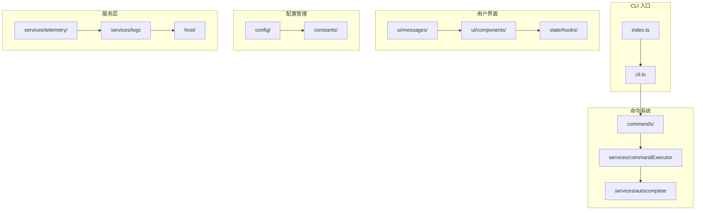

# CLI 工具模块

## 1. 模块概述

Kilocode CLI 工具 (`cli/`) 是一个功能强大的终端用户界面，为开发者提供了在命令行环境中使用 Kilocode AI 助手的能力。该模块采用现代化的 Node.js 技术栈，支持多种 AI 模型和丰富的交互功能。

## 2. 模块架构



## 3. 目录结构

```
cli/
├── src/
│   ├── index.ts              # CLI 主入口
│   ├── cli.ts                # CLI 核心类
│   ├── commands/             # 命令系统
│   │   ├── core/            # 核心命令逻辑
│   │   └── registry.ts      # 命令注册表
│   ├── config/              # 配置管理
│   │   ├── defaults.ts      # 默认配置
│   │   ├── persistence.ts   # 配置持久化
│   │   └── types.ts         # 配置类型定义
│   ├── services/            # 服务层
│   │   ├── commandExecutor.ts  # 命令执行器
│   │   ├── autocomplete.ts     # 自动补全
│   │   ├── telemetry/          # 遥测服务
│   │   └── logs.ts             # 日志服务
│   ├── ui/                  # 用户界面
│   │   ├── messages/        # 消息组件
│   │   ├── components/      # UI 组件
│   │   └── utils/           # UI 工具
│   ├── state/               # 状态管理
│   │   └── hooks/           # React Hooks
│   ├── utils/               # 工具函数
│   ├── constants/           # 常量定义
│   └── types/               # 类型定义
├── docs/                    # 文档
├── package.json             # 包配置
└── README.md               # 说明文档
```

## 4. 核心功能

### 4.1 CLI 主入口 (index.ts)

CLI 工具的主入口，负责：

- 命令行参数解析
- 配置初始化
- CLI 实例创建和启动
- 错误处理和清理

```typescript
// 主要命令行选项
program
	.option("-m, --mode <mode>", "运行模式")
	.option("-w, --workspace <path>", "工作空间路径")
	.option("--auto", "自动模式")
	.option("--timeout <seconds>", "超时时间")
```

### 4.2 命令系统 (commands/)

强大的命令系统，支持：

- **命令注册**: 动态命令注册机制
- **命令解析**: 智能命令解析
- **自动补全**: 命令和参数自动补全
- **帮助系统**: 内置帮助和文档

#### 4.2.1 核心命令

| 命令      | 功能         | 示例              |
| --------- | ------------ | ----------------- |
| `/help`   | 显示帮助信息 | `/help`           |
| `/mode`   | 切换工作模式 | `/mode architect` |
| `/config` | 配置管理     | `/config edit`    |
| `/clear`  | 清除屏幕     | `/clear`          |
| `/exit`   | 退出 CLI     | `/exit`           |

### 4.3 配置管理 (config/)

完整的配置管理系统：

```typescript
interface CLIConfig {
	kilocodeToken?: string
	apiProvider?: string
	apiModelId?: string
	maxTokens?: number
	temperature?: number
	workspace?: string
	mode?: string
}
```

#### 4.3.1 配置文件位置

- **Windows**: `%APPDATA%\kilocode\config.json`
- **macOS**: `~/Library/Application Support/kilocode/config.json`
- **Linux**: `~/.config/kilocode/config.json`

### 4.4 用户界面 (ui/)

基于 React 和 Ink 的终端 UI：

- **消息组件**: 各种消息类型的显示组件
- **交互组件**: 输入、选择、确认等交互组件
- **主题系统**: 支持多种终端主题
- **响应式布局**: 适应不同终端尺寸

#### 4.4.1 消息类型

```typescript
// 工具消息组件
- ToolSearchAndReplaceMessage  # 搜索替换操作
- ToolFileMessage             # 文件操作
- ToolCommandMessage          # 命令执行
- ToolBrowserMessage          # 浏览器操作
```

## 5. 服务层详解

### 5.1 命令执行器 (commandExecutor.ts)

负责命令的执行和管理：

- **命令解析**: 解析用户输入的命令
- **参数验证**: 验证命令参数的有效性
- **执行控制**: 控制命令的执行流程
- **结果处理**: 处理命令执行结果

```typescript
export interface CommandContext {
	workspace: string
	config: CLIConfig
	telemetry: TelemetryService
	logger: Logger
}
```

### 5.2 自动补全服务 (autocomplete.ts)

智能的自动补全功能：

- **命令补全**: 命令名称自动补全
- **参数补全**: 命令参数智能提示
- **文件路径补全**: 文件和目录路径补全
- **历史记录**: 基于历史的智能建议

```typescript
export interface CommandSuggestion {
	command: Command
	score: number
	matchType: "exact" | "prefix" | "fuzzy"
}
```

### 5.3 遥测服务 (telemetry/)

完整的使用数据收集：

- **事件追踪**: 用户操作事件记录
- **性能指标**: 命令执行性能统计
- **错误报告**: 自动错误收集和报告
- **使用统计**: 功能使用情况分析

## 6. 状态管理

### 6.1 React Hooks (state/hooks/)

基于 React Hooks 的状态管理：

```typescript
// 主要 Hooks
- useCommandContext    # 命令上下文
- useModelSelection    # 模型选择
- useHotkeys          # 快捷键管理
- useTheme            # 主题管理
- useConfig           # 配置管理
```

### 6.2 状态类型

```typescript
interface CLIState {
	currentMode: string
	isStreaming: boolean
	isApprovalPending: boolean
	hasResumeTask: boolean
	isFollowupVisible: boolean
}
```

## 7. 多模型支持

### 7.1 支持的 AI 提供商

| 提供商      | 配置字段            | 默认模型                        |
| ----------- | ------------------- | ------------------------------- |
| OpenAI      | `openaiApiKey`      | `gpt-4`                         |
| Anthropic   | `anthropicApiKey`   | `claude-3-sonnet`               |
| Google      | `googleApiKey`      | `gemini-pro`                    |
| Groq        | `groqApiKey`        | `llama-3.3-70b-versatile`       |
| Ollama      | `ollamaBaseUrl`     | `llama2`                        |
| HuggingFace | `huggingFaceApiKey` | `meta-llama/Llama-2-7b-chat-hf` |

### 7.2 配置示例

```json
{
	"id": "default",
	"provider": "openai",
	"openaiApiKey": "sk-...",
	"apiModelId": "gpt-4",
	"maxTokens": 4096,
	"temperature": 0.7
}
```

## 8. 工作模式

### 8.1 可用模式

- **Architect**: 架构设计模式
- **Coder**: 编码实现模式
- **Debugger**: 调试模式
- **Custom**: 自定义模式

### 8.2 模式切换

```bash
# 启动时指定模式
kilocode --mode architect

# 运行时切换模式
/mode coder
```

## 9. 安装和使用

### 9.1 安装

```bash
# 全局安装
npm install -g @kilocode/cli

# 或使用 pnpm
pnpm add -g @kilocode/cli
```

### 9.2 配置

```bash
# 打开配置文件
kilocode config

# 或直接编辑
kilocode config edit
```

### 9.3 基本使用

```bash
# 启动 CLI
kilocode

# 指定工作空间
kilocode --workspace /path/to/project

# 自动模式
kilocode --auto "创建一个 React 组件"

# 指定超时时间
kilocode --timeout 300
```

## 10. 开发和调试

### 10.1 开发环境

```bash
# 安装依赖
pnpm install

# 开发模式
pnpm dev

# 构建
pnpm build

# 运行测试
pnpm test
```

### 10.2 调试功能

- **详细日志**: 支持多级别日志输出
- **错误追踪**: 完整的错误堆栈信息
- **性能监控**: 命令执行时间统计
- **内存监控**: 内存使用情况追踪

## 11. 扩展性

### 11.1 自定义命令

```typescript
// 注册自定义命令
commandRegistry.register({
	name: "custom",
	description: "自定义命令",
	execute: async (context, args) => {
		// 命令实现
	},
})
```

### 11.2 插件系统

- **命令插件**: 扩展新的命令功能
- **UI 插件**: 自定义 UI 组件
- **服务插件**: 集成外部服务

## 12. 性能优化

### 12.1 启动优化

- **懒加载**: 按需加载模块
- **缓存机制**: 配置和数据缓存
- **并行初始化**: 并行初始化服务

### 12.2 运行时优化

- **内存管理**: 及时释放不用的资源
- **异步处理**: 非阻塞的异步操作
- **流式输出**: 大数据流式处理

---

_本文档详细介绍了 Kilocode CLI 工具模块的架构和功能，为开发者提供了完整的使用和开发指南。_
