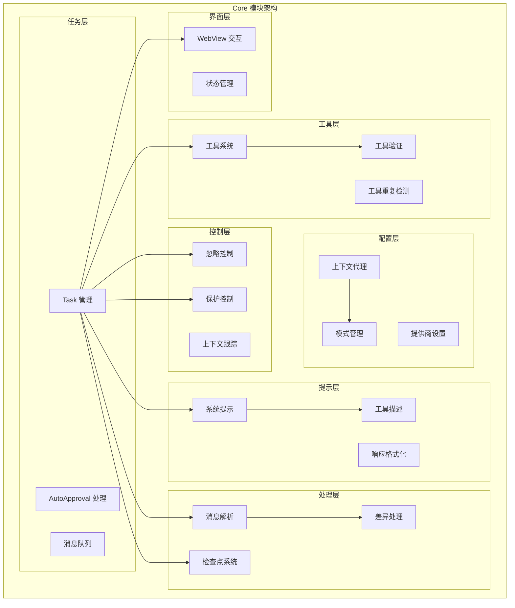
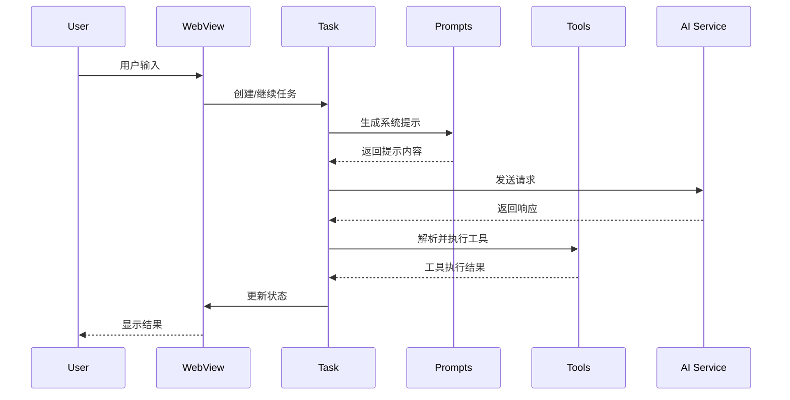

# Core 模块总体架构

## 1. 模块概述

Core 模块是 Kilocode 项目的核心引擎，负责处理 AI 助手的核心逻辑、任务管理、工具执行、提示生成等关键功能。它是连接用户界面和底层服务的中间层，提供了完整的任务执行框架。

### 1.1 核心职责

- **任务生命周期管理**: 从任务创建到完成的全流程管理
- **工具系统**: 提供丰富的工具集，支持文件操作、命令执行、代码搜索等
- **AI 交互**: 处理与 AI 模型的通信和响应解析
- **上下文管理**: 智能管理对话上下文和工作环境
- **配置管理**: 处理各种配置和模式设置

## 2. 架构设计

## 3. 子模块详细说明

### 3.1 核心子模块

| 子模块                                    | 路径                 | 主要功能         | 核心类/文件                                |
| ----------------------------------------- | -------------------- | ---------------- | ------------------------------------------ |
| [任务管理](./task/README.md)              | `task/`              | 任务生命周期管理 | `Task.ts`, `AutoApprovalHandler.ts`        |
| [工具系统](./tools/README.md)             | `tools/`             | 各种工具实现     | `*Tool.ts`, `ToolRepetitionDetector.ts`    |
| [提示系统](./prompts/README.md)           | `prompts/`           | 提示生成和管理   | `system.ts`, `tools/index.ts`              |
| [配置管理](./config/README.md)            | `config/`            | 配置和模式管理   | `ContextProxy.ts`, `CustomModesManager.ts` |
| [消息解析](./assistant-message/README.md) | `assistant-message/` | AI 消息解析      | `AssistantMessageParser.ts`                |
| [上下文管理](./context/README.md)         | `context/`           | 上下文和指令管理 | `context-management/`, `instructions/`     |
| [差异处理](./diff/README.md)              | `diff/`              | 代码差异处理     | `strategies/`                              |
| [检查点系统](./checkpoints/README.md)     | `checkpoints/`       | 状态保存恢复     | `index.ts`                                 |
| [忽略控制](./ignore/README.md)            | `ignore/`            | 文件忽略管理     | `RooIgnoreController.ts`                   |
| [保护控制](./protect/README.md)           | `protect/`           | 文件保护机制     | `RooProtectedController.ts`                |
| [Web视图](./webview/README.md)            | `webview/`           | 前端交互         | `ClineProvider.ts`                         |

### 3.2 辅助子模块

| 子模块     | 路径                | 主要功能         |
| ---------- | ------------------- | ---------------- |
| 环境检测   | `environment/`      | 系统环境信息获取 |
| 消息队列   | `message-queue/`    | 消息队列服务     |
| 滑动窗口   | `sliding-window/`   | 上下文窗口管理   |
| 任务持久化 | `task-persistence/` | 任务数据持久化   |
| 上下文跟踪 | `context-tracking/` | 文件上下文跟踪   |
| 提及处理   | `mentions/`         | @提及功能处理    |
| 斜杠命令   | `slash-commands/`   | 斜杠命令处理     |
| 压缩处理   | `condense/`         | 对话内容压缩     |

## 4. 核心数据流

## 5. 关键设计模式

### 5.1 事件驱动架构

- Task 类继承 EventEmitter，支持事件监听
- 各模块通过事件进行松耦合通信
- 支持异步处理和状态变更通知

### 5.2 策略模式

- 差异处理使用不同策略 (MultiSearchReplace, MultiFileSearchReplace)
- 工具执行支持多种实现策略
- 配置管理支持多种模式切换

### 5.3 工厂模式

- ApiHandler 通过工厂方法创建
- 各种工具通过统一接口创建和管理
- 检查点服务通过工厂方法初始化

### 5.4 代理模式

- ContextProxy 代理配置访问
- 各种控制器代理文件操作权限

## 6. 性能优化

### 6.1 内存管理

- 滑动窗口机制控制上下文大小
- 及时清理不需要的任务数据
- 使用弱引用避免内存泄漏

### 6.2 异步处理

- 大量使用 Promise 和 async/await
- 工具执行支持并发处理
- 文件操作使用异步 I/O

### 6.3 缓存策略

- 配置信息缓存
- 文件内容缓存
- API 响应缓存

## 7. 错误处理

### 7.1 分层错误处理

- 工具层：捕获和包装工具执行错误
- 任务层：处理任务级别的错误和重试
- 服务层：处理网络和 API 错误

### 7.2 错误恢复机制

- 自动重试机制
- 上下文窗口超限自动压缩
- 检查点恢复机制

## 8. 扩展性设计

### 8.1 插件化架构

- 工具系统支持动态注册
- MCP 服务器支持扩展
- 模式系统支持自定义

### 8.2 配置驱动

- 通过配置控制功能开关
- 支持实验性功能切换
- 运行时配置更新

## 9. 安全考虑

### 9.1 文件访问控制

- RooIgnoreController 控制文件访问
- RooProtectedController 保护敏感文件
- 路径验证和规范化

### 9.2 命令执行安全

- 命令白名单机制
- 执行权限控制
- 输出内容过滤

## 10. 测试策略

### 10.1 单元测试

- 每个子模块都有对应的测试文件
- 使用 Vitest 作为测试框架
- 模拟外部依赖

### 10.2 集成测试

- 端到端任务执行测试
- 工具链集成测试
- API 交互测试

---

_本文档提供了 Core 模块的总体架构概览，详细的子模块文档请参考各自的 README 文件。_
