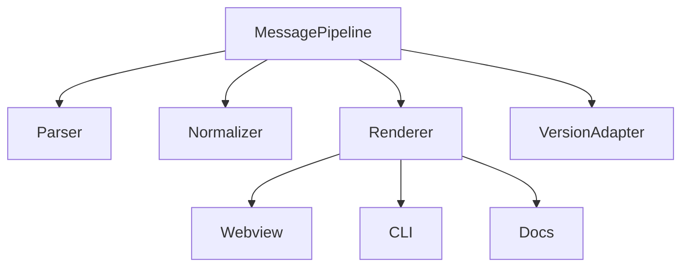
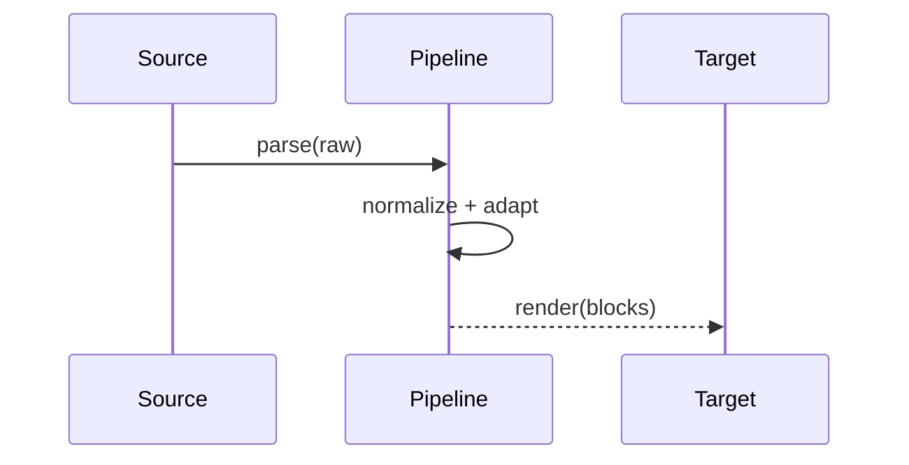

# src/core/assistant-message — 详细架构与设计

## 目标

- 解析与呈现助手消息的版本化管线与适配，支持多渲染目标。

## 组件架构



## 数据模型

- AssistantMessage: {id, role, content[], version, metadata}
- RenderBlock: {type, payload}

## 公共 API

```ts
interface MessagePipeline {
	parse(raw: unknown): AssistantMessage
	render(msg: AssistantMessage, target: "webview" | "cli" | "docs"): string
}
```

## 流程



## 错误分类

- ParseError: 非法结构
- AdaptError: 版本转换失败
- RenderError: 目标不支持的块类型

## 测试

- 不同版本消息解析；多目标渲染；异常降级与日志。
