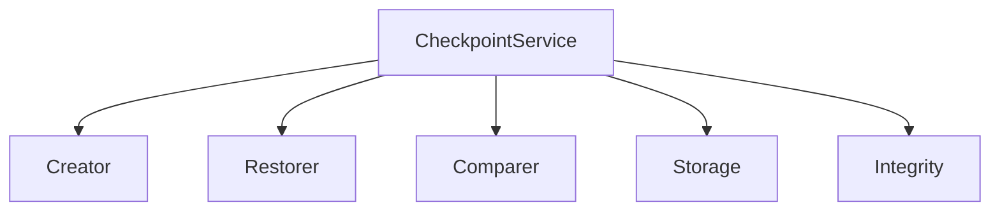
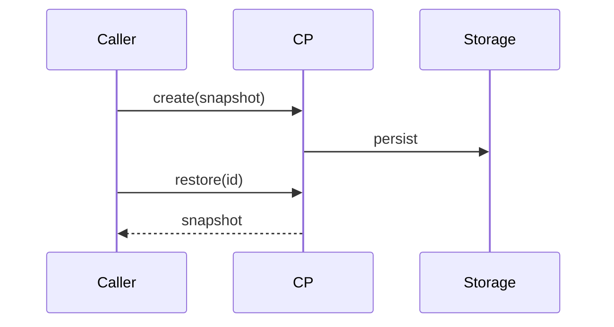

# src/core/checkpoints — 详细架构与设计

## 目标

- 提供检查点能力：在核心层与服务层创建/恢复/比较运行状态。

## 组件架构



## 数据模型

- Checkpoint: {id, ts, snapshot, integrity}

## 公共 API

```ts
interface CheckpointService {
	create(snapshot: unknown): Promise<Checkpoint>
	restore(id: string): Promise<unknown>
	compare(a: string, b: string): DiffSummary
}
```

## 流程



## 错误分类

- IntegrityError: 校验失败
- RestoreError: 恢复不可用

## 测试

- 创建/恢复路径；完整性校验；跨版本兼容；差异摘要正确。
