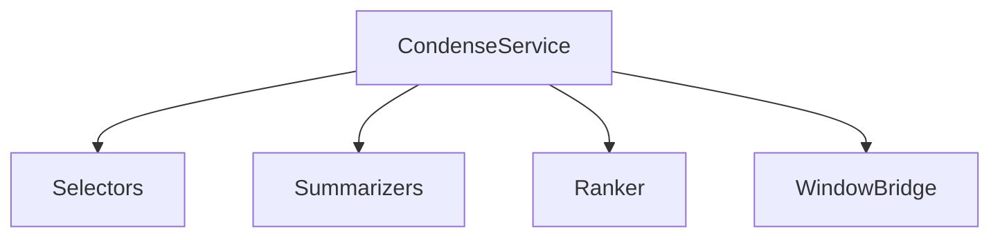
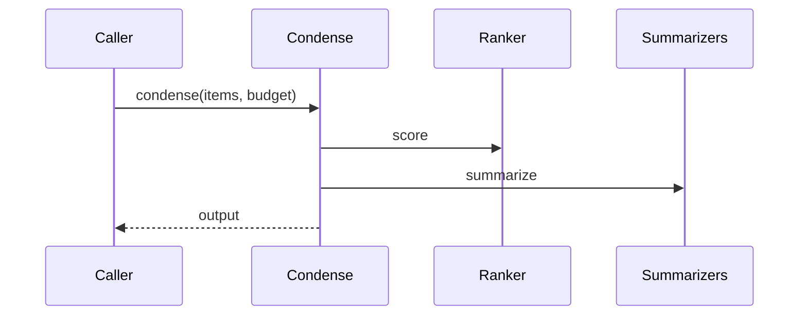

# src/core/condense — 详细架构与设计

## 目标
- 上下文凝练策略：控制提示长度，提高信息密度与相关性。

## 组件架构


## 数据模型
- CondenseInput: {items[], budgetTokens}
- CondenseOutput: {selected[], summary, stats}

## 公共 API
```ts
interface CondenseService {
  condense(input: CondenseInput): Promise<CondenseOutput>
}
```

## 流程


## 错误分类
- BudgetError: 预算不足
- SummarizeError: 摘要失败

## 测试
- 选择与排名效果；预算边界；摘要质量与一致性。