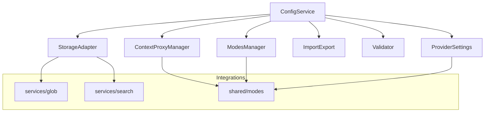
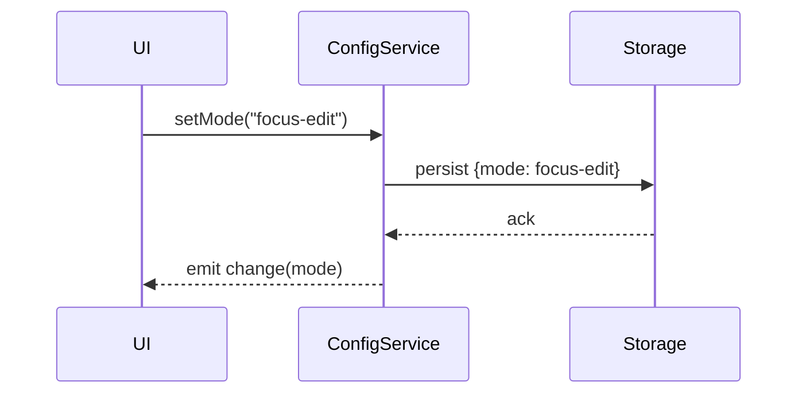

# src/core/config — 详细架构与设计

## 目标与范围
- 统一管理“上下文代理、模式管理、供应商设置、导入导出”配置。
- 提供强类型 API、事件通知、持久化与校验、热更新能力。

## 组件架构


## 数据模型
- Config: { contextProxy, modes, providers, rules, version }
- Provider: { name, endpoint, apiKeyRef, limits }
- Mode: { id, name, features, defaults }

## 公共 API（TypeScript）
```ts
interface ConfigService {
  load(): Promise<Config>
  save(next: Config): Promise<void>
  getMode(id?: string): Mode
  setMode(id: string): void
  getProvider(name: string): Provider | undefined
  updateProvider(name: string, patch: Partial<Provider>): void
  on(event: 'change'|'error', handler: (p: ConfigEvent) => void): () => void
}
```

## 关键流程


## 校验与版本
- JSON Schema 验证；不合格项抛含路径的 ValidationError。
- 版本字段 `version` 支持向后兼容迁移：vN -> vN+1 由 Migrator 处理。

## 配置示例
```json
{
  "version": 2,
  "modes": [{"id": "focus-edit", "features": ["sliding-window","diff"]}],
  "providers": {"default": {"endpoint": "https://api.example", "limits": {"rpm": 60}}},
  "contextProxy": {"strategy": "weighted"}
}
```

## 错误分类
- ValidationError: 模式/提供商字段非法
- PersistenceError: 读写失败或权限不足
- MigrationError: 旧版本迁移失败

## 性能与扩展
- 读写通过 `StorageAdapter` 抽象：file/memory/remote。
- 事件去抖动 50–200ms 合并批量更改。

## 测试矩阵
- 加载/保存不同后端适配；模式切换事件；JSON Schema 校验；版本迁移路径；并发写入冲突。
