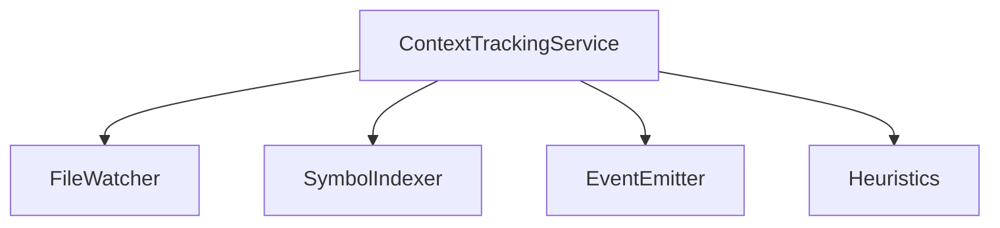
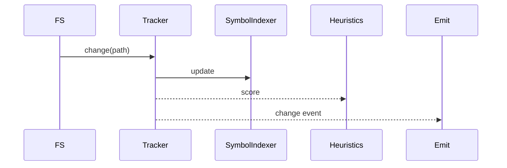

# src/core/context-tracking — 详细架构与设计

## 目标

- 跟踪文件/符号层级的上下文变化，向提示与工具选择提供信号。

## 组件架构



## 数据模型

- ContextEvent: {type, path, symbol?, change}

## 公共 API

```ts
interface ContextTrackingService {
	start(): Promise<void>
	on(event: "change", cb: (e: ContextEvent) => void): () => void
}
```

## 流程



## 错误分类

- WatchError: 监控失败
- IndexError: 索引异常

## 测试

- 多文件更改；符号级别追踪；启停稳定性；噪声过滤。
