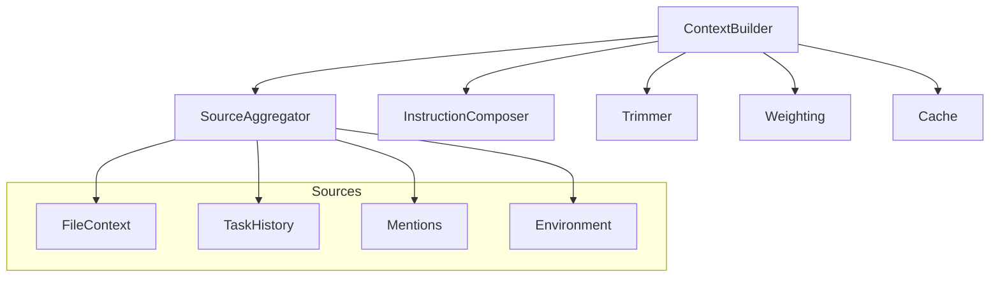
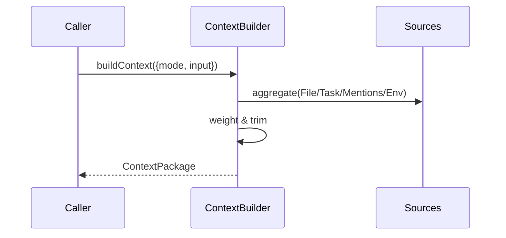

# src/core/context — 详细架构与设计

## 目标

- 聚合系统/用户/任务上下文；生成可直接用于提示构建的指令包。
- 可插拔的“指令策略、来源权重、裁剪与拼接”机制。

## 组件架构



## 数据模型

- ContextPackage: { systemInstructions, userInstructions, taskPrompt, metadata }
- SourceItem: { id, type, weight, content, origin }

## 公共 API

```ts
interface ContextBuilder {
	buildContext(opts: BuildOpts): Promise<ContextPackage>
	getSystemInstructions(mode: string): string[]
	composeUserInstructions(input: string, refs?: SourceItem[]): string
}
```

## 核心流程



## 策略与权重

- Weighting: 基于来源类型、最近性、用户显式 @mention 提升权重。
- Trimmer: 结合 `sliding-window` 控制 token 上限，保留高权重片段。

## 错误处理

- SourceError: 某来源不可用；降级继续。
- ComposeError: 模板片段缺失；记录并回退缺省策略。

## 测试

- 权重计算正确性；不同窗口/步长裁剪一致性；多源聚合顺序；异常来源降级。
