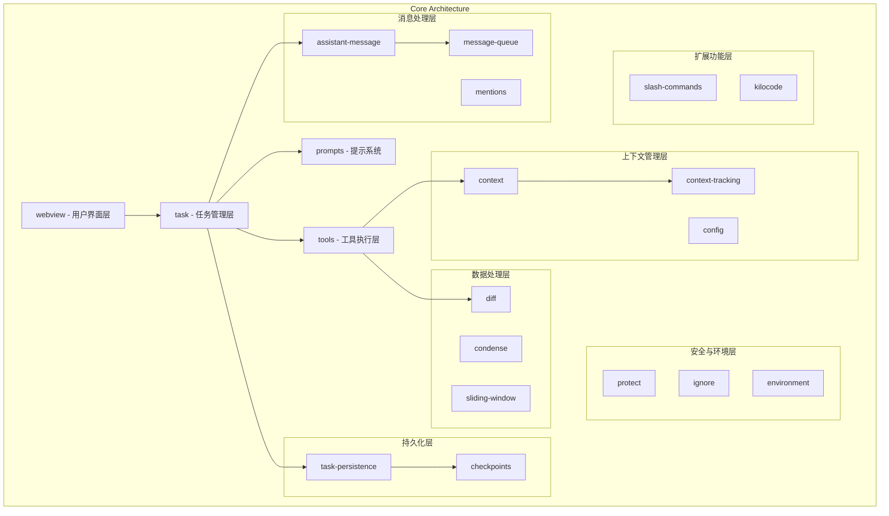
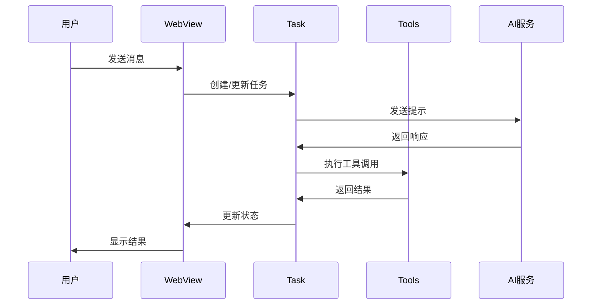

# Kilocode Core 架构文档

## 1. 架构概述

Kilocode Core 是整个 Kilocode 系统的核心模块，负责任务管理、工具执行、消息处理、上下文管理等核心功能。该模块采用模块化设计，各个子模块职责明确，通过事件驱动和依赖注入实现松耦合。

### 1.1 核心设计原则

- **模块化设计**：每个子模块负责特定功能，便于维护和扩展
- **事件驱动**：通过事件系统实现模块间通信
- **异步处理**：支持并发任务执行和非阻塞操作
- **可扩展性**：支持自定义工具、模式和配置
- **容错性**：完善的错误处理和恢复机制

## 2. 模块架构图

## 3. 核心模块说明

### 3.1 用户界面层

- **webview**: 提供 VS Code 扩展的用户界面，处理用户交互和消息传递

### 3.2 任务管理层

- **task**: 核心任务管理，包括任务生命周期、状态管理、任务栈等
- **task-persistence**: 任务持久化，保存和恢复任务状态

### 3.3 工具执行层

- **tools**: 各种工具的实现，如文件操作、代码搜索、命令执行等

### 3.4 消息处理层

- **assistant-message**: AI 助手消息解析和处理
- **message-queue**: 消息队列服务，管理异步消息处理
- **mentions**: 处理用户内容中的提及和引用

### 3.5 上下文管理层

- **context**: 上下文管理和指令处理
- **context-tracking**: 文件上下文跟踪
- **config**: 配置管理，包括模式配置、提供商设置等

### 3.6 数据处理层

- **diff**: 差异处理和应用
- **condense**: 内容压缩和摘要
- **sliding-window**: 滑动窗口内存管理

### 3.7 持久化层

- **checkpoints**: 检查点管理，支持任务状态快照和恢复

### 3.8 安全与环境层

- **protect**: 保护机制，防止误操作
- **ignore**: 忽略规则管理
- **environment**: 环境信息获取和管理

### 3.9 扩展功能层

- **slash-commands**: 斜杠命令处理
- **kilocode**: Kilocode 特定功能和包装器

### 3.10 提示系统

- **prompts**: 系统提示、工具描述、响应格式等

## 4. 数据流架构

## 5. 关键技术特性

### 5.1 任务管理

- 支持任务栈和父子任务关系
- 任务暂停/恢复机制
- 任务状态持久化
- 自动批准和用户交互

### 5.2 工具系统

- 可扩展的工具架构
- 工具重复检测
- 工具使用验证
- 原生工具和自定义工具支持

### 5.3 上下文管理

- 智能上下文跟踪
- 文件变更监控
- 上下文压缩和优化
- 滑动窗口内存管理

### 5.4 消息处理

- 异步消息队列
- 消息解析和验证
- 流式响应处理
- 错误处理和重试

### 5.5 配置系统

- 多提供商支持
- 自定义模式配置
- 动态配置更新
- 配置验证和迁移

## 6. 扩展点

### 6.1 工具扩展

- 实现 `ToolFunction` 接口
- 注册到工具系统
- 提供工具描述和验证

### 6.2 模式扩展

- 定义自定义模式配置
- 实现模式特定的提示组件
- 配置工具权限和行为

### 6.3 提供商扩展

- 实现 API 提供商接口
- 配置认证和端点
- 支持自定义模型

## 7. 性能优化

### 7.1 内存管理

- 滑动窗口机制限制内存使用
- 及时清理不需要的资源
- 智能缓存策略

### 7.2 并发处理

- 异步任务执行
- 非阻塞 I/O 操作
- 合理的并发控制

### 7.3 持久化优化

- 增量保存机制
- 压缩存储格式
- 快速恢复策略

## 8. 安全考虑

### 8.1 代码保护

- 敏感文件保护机制
- 操作权限控制
- 安全的命令执行

### 8.2 数据安全

- 敏感信息过滤
- 安全的数据传输
- 本地数据加密

## 9. 监控和调试

### 9.1 日志系统

- 分级日志记录
- 结构化日志格式
- 性能指标收集

### 9.2 错误处理

- 全局错误捕获
- 错误恢复机制
- 用户友好的错误提示

## 10. 未来发展方向

### 10.1 架构演进

- 微服务化改造
- 插件系统完善
- 分布式任务处理

### 10.2 功能扩展

- 更多工具类型支持
- 高级上下文理解
- 智能代码生成

### 10.3 性能提升

- 更高效的内存管理
- 更快的响应速度
- 更好的并发性能
