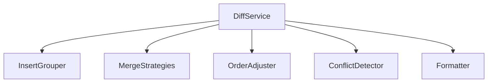
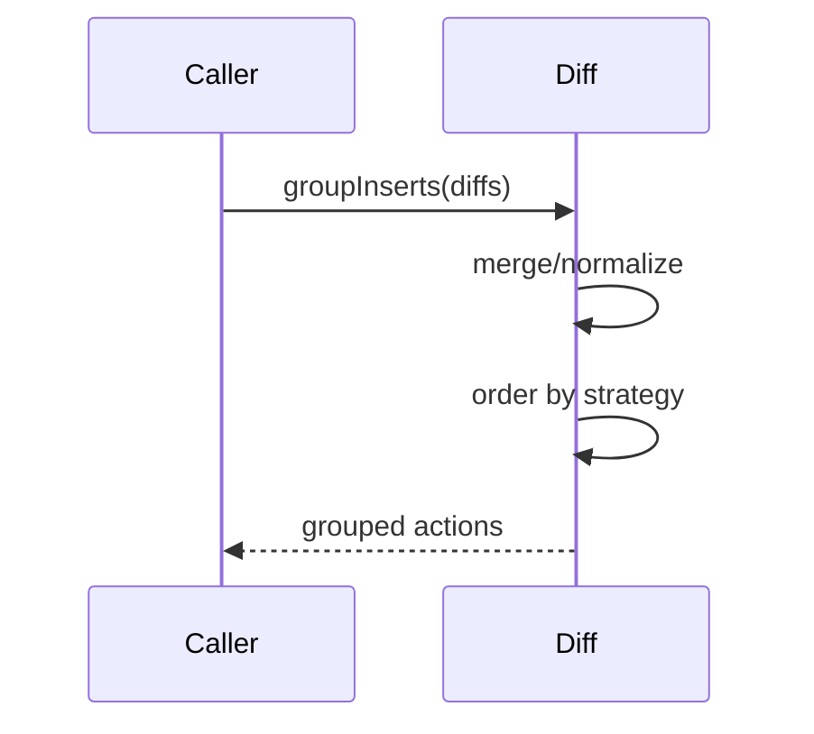

# src/core/diff — 详细架构与设计

## 目标
- 将原始文本差异转换为“可执行变更组”，支持策略化排序与合并。

## 组件架构


## 数据模型
- RawDiff: {type: 'insert'|'delete'|'replace', range, text}
- ActionGroup: {id, actions[], priority, region}

## 公共 API
```ts
interface DiffService {
  groupInserts(diffs: RawDiff[], opts?: GroupOpts): ActionGroup[]
  applyStrategy(groups: ActionGroup[], strategy: DiffStrategy): ActionGroup[]
}
```

## 流程


## 错误与冲突
- ConflictError: 同一区域重复或互斥更改；建议回退或人工干预。
- PerformanceWarn: 超大文件启用分块与窗口处理。

## 测试
- 插入分组边界；策略优先级正确；冲突检测；formatter 输出一致性。