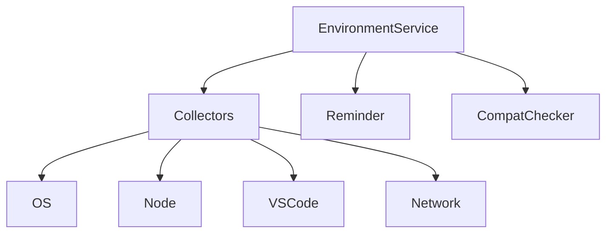

# src/core/environment — 详细架构与设计

## 目标
- 采集运行环境信息，生成提醒与兼容性检查；提供统一查询接口。

## 组件架构


## 数据模型
- EnvDetails: {os, node, vscode, network, features}
- Reminder: {id, message, severity, actions?}

## 公共 API
```ts
interface EnvironmentService {
  getEnvironmentDetails(): Promise<EnvDetails>
  reminder(details: EnvDetails): Reminder[]
}
```

## 兼容检查
- 版本门槛、可选特性可用性、已知冲突列表；

## 错误分类
- ProbeError: 采集失败
- CompatError: 不满足最低要求

## 测试
- 各采集器输出；提醒模板；冲突检测路径；错误降级。