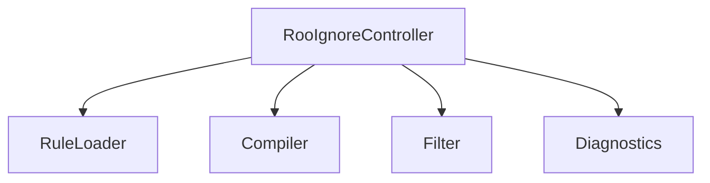
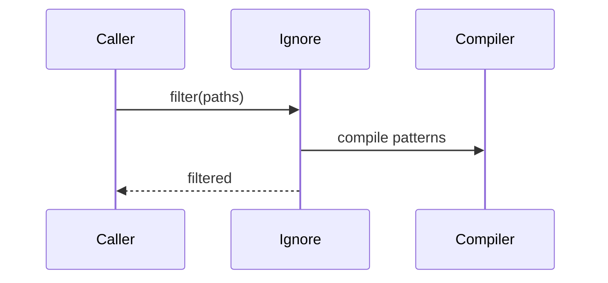

# src/core/ignore — 详细架构与设计

## 目标
- 聚合 RooIgnore 规则，提供路径与内容统一过滤策略。

## 组件架构


## 数据模型
- IgnoreRule: {pattern, type: 'path'|'content', priority}

## 公共 API
```ts
interface RooIgnoreController {
  loadRules(): Promise<void>
  shouldIgnore(path: string, content?: string): boolean
  filter(paths: string[]): string[]
}
```

## 流程


## 错误与性能
- InvalidRule: 模式非法；
- 大量规则：预编译与缓存；

## 测试
- 规则合并；边界匹配；性能基线；诊断输出。