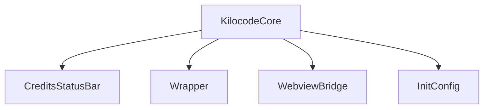
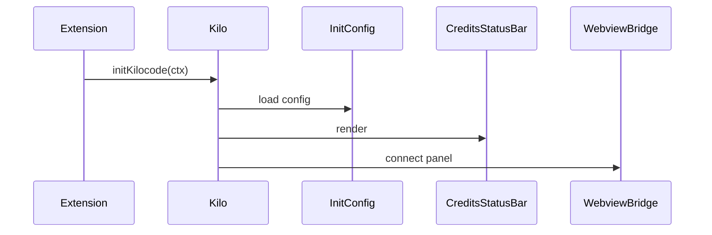

# src/core/kilocode — 详细架构与设计

## 目标

- 作为核心协调层：初始化状态、连接状态栏与 webview、提供统一封装器。

## 组件架构



## 公共 API

```ts
interface KilocodeCore {
	initKilocode(ctx: ExtensionContext): Promise<void>
	getWrapper(): Wrapper
	updateCredits(delta: number): void
}
```

## 流程



## 错误分类

- InitError: 初始化失败
- BridgeError: Webview 连接失败

## 测试

- 初始化路径；状态栏更新；webview 交互桥的健壮性。
