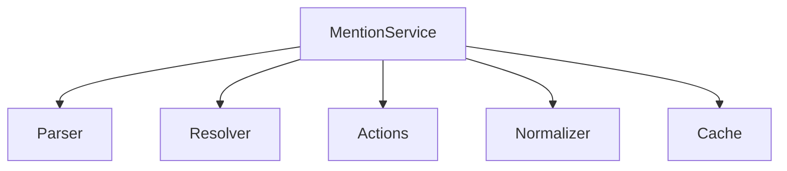
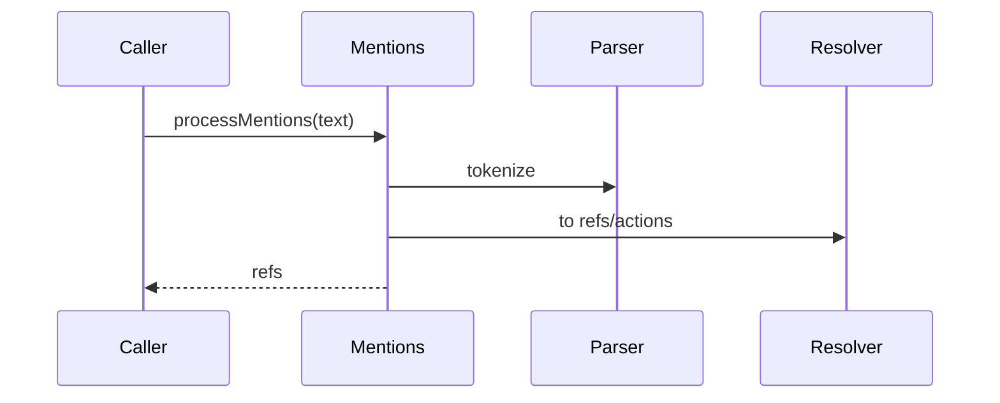

# src/core/mentions — 详细架构与设计

## 目标

- 解析用户文本中的 @mentions，产出上下文引用或触发动作。

## 组件架构



## 数据模型

- Mention: {raw, type, target, range}
- MentionRef: {id, kind, sourcePath?, symbol?}

## 公共 API

```ts
interface MentionService {
	processMentions(text: string, opts?: ProcessOpts): MentionRef[]
}
```

## 流程



## 错误分类

- InvalidMention: 语法不合法或目标不存在
- ResolveError: 项目特化解析失败

## 测试

- 语法覆盖；跨文件/符号解析；动作触发；错误与性能日志。
