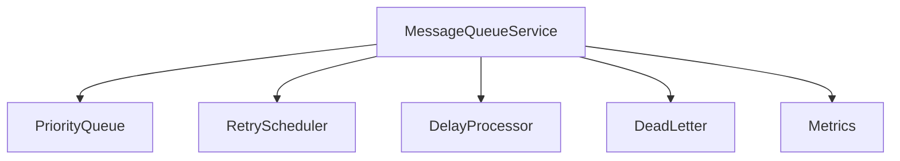
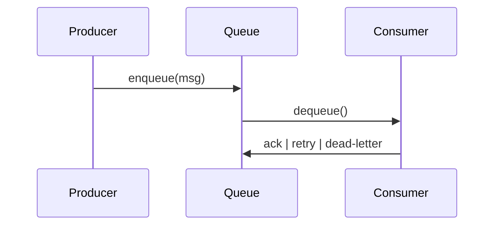

# src/core/message-queue — 详细架构与设计

## 目标

- 提供 FIFO/优先队列、重试/延迟机制；与事件路由集成。

## 组件架构



## 数据模型

- Message: {id, type, payload, priority, attempts}

## 公共 API

```ts
interface MessageQueueService {
	enqueue(msg: Message): void
	dequeue(): Message | undefined
	process(handler: (m: Message) => Promise<void>): Promise<void>
}
```

## 流程



## 错误与恢复

- 超过最大重试放入 DLQ；
- 指标上报：处理耗时、失败率、拥塞度。

## 测试

- 优先级正确；重试退避策略；DLQ 行为；并发处理安全。
