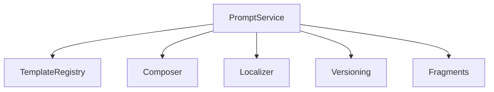
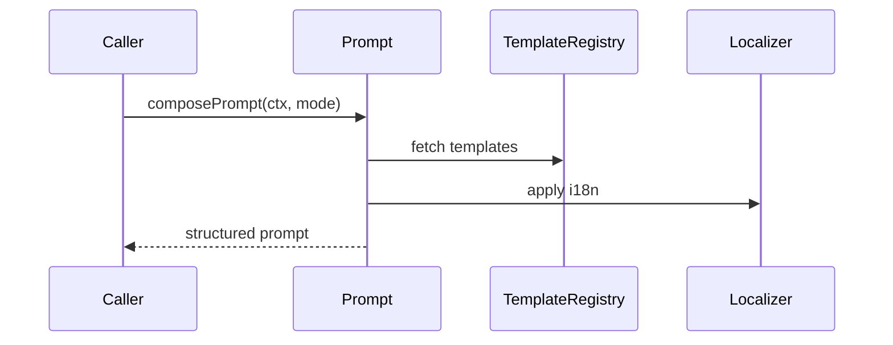

# src/core/prompts — 详细架构与设计

## 目标
- 统一提示词模板管理与组合：系统/工具/响应/片段库；支持模式与上下文驱动。

## 组件架构


## 数据模型
- Template: {id, version, fields, content}
- Prompt: {system, tools[], response, sections[]}

## 公共 API
```ts
interface PromptService {
  buildSystemPrompt(ctx: Ctx): string
  buildToolPrompt(tool: Tool, ctx: Ctx): string
  composePrompt(ctx: Ctx, mode: string): Prompt
}
```

## 流程


## 版本与本地化
- TemplateVersioning: 兼容旧字段；
- Localizer: `i18n` 集成，语言/区域差异；

## 错误分类
- TemplateMissing: 模板不存在或版本不匹配
- FieldMismatch: 字段缺失或类型错误

## 测试
- 模板组合正确；本地化替换；字段校验；版本回退策略。