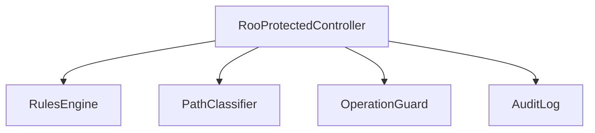

# src/core/protect — 详细架构与设计

## 目标
- 识别并阻止/警示对敏感路径与操作的访问；与工具权限协作。

## 组件架构


## 数据模型
- ProtectRule: {pattern, severity, actions}
- Decision: {allowed, reason, requireApproval?}

## 公共 API
```ts
interface RooProtectedController {
  isProtected(pathOrOp: string): Decision
  enforce(op: string, ctx?: unknown): void // throw on deny
}
```

## 策略
- 规则优先级：显式拒绝>需审批>允许；
- 与 tools 权限整合：在执行层前置校验；

## 错误分类
- PolicyError: 规则解释失败
- EnforcementError: 执行层未处理拒绝

## 测试
- 规则合并与优先级；路径边界；操作类型覆盖；审计记录完整性。