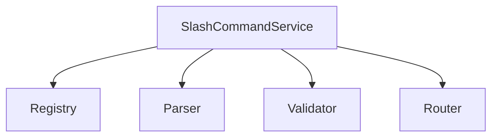
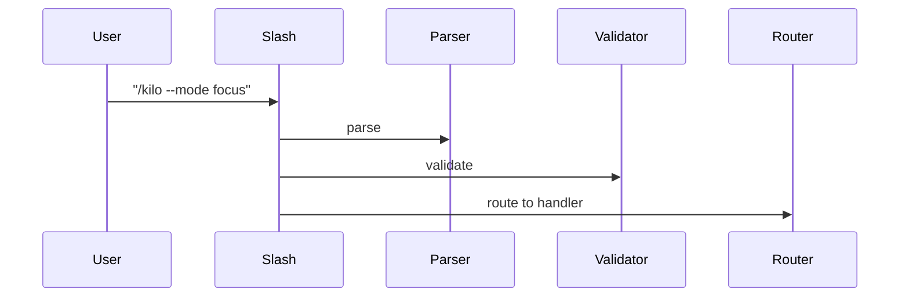

# src/core/slash-commands — 详细架构与设计

## 目标

- 统一注册/解析斜杠命令（如 /kilo），并路由到核心能力。

## 组件架构



## 数据模型

- Command: {name, argsSchema, handler}
- Parsed: {name, args}

## 公共 API

```ts
interface SlashCommandService {
	registerSlashCommands(cmds: Command[]): void
	handleSlashCommand(input: string): Promise<unknown>
}
```

## 流程



## 错误分类

- ParseError: 语法错误
- ValidationError: 参数非法
- RouteError: 未找到处理器

## 测试

- 多命令注册；参数解析边界；路由与错误处理覆盖。
