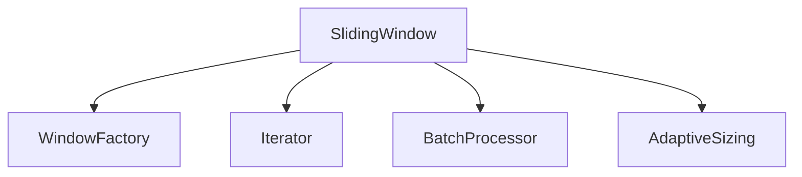
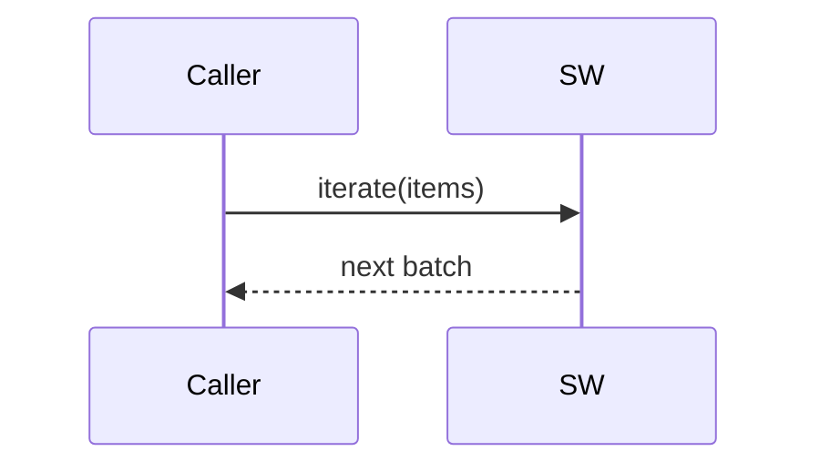

# src/core/sliding-window — 详细架构与设计

## 目标
- 提供滑动窗口与步长策略的批处理；控制提示长度与处理粒度。

## 组件架构


## 数据模型
- WindowOpts: {size, step, align?: 'line'|'token'}

## 公共 API
```ts
interface SlidingWindow {
  createSlidingWindow(size: number, step: number): Window
  iterate<T>(items: T[]): Iterable<T[]>
}
```

## 流程


## 错误与边界
- EmptyInput: 空集合；
- Overlong: 单项超出窗口；

## 测试
- 不同 size/step 组合；边界对齐；批处理一致性。