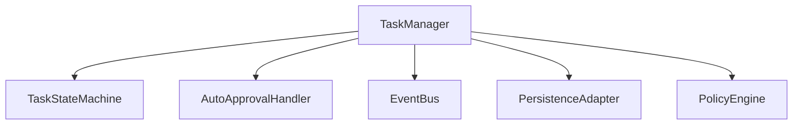
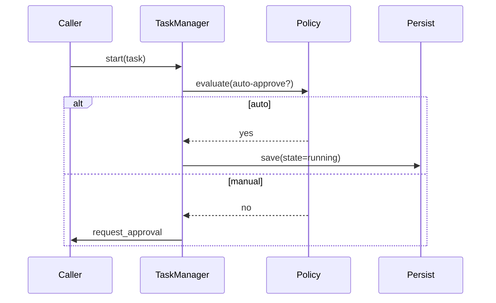

# src/core/task — 详细架构与设计

## 目标
- 定义任务类型与生命周期状态机；自动审批与事件流。

## 组件架构


## 状态机
- states: init -> running -> waiting_approval -> completing -> completed | failed | canceled
- events: start, update, request_approval, approve, reject, complete, error

## 公共 API
```ts
interface Task {
  start(): Promise<void>
  update(patch: Partial<TaskData>): void
  complete(result?: unknown): void
}
```

## 审批策略
- 规则匹配：操作风险、受保护资源、用户偏好；
- 自动批准：低风险、重复操作、白名单工具；

## 序列流程


## 错误分类
- PolicyError: 规则评估异常
- PersistenceError: 任务保存失败
- TransitionError: 非法状态转换

## 测试
- 状态迁移路径；审批策略覆盖；事件发布顺序；失败回滚与持久化一致性。