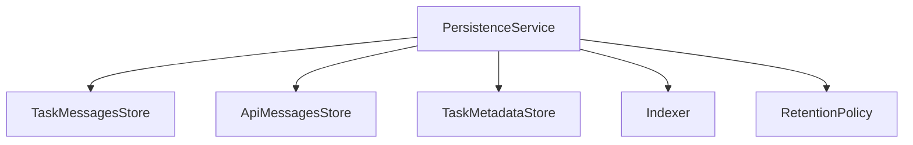
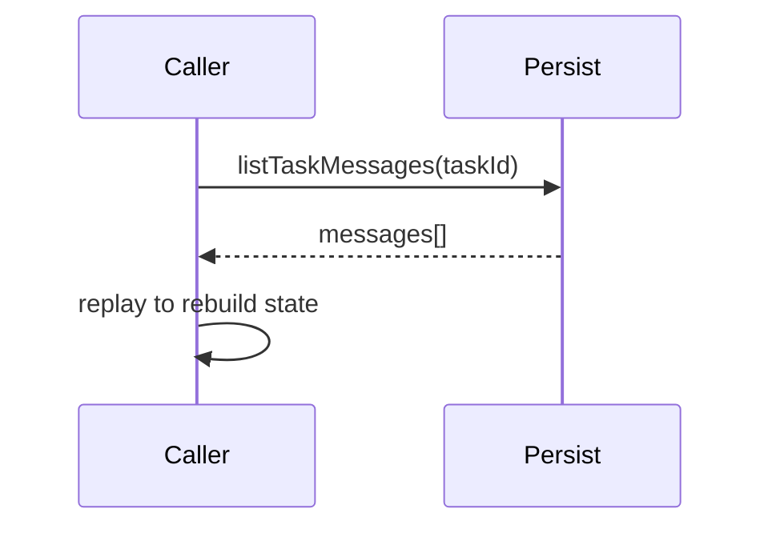

# src/core/task-persistence — 详细架构与设计

## 目标

- 任务消息与元数据的持久化、恢复、审计回放。

## 组件架构



## 数据模型

- TaskMessage: {id, taskId, type, payload, ts}
- TaskMetadata: {taskId, status, mode, credits, tags}

## 公共 API

```ts
interface PersistenceService {
	saveTaskMessage(msg: TaskMessage): Promise<void>
	listTaskMessages(taskId: string): Promise<TaskMessage[]>
	saveTaskMetadata(meta: TaskMetadata): Promise<void>
	getTaskMetadata(taskId: string): Promise<TaskMetadata | null>
}
```

## 恢复流程



## 策略

- 保留策略：大小/时间/状态驱动的归档与清理；
- 索引：taskId、时间、类型多维检索；

## 错误分类

- StorageError: 后端存储不可用
- DataError: 非法消息结构

## 测试

- 存取一致性；恢复正确；保留策略触发；索引性能与边界。
