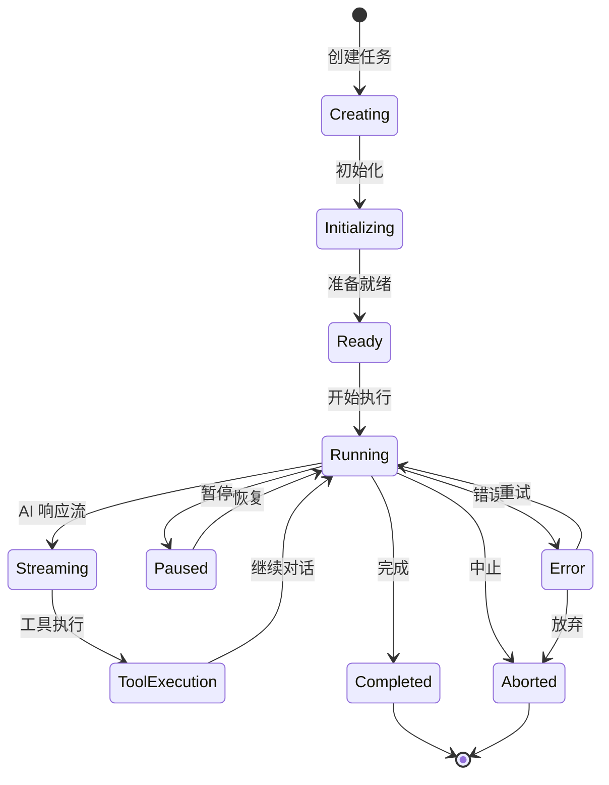

# Task 任务管理模块

## 1. 模块概述

Task 模块是 Kilocode 的核心任务管理系统，负责处理 AI 助手任务的完整生命周期，从任务创建、执行、到完成或中止的全过程管理。

### 1.1 核心功能

- **任务生命周期管理**: 创建、初始化、执行、暂停、恢复、完成任务
- **AI 交互管理**: 处理与 AI 模型的通信和响应
- **工具执行协调**: 管理各种工具的执行和结果处理
- **状态持久化**: 任务状态的保存和恢复
- **错误处理和重试**: 智能错误处理和自动重试机制

## 2. 文档结构

- `task.md` - 模块技术文档，包含详细的功能说明和 API 文档
- `task-main.md` - 主要功能和使用说明
- `task-architecture.md` - 模块架构设计文档

## 3. 核心类设计

### 3.1 Task 类

```typescript
export class Task extends EventEmitter<TaskEvents> implements TaskLike {
	// 任务标识
	readonly taskId: string
	readonly rootTaskId?: string
	readonly parentTaskId?: string

	// 任务元数据
	readonly metadata: TaskMetadata
	readonly workspacePath: string

	// 任务状态
	abort: boolean
	isPaused: boolean
	isInitialized: boolean

	// API 配置
	readonly apiConfiguration: ProviderSettings
	api: ApiHandler

	// 工具和服务
	toolRepetitionDetector: ToolRepetitionDetector
	rooIgnoreController?: RooIgnoreController
	rooProtectedController?: RooProtectedController
	fileContextTracker: FileContextTracker

	// 消息和对话
	apiConversationHistory: ApiMessage[]
	clineMessages: ClineMessage[]
}
```

### 2.2 任务状态管理



## 3. 关键方法详解

### 3.1 任务创建和初始化

```typescript
// 任务构造函数
constructor(options: TaskOptions) {
    // 设置任务 ID 和元数据
    this.taskId = historyItem ? historyItem.id : crypto.randomUUID()
    this.metadata = {
        task: historyItem ? historyItem.task : task,
        images: historyItem ? [] : images,
    }

    // 初始化控制器和服务
    this.rooIgnoreController = new RooIgnoreController(this.cwd)
    this.rooProtectedController = new RooProtectedController(this.cwd)
    this.fileContextTracker = new FileContextTracker(provider, this.taskId)

    // 异步初始化任务模式
    this.taskModeReady = this.initializeTaskMode(provider)
}

// 任务模式初始化
private async initializeTaskMode(provider: ClineProvider): Promise<void> {
    try {
        const state = await provider.getState()
        this._taskMode = state?.currentModeSlug || defaultModeSlug
    } catch (error) {
        this._taskMode = defaultModeSlug
    }
}
```

### 3.2 任务执行流程

```typescript
// 开始任务执行
async startTask(): Promise<void> {
    if (!this.isInitialized) {
        await this.initialize()
    }

    // 处理用户输入
    await this.processUserInput()

    // 开始 AI 对话循环
    await this.conversationLoop()
}

// 对话循环
private async conversationLoop(): Promise<void> {
    while (!this.abort && !this.isPaused) {
        try {
            // 生成系统提示
            const systemPrompt = await this.generateSystemPrompt()

            // 调用 AI API
            const response = await this.callAI(systemPrompt)

            // 处理 AI 响应
            await this.processAIResponse(response)

            // 执行工具调用
            if (this.hasToolCalls()) {
                await this.executeTools()
            }

        } catch (error) {
            await this.handleError(error)
        }
    }
}
```

### 3.3 工具执行管理

```typescript
// 执行工具调用
private async executeTools(): Promise<void> {
    const toolCalls = this.extractToolCalls()

    for (const toolCall of toolCalls) {
        try {
            // 验证工具使用
            await this.validateToolUse(toolCall)

            // 执行工具
            const result = await this.executeTool(toolCall)

            // 处理工具结果
            await this.processToolResult(toolCall, result)

        } catch (error) {
            await this.handleToolError(toolCall, error)
        }
    }
}

// 工具重复检测
private async validateToolUse(toolCall: ToolCall): Promise<void> {
    if (this.toolRepetitionDetector.isRepetitive(toolCall)) {
        throw new Error(`Tool ${toolCall.name} is being used repetitively`)
    }

    this.toolRepetitionDetector.recordToolUse(toolCall)
}
```

## 4. 自动批准处理

### 4.1 AutoApprovalHandler 类

```typescript
export class AutoApprovalHandler {
	private approvalRules: ApprovalRule[] = []

	// 检查是否应该自动批准
	shouldAutoApprove(toolCall: ToolCall, context: TaskContext): boolean {
		return this.approvalRules.some((rule) => rule.matches(toolCall, context) && rule.isApproved)
	}

	// 添加批准规则
	addApprovalRule(rule: ApprovalRule): void {
		this.approvalRules.push(rule)
	}
}
```

### 4.2 批准规则示例

```typescript
// 文件读取自动批准
const readFileRule: ApprovalRule = {
	toolName: "read_file",
	matches: (toolCall, context) => {
		const filePath = toolCall.parameters.path
		return !context.protectedController.isProtected(filePath)
	},
	isApproved: true,
}

// 安全命令自动批准
const safeCommandRule: ApprovalRule = {
	toolName: "execute_command",
	matches: (toolCall, context) => {
		const command = toolCall.parameters.command
		return SAFE_COMMANDS.includes(command.split(" ")[0])
	},
	isApproved: true,
}
```

## 5. 错误处理和重试机制

### 5.1 错误分类处理

```typescript
// 错误处理策略
private async handleError(error: Error): Promise<void> {
    if (isContextWindowError(error)) {
        // 上下文窗口超限处理
        await this.handleContextWindowError(error)
    } else if (isRateLimitError(error)) {
        // 速率限制处理
        await this.handleRateLimitError(error)
    } else if (isPaymentRequiredError(error)) {
        // 支付错误处理
        await this.handlePaymentError(error)
    } else {
        // 通用错误处理
        await this.handleGenericError(error)
    }
}

// 上下文窗口错误处理
private async handleContextWindowError(error: Error): Promise<void> {
    if (this.contextWindowRetries < MAX_CONTEXT_WINDOW_RETRIES) {
        // 压缩对话历史
        await this.compressConversationHistory()
        this.contextWindowRetries++

        // 重试
        await this.retry()
    } else {
        // 超过重试次数，中止任务
        this.abort = true
        this.abortReason = 'context_window_exceeded'
    }
}
```

### 5.2 指数退避重试

```typescript
// 指数退避重试
private async retryWithBackoff(operation: () => Promise<void>, maxRetries: number = 3): Promise<void> {
    let retries = 0

    while (retries < maxRetries) {
        try {
            await operation()
            return
        } catch (error) {
            retries++

            if (retries >= maxRetries) {
                throw error
            }

            // 指数退避延迟
            const delay = Math.min(1000 * Math.pow(2, retries), MAX_EXPONENTIAL_BACKOFF_SECONDS * 1000)
            await new Promise(resolve => setTimeout(resolve, delay))
        }
    }
}
```

## 6. 任务持久化

### 6.1 状态保存

```typescript
// 保存任务状态
async saveState(): Promise<void> {
    const taskData = {
        taskId: this.taskId,
        metadata: this.metadata,
        apiConversationHistory: this.apiConversationHistory,
        clineMessages: this.clineMessages,
        toolUsage: this.toolUsage,
        mode: this._taskMode,
        createdAt: this.createdAt,
        updatedAt: new Date().toISOString()
    }

    await saveTaskMessages(this.globalStoragePath, this.taskId, taskData)
}

// 恢复任务状态
async restoreState(taskId: string): Promise<void> {
    const taskData = await readTaskMessages(this.globalStoragePath, taskId)

    if (taskData) {
        this.apiConversationHistory = taskData.apiConversationHistory || []
        this.clineMessages = taskData.clineMessages || []
        this.toolUsage = taskData.toolUsage || {}
        this._taskMode = taskData.mode || defaultModeSlug
    }
}
```

## 7. 事件系统

### 7.1 任务事件

```typescript
// 任务事件类型
interface TaskEvents {
	"task:started": (task: Task) => void
	"task:completed": (task: Task, result: any) => void
	"task:aborted": (task: Task, reason: string) => void
	"task:paused": (task: Task) => void
	"task:resumed": (task: Task) => void
	"tool:executed": (task: Task, toolCall: ToolCall, result: any) => void
	error: (task: Task, error: Error) => void
	"message:received": (task: Task, message: ClineMessage) => void
}

// 事件发射示例
this.emit("task:started", this)
this.emit("tool:executed", this, toolCall, result)
this.emit("task:completed", this, result)
```

## 8. 性能优化

### 8.1 内存管理

```typescript
// 清理资源
dispose(): void {
    // 清理事件监听器
    this.removeAllListeners()

    // 清理定时器
    if (this.pauseInterval) {
        clearInterval(this.pauseInterval)
    }

    // 清理文件监听器
    this.fileContextTracker.dispose()

    // 清理浏览器会话
    this.browserSession.dispose()
}

// 滑动窗口管理
private async manageContextWindow(): Promise<void> {
    if (this.apiConversationHistory.length > MAX_CONTEXT_MESSAGES) {
        // 保留最近的消息，压缩旧消息
        const recentMessages = this.apiConversationHistory.slice(-MAX_RECENT_MESSAGES)
        const oldMessages = this.apiConversationHistory.slice(0, -MAX_RECENT_MESSAGES)

        const summary = await this.summarizeMessages(oldMessages)
        this.apiConversationHistory = [summary, ...recentMessages]
    }
}
```

## 9. 测试策略

### 9.1 单元测试示例

```typescript
describe("Task", () => {
	let task: Task
	let mockProvider: ClineProvider

	beforeEach(() => {
		mockProvider = createMockProvider()
		task = new Task({
			provider: mockProvider,
			apiConfiguration: mockApiConfig,
			task: "Test task",
		})
	})

	it("should initialize task correctly", async () => {
		await task.initialize()
		expect(task.isInitialized).toBe(true)
		expect(task.taskId).toBeDefined()
	})

	it("should handle tool execution", async () => {
		const toolCall = createMockToolCall("read_file", { path: "test.txt" })
		const result = await task.executeTool(toolCall)
		expect(result).toBeDefined()
	})
})
```

## 10. 最佳实践

### 10.1 任务创建

- 总是提供必要的配置参数
- 正确设置工作目录路径
- 合理配置重试限制和超时时间

### 10.2 错误处理

- 实现适当的错误恢复机制
- 记录详细的错误日志
- 提供用户友好的错误消息

### 10.3 性能优化

- 及时清理不需要的资源
- 使用滑动窗口管理上下文
- 合理使用缓存机制

---

_本文档详细介绍了 Task 任务管理模块的设计和实现，为开发者提供了完整的使用指南。_
