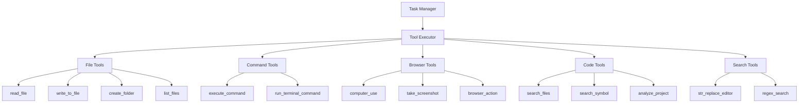

# Tools 工具系统模块

## 1. 模块概述

Tools 模块是 Kilocode 的工具执行系统，提供了丰富的工具集合，使 AI 助手能够与文件系统、命令行、浏览器等进行交互，实现各种自动化任务。

### 1.1 核心功能

- **文件系统操作**: 读取、写入、创建、删除文件和目录
- **命令行执行**: 执行系统命令和脚本
- **浏览器自动化**: 网页浏览、截图、交互
- **代码分析**: 代码搜索、符号查找、AST 分析
- **项目管理**: 项目结构分析、依赖管理

## 2. 文档结构

- `tools-overview.md` - 工具系统概览和使用指南
- `tools-architecture.md` - 工具系统架构设计文档

## 3. 工具架构设计



## 3. 核心工具详解

### 3.1 文件系统工具

#### 3.1.1 read_file 工具

```typescript
interface ReadFileParams {
	path: string
	view_range?: [number, number]
}

interface ReadFileResult {
	content: string
	size: number
	encoding: string
	lastModified: Date
}

// 实现示例
async function readFile(params: ReadFileParams): Promise<ReadFileResult> {
	const { path, view_range } = params

	// 安全检查
	if (await isProtectedFile(path)) {
		throw new Error(`File ${path} is protected`)
	}

	// 读取文件
	const content = await fs.readFile(path, "utf-8")
	const stats = await fs.stat(path)

	// 处理视图范围
	let finalContent = content
	if (view_range) {
		const lines = content.split("\n")
		finalContent = lines.slice(view_range[0] - 1, view_range[1]).join("\n")
	}

	return {
		content: finalContent,
		size: stats.size,
		encoding: "utf-8",
		lastModified: stats.mtime,
	}
}
```

#### 3.1.2 write_to_file 工具

```typescript
interface WriteFileParams {
	path: string
	content: string
	create_directories?: boolean
	backup?: boolean
}

interface WriteFileResult {
	success: boolean
	bytesWritten: number
	backupPath?: string
}

// 实现示例
async function writeToFile(params: WriteFileParams): Promise<WriteFileResult> {
	const { path, content, create_directories = true, backup = false } = params

	// 创建目录
	if (create_directories) {
		await fs.mkdir(dirname(path), { recursive: true })
	}

	// 备份原文件
	let backupPath: string | undefined
	if (backup && (await fs.pathExists(path))) {
		backupPath = `${path}.backup.${Date.now()}`
		await fs.copy(path, backupPath)
	}

	// 写入文件
	await fs.writeFile(path, content, "utf-8")
	const stats = await fs.stat(path)

	return {
		success: true,
		bytesWritten: stats.size,
		backupPath,
	}
}
```

### 3.2 命令执行工具

#### 3.2.1 execute_command 工具

```typescript
interface ExecuteCommandParams {
	command: string
	cwd?: string
	timeout?: number
	env?: Record<string, string>
}

interface ExecuteCommandResult {
	stdout: string
	stderr: string
	exitCode: number
	duration: number
}

// 实现示例
async function executeCommand(params: ExecuteCommandParams): Promise<ExecuteCommandResult> {
	const { command, cwd = process.cwd(), timeout = 30000, env } = params

	// 安全检查
	if (isDangerousCommand(command)) {
		throw new Error(`Command "${command}" is not allowed`)
	}

	const startTime = Date.now()

	try {
		const result = await exec(command, {
			cwd,
			timeout,
			env: { ...process.env, ...env },
		})

		return {
			stdout: result.stdout,
			stderr: result.stderr,
			exitCode: 0,
			duration: Date.now() - startTime,
		}
	} catch (error) {
		return {
			stdout: error.stdout || "",
			stderr: error.stderr || error.message,
			exitCode: error.code || 1,
			duration: Date.now() - startTime,
		}
	}
}
```

### 3.3 浏览器自动化工具

#### 3.3.1 computer_use 工具

```typescript
interface ComputerUseParams {
	action: "screenshot" | "click" | "type" | "scroll" | "key"
	coordinate?: [number, number]
	text?: string
	key?: string
}

interface ComputerUseResult {
	success: boolean
	screenshot?: string
	message?: string
}

// 实现示例
class BrowserAutomation {
	private browser: Browser
	private page: Page

	async computerUse(params: ComputerUseParams): Promise<ComputerUseResult> {
		const { action, coordinate, text, key } = params

		switch (action) {
			case "screenshot":
				return await this.takeScreenshot()

			case "click":
				if (!coordinate) throw new Error("Coordinate required for click")
				await this.page.mouse.click(coordinate[0], coordinate[1])
				return { success: true, message: "Click executed" }

			case "type":
				if (!text) throw new Error("Text required for type")
				await this.page.keyboard.type(text)
				return { success: true, message: "Text typed" }

			case "scroll":
				await this.page.mouse.wheel(0, coordinate?.[1] || 100)
				return { success: true, message: "Scroll executed" }

			case "key":
				if (!key) throw new Error("Key required for key action")
				await this.page.keyboard.press(key)
				return { success: true, message: "Key pressed" }

			default:
				throw new Error(`Unknown action: ${action}`)
		}
	}

	private async takeScreenshot(): Promise<ComputerUseResult> {
		const screenshot = await this.page.screenshot({
			encoding: "base64",
			fullPage: true,
		})

		return {
			success: true,
			screenshot: `data:image/png;base64,${screenshot}`,
			message: "Screenshot taken",
		}
	}
}
```

### 3.4 代码分析工具

#### 3.4.1 search_files 工具

```typescript
interface SearchFilesParams {
	path: string
	regex: string
	file_pattern?: string
	max_results?: number
}

interface SearchFilesResult {
	matches: SearchMatch[]
	totalMatches: number
	searchTime: number
}

interface SearchMatch {
	file: string
	line: number
	column: number
	match: string
	context: string
}

// 实现示例
async function searchFiles(params: SearchFilesParams): Promise<SearchFilesResult> {
	const { path, regex, file_pattern = "*", max_results = 100 } = params
	const startTime = Date.now()

	const matches: SearchMatch[] = []
	const regexObj = new RegExp(regex, "gi")

	// 获取文件列表
	const files = await glob(file_pattern, { cwd: path })

	for (const file of files) {
		if (matches.length >= max_results) break

		try {
			const content = await fs.readFile(join(path, file), "utf-8")
			const lines = content.split("\n")

			lines.forEach((line, index) => {
				let match
				while ((match = regexObj.exec(line)) !== null) {
					matches.push({
						file,
						line: index + 1,
						column: match.index + 1,
						match: match[0],
						context: line.trim(),
					})

					if (matches.length >= max_results) break
				}
			})
		} catch (error) {
			// 忽略无法读取的文件
			continue
		}
	}

	return {
		matches,
		totalMatches: matches.length,
		searchTime: Date.now() - startTime,
	}
}
```

## 4. 工具安全机制

### 4.1 权限控制

```typescript
// 工具权限定义
interface ToolPermission {
	toolName: string
	allowedPaths?: string[]
	blockedPaths?: string[]
	allowedCommands?: string[]
	blockedCommands?: string[]
	requiresApproval?: boolean
}

// 权限检查器
class ToolPermissionChecker {
	private permissions: Map<string, ToolPermission> = new Map()

	checkPermission(toolName: string, params: any): boolean {
		const permission = this.permissions.get(toolName)
		if (!permission) return false

		switch (toolName) {
			case "read_file":
			case "write_to_file":
				return this.checkFilePermission(permission, params.path)

			case "execute_command":
				return this.checkCommandPermission(permission, params.command)

			default:
				return true
		}
	}

	private checkFilePermission(permission: ToolPermission, path: string): boolean {
		// 检查阻止路径
		if (permission.blockedPaths?.some((blocked) => path.includes(blocked))) {
			return false
		}

		// 检查允许路径
		if (permission.allowedPaths?.length > 0) {
			return permission.allowedPaths.some((allowed) => path.startsWith(allowed))
		}

		return true
	}

	private checkCommandPermission(permission: ToolPermission, command: string): boolean {
		const commandName = command.split(" ")[0]

		// 检查阻止命令
		if (permission.blockedCommands?.includes(commandName)) {
			return false
		}

		// 检查允许命令
		if (permission.allowedCommands?.length > 0) {
			return permission.allowedCommands.includes(commandName)
		}

		return true
	}
}
```

### 4.2 沙箱执行

```typescript
// 沙箱执行环境
class ToolSandbox {
	private readonly workingDirectory: string
	private readonly allowedPaths: Set<string>

	constructor(workingDirectory: string) {
		this.workingDirectory = workingDirectory
		this.allowedPaths = new Set([workingDirectory])
	}

	// 验证路径安全性
	validatePath(path: string): boolean {
		const resolvedPath = resolve(path)

		// 检查是否在允许的路径内
		for (const allowedPath of this.allowedPaths) {
			if (resolvedPath.startsWith(allowedPath)) {
				return true
			}
		}

		return false
	}

	// 安全执行工具
	async executeTool(toolName: string, params: any): Promise<any> {
		// 路径验证
		if (params.path && !this.validatePath(params.path)) {
			throw new Error(`Path ${params.path} is not allowed`)
		}

		// 执行工具
		const tool = this.getTool(toolName)
		return await tool.execute(params)
	}
}
```

## 5. 工具注册和发现

### 5.1 工具注册系统

```typescript
// 工具定义接口
interface ToolDefinition {
	name: string
	description: string
	parameters: ToolParameter[]
	execute: (params: any) => Promise<any>
	validate?: (params: any) => boolean
	requiresApproval?: boolean
}

// 工具注册器
class ToolRegistry {
	private tools: Map<string, ToolDefinition> = new Map()

	// 注册工具
	register(tool: ToolDefinition): void {
		this.tools.set(tool.name, tool)
	}

	// 获取工具
	getTool(name: string): ToolDefinition | undefined {
		return this.tools.get(name)
	}

	// 获取所有工具
	getAllTools(): ToolDefinition[] {
		return Array.from(this.tools.values())
	}

	// 获取工具描述（用于 AI）
	getToolDescriptions(): string {
		return this.getAllTools()
			.map((tool) => `${tool.name}: ${tool.description}`)
			.join("\n")
	}
}

// 工具注册示例
const toolRegistry = new ToolRegistry()

toolRegistry.register({
	name: "read_file",
	description: "Read the contents of a file",
	parameters: [
		{ name: "path", type: "string", required: true, description: "Path to the file" },
		{ name: "view_range", type: "array", required: false, description: "Line range to view" },
	],
	execute: readFile,
	validate: (params) => typeof params.path === "string",
})
```

### 5.2 动态工具加载

```typescript
// 动态工具加载器
class DynamicToolLoader {
	private toolRegistry: ToolRegistry

	constructor(toolRegistry: ToolRegistry) {
		this.toolRegistry = toolRegistry
	}

	// 从目录加载工具
	async loadToolsFromDirectory(directory: string): Promise<void> {
		const toolFiles = await glob("*.tool.js", { cwd: directory })

		for (const toolFile of toolFiles) {
			try {
				const toolModule = await import(join(directory, toolFile))
				const toolDefinition = toolModule.default || toolModule

				if (this.isValidToolDefinition(toolDefinition)) {
					this.toolRegistry.register(toolDefinition)
				}
			} catch (error) {
				console.warn(`Failed to load tool from ${toolFile}:`, error)
			}
		}
	}

	private isValidToolDefinition(tool: any): tool is ToolDefinition {
		return (
			tool &&
			typeof tool.name === "string" &&
			typeof tool.description === "string" &&
			Array.isArray(tool.parameters) &&
			typeof tool.execute === "function"
		)
	}
}
```

## 6. 工具执行监控

### 6.1 执行统计

```typescript
// 工具使用统计
interface ToolUsageStats {
	toolName: string
	executionCount: number
	totalExecutionTime: number
	averageExecutionTime: number
	successCount: number
	errorCount: number
	lastUsed: Date
}

// 工具监控器
class ToolMonitor {
	private stats: Map<string, ToolUsageStats> = new Map()

	// 记录工具执行
	recordExecution(toolName: string, executionTime: number, success: boolean): void {
		let stat = this.stats.get(toolName)

		if (!stat) {
			stat = {
				toolName,
				executionCount: 0,
				totalExecutionTime: 0,
				averageExecutionTime: 0,
				successCount: 0,
				errorCount: 0,
				lastUsed: new Date(),
			}
			this.stats.set(toolName, stat)
		}

		stat.executionCount++
		stat.totalExecutionTime += executionTime
		stat.averageExecutionTime = stat.totalExecutionTime / stat.executionCount
		stat.lastUsed = new Date()

		if (success) {
			stat.successCount++
		} else {
			stat.errorCount++
		}
	}

	// 获取统计信息
	getStats(toolName?: string): ToolUsageStats[] {
		if (toolName) {
			const stat = this.stats.get(toolName)
			return stat ? [stat] : []
		}

		return Array.from(this.stats.values())
	}
}
```

## 7. 错误处理和重试

### 7.1 工具错误处理

```typescript
// 工具错误类型
enum ToolErrorType {
	PERMISSION_DENIED = "permission_denied",
	FILE_NOT_FOUND = "file_not_found",
	COMMAND_FAILED = "command_failed",
	TIMEOUT = "timeout",
	INVALID_PARAMS = "invalid_params",
}

// 工具错误类
class ToolError extends Error {
	constructor(
		public readonly type: ToolErrorType,
		public readonly toolName: string,
		message: string,
		public readonly params?: any,
	) {
		super(message)
		this.name = "ToolError"
	}
}

// 工具执行器
class ToolExecutor {
	async executeTool(toolName: string, params: any): Promise<any> {
		const tool = this.toolRegistry.getTool(toolName)
		if (!tool) {
			throw new ToolError(ToolErrorType.INVALID_PARAMS, toolName, `Tool ${toolName} not found`)
		}

		try {
			// 参数验证
			if (tool.validate && !tool.validate(params)) {
				throw new ToolError(ToolErrorType.INVALID_PARAMS, toolName, "Invalid parameters", params)
			}

			// 执行工具
			const result = await tool.execute(params)
			return result
		} catch (error) {
			if (error instanceof ToolError) {
				throw error
			}

			// 包装其他错误
			throw new ToolError(ToolErrorType.COMMAND_FAILED, toolName, error.message, params)
		}
	}
}
```

## 8. 性能优化

### 8.1 工具缓存

```typescript
// 工具结果缓存
class ToolCache {
	private cache: Map<string, { result: any; timestamp: number }> = new Map()
	private readonly ttl: number = 5 * 60 * 1000 // 5分钟

	// 生成缓存键
	private getCacheKey(toolName: string, params: any): string {
		return `${toolName}:${JSON.stringify(params)}`
	}

	// 获取缓存结果
	get(toolName: string, params: any): any | null {
		const key = this.getCacheKey(toolName, params)
		const cached = this.cache.get(key)

		if (!cached) return null

		// 检查是否过期
		if (Date.now() - cached.timestamp > this.ttl) {
			this.cache.delete(key)
			return null
		}

		return cached.result
	}

	// 设置缓存结果
	set(toolName: string, params: any, result: any): void {
		const key = this.getCacheKey(toolName, params)
		this.cache.set(key, {
			result,
			timestamp: Date.now(),
		})
	}

	// 清理过期缓存
	cleanup(): void {
		const now = Date.now()
		for (const [key, cached] of this.cache.entries()) {
			if (now - cached.timestamp > this.ttl) {
				this.cache.delete(key)
			}
		}
	}
}
```

## 9. 测试策略

### 9.1 工具单元测试

```typescript
describe("Tools", () => {
	let toolRegistry: ToolRegistry
	let toolExecutor: ToolExecutor

	beforeEach(() => {
		toolRegistry = new ToolRegistry()
		toolExecutor = new ToolExecutor(toolRegistry)
	})

	describe("read_file tool", () => {
		it("should read file content", async () => {
			const params = { path: "test.txt" }
			const result = await toolExecutor.executeTool("read_file", params)

			expect(result.content).toBeDefined()
			expect(result.size).toBeGreaterThan(0)
		})

		it("should handle file not found", async () => {
			const params = { path: "nonexistent.txt" }

			await expect(toolExecutor.executeTool("read_file", params)).rejects.toThrow(ToolError)
		})
	})
})
```

## 10. 最佳实践

### 10.1 工具设计原则

- **单一职责**: 每个工具只做一件事
- **参数验证**: 严格验证输入参数
- **错误处理**: 提供清晰的错误信息
- **幂等性**: 相同输入产生相同输出

### 10.2 安全考虑

- **路径验证**: 防止路径遍历攻击
- **命令过滤**: 阻止危险命令执行
- **权限控制**: 实施最小权限原则
- **输入清理**: 清理和验证用户输入

### 10.3 性能优化

- **结果缓存**: 缓存昂贵操作的结果
- **异步执行**: 使用异步操作避免阻塞
- **资源管理**: 及时释放系统资源
- **批量操作**: 合并相似操作减少开销

---

_本文档详细介绍了 Tools 工具系统模块的设计和实现，为开发者提供了完整的工具开发和使用指南。_
