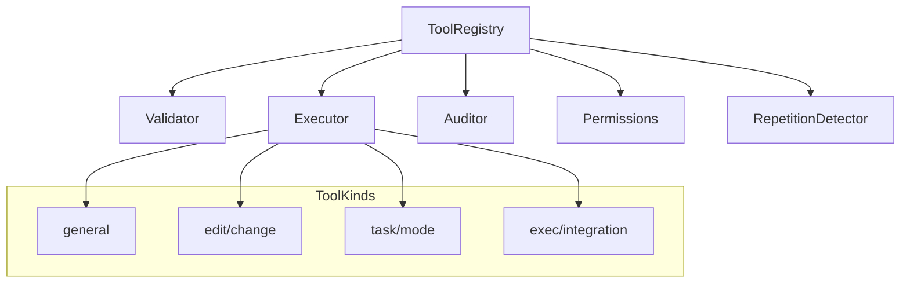
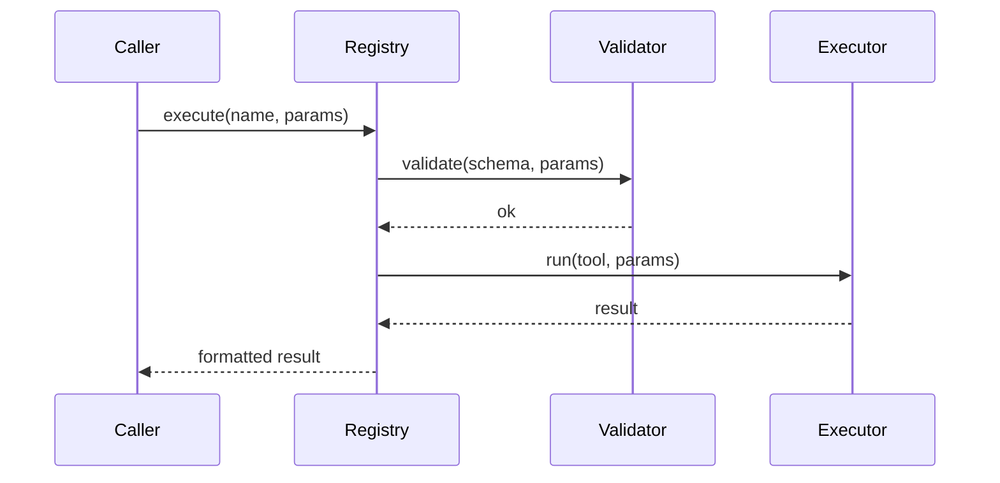

# src/core/tools — 详细架构与设计

## 目标

- 提供可组合、可审计的动作集合；统一校验、执行与结果格式化。

## 组件架构



## 数据模型

- Tool: { name, description, schema, execute }
- ExecutionRecord: { tool, input, output, duration, error? }

## 公共 API

```ts
interface ToolRegistry {
	register(tool: Tool): void
	get(name: string): Tool | undefined
	execute(name: string, params: unknown): Promise<ToolResult>
}
```

## 执行流程



## 权限与审计

- Permissions: 基于 `protect` 策略与任务上下文判定。
- Auditor: 写入 `task-persistence`，可重放与追踪。

## 错误分类

- ValidationError: 参数与 schema 不匹配
- PermissionDenied: 受保护操作
- ExecutionError: 工具执行失败

## 测试

- schema 校验覆盖；重复检测拦截；受保护路径拒绝；执行审计记录完整。
