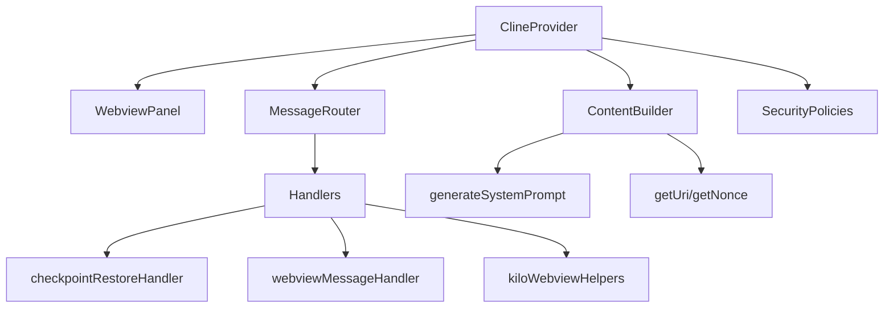
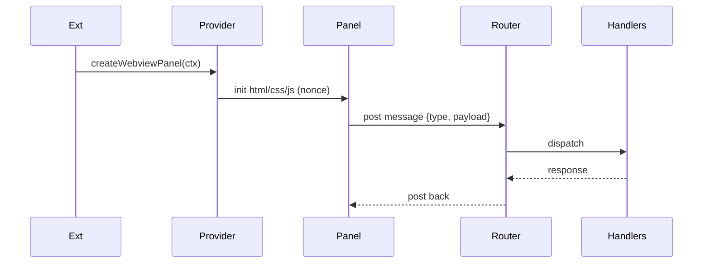

# src/core/webview — 详细架构与设计

## 目标
- 管理 Webview 生命周期与消息路由；生成安全可展示内容并与 VS Code 交互。

## 组件架构


## 公共 API
```ts
interface ClineProvider {
  createWebviewPanel(ctx: ExtensionContext): WebviewPanel
  postMessage(type: string, payload: unknown): void
  onMessage(cb: (msg: WebviewMessage) => void): () => void
}
```

## 典型流程


## 安全策略
- CSP: `nonce` + 仅允许可信资源；
- 输入校验：消息协议 schema 验证；
- 敏感操作：结合 `protect` 与权限白名单。

## 错误分类
- RouterError: 未知消息类型/负载不合法
- RenderError: 模板生成失败
- SecurityError: CSP/权限校验失败

## 性能与稳定
- 批量消息合并；对 UI 无关的任务采用后台线程；错误降级为 toast 提示。

## 测试
- 消息路由正确性；CSP 生效；模板生成边界；恢复检查点交互。