# ClineProvider 对象协作分析文档

## 📋 文档概述

本文档详细分析 `core/webview/ClineProvider.ts` 中涉及的所有对象及其协作机制，帮助开发者理解整个系统的架构设计和对象间的交互模式。

## 🏗️ 系统架构概览

ClineProvider 作为核心协调器，管理着多个功能模块和服务对象。为了更清晰地展示系统架构，我们将其拆分为主架构图和各个子模块的详细架构图。

### 1. 主架构图 - ClineProvider 核心层次结构

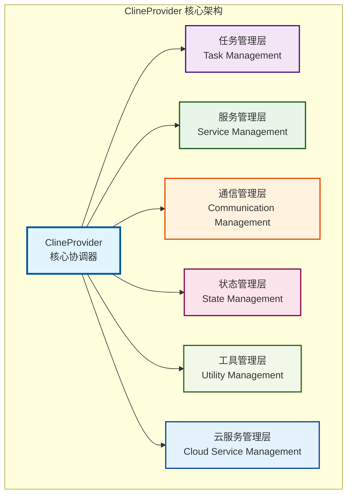

_主架构图展示了 ClineProvider 的六大核心功能层，每个层负责特定的职责领域。_

### 2. 任务管理模块架构图

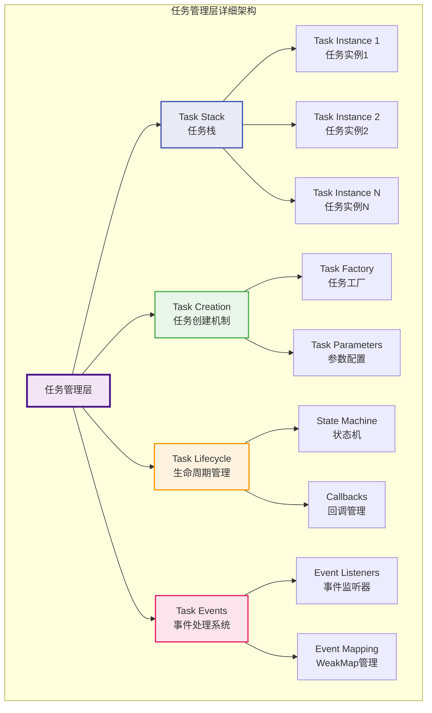

_任务管理层负责 AI 任务的完整生命周期，从创建到销毁的全过程管理。_

### 3. 服务集成模块架构图

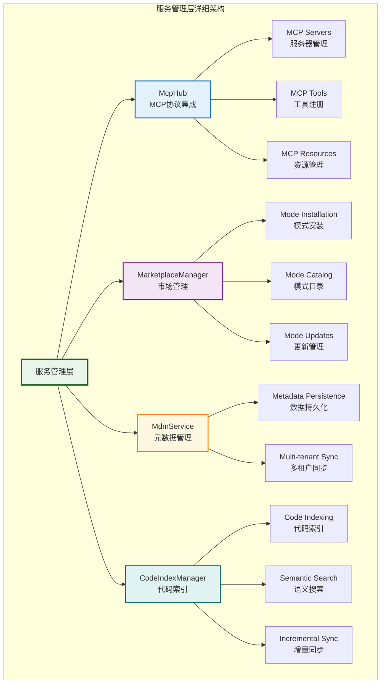

_服务管理层集成了多个外部服务和协议，提供丰富的功能扩展能力。_

### 4. 状态管理模块架构图

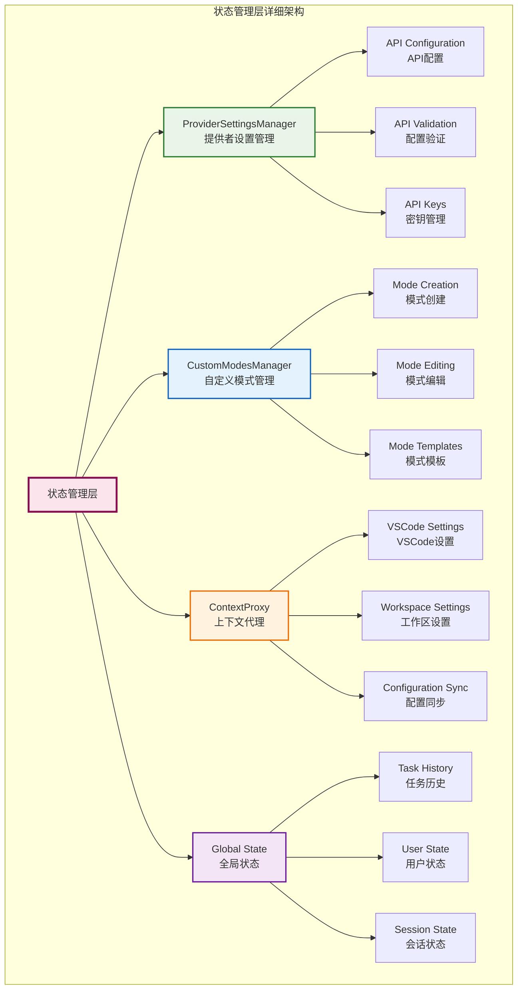

_状态管理层确保系统配置和状态的一致性，支持多层次的配置管理。_

### 5. 通信管理模块架构图

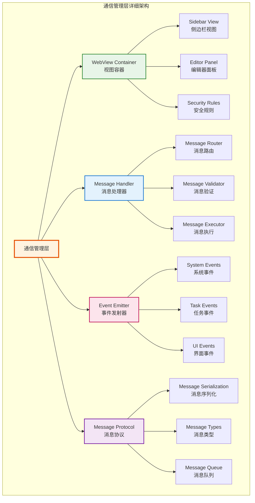

_通信管理层处理前后端的所有消息通信，确保数据传输的安全性和可靠性。_

### 6. 工具管理模块架构图

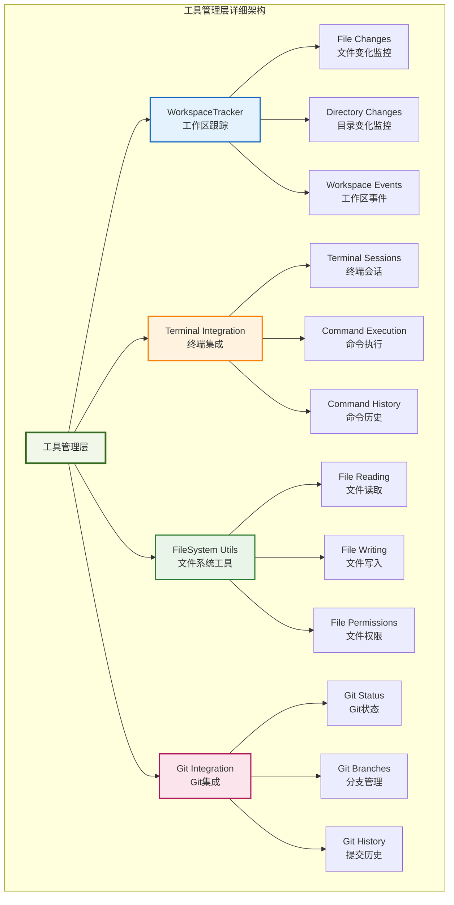

_工具管理层提供各种开发工具的集成，支持文件操作、终端控制和版本管理。_

### 7. 云服务管理模块架构图

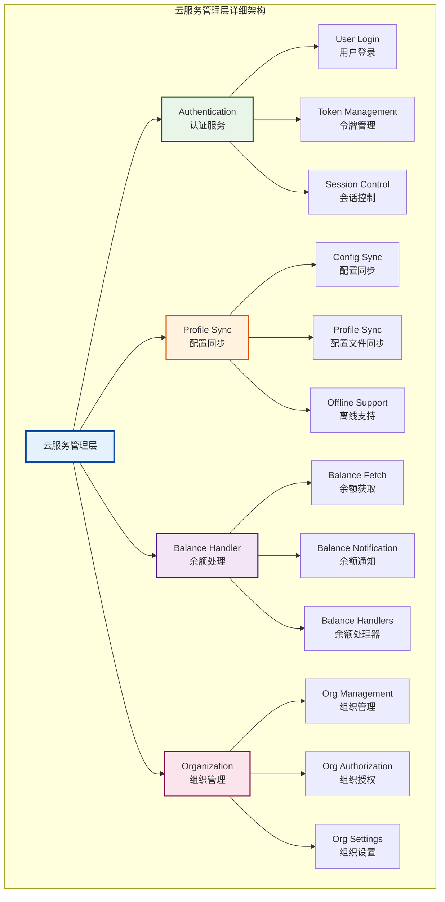

_云服务管理层处理所有与云端相关的功能，包括用户认证、数据同步和组织管理。_

### 8. 对象交互关系图

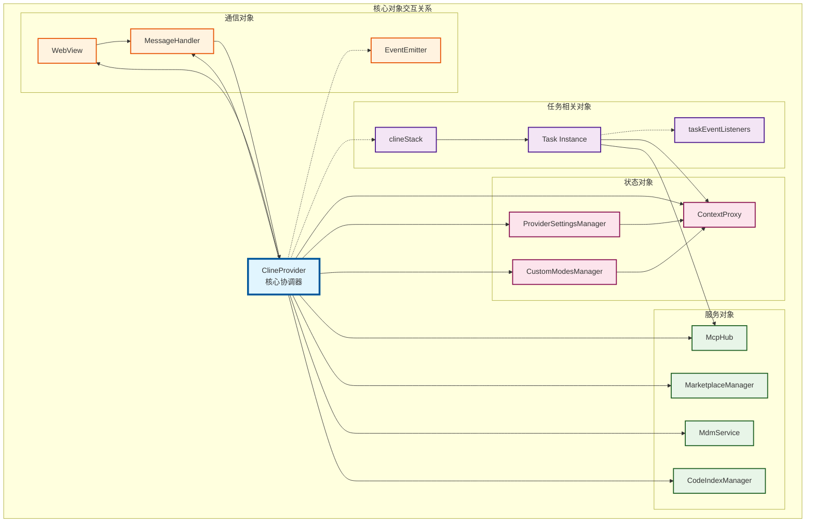

_对象交互关系图展示了核心对象之间的依赖关系和通信路径，实线表示直接依赖，虚线表示间接关系。_

### 9. 数据流架构图

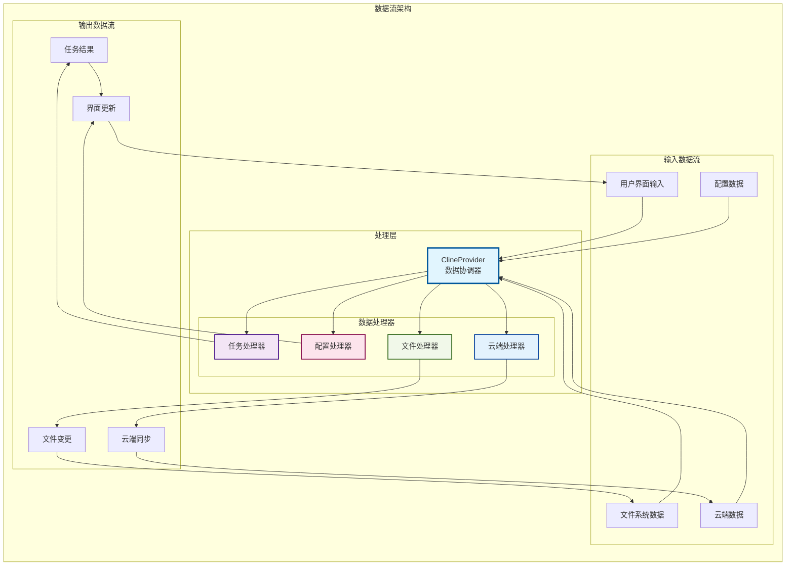

_数据流架构图展示了不同类型数据在系统中的流转路径和处理方式。_

### 10. 系统协作时序图

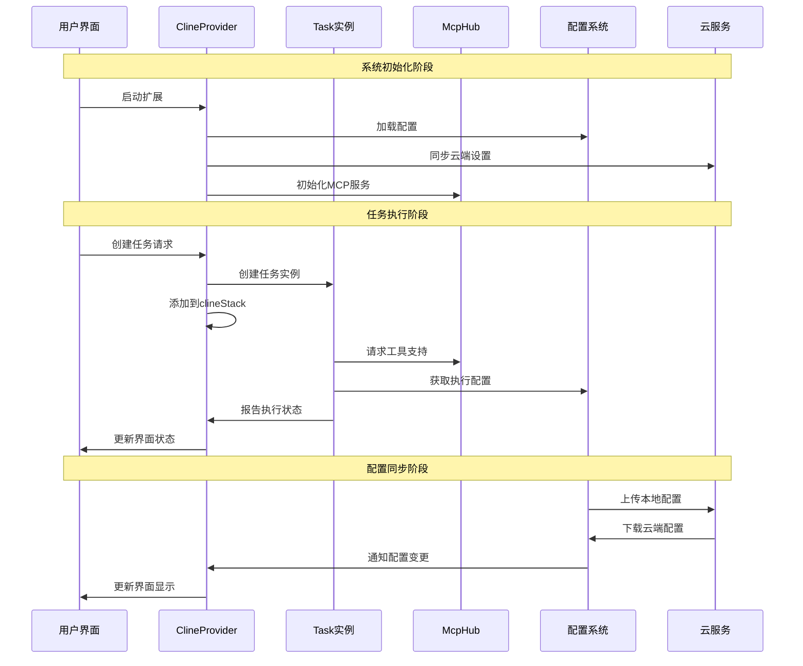

_系统协作时序图展示了主要操作流程中各个组件的交互顺序和时机。_

## 🔧 核心对象详细分析

### 1. 任务管理相关对象

#### 1.1 Task 对象

```typescript
private clineStack: Task[] = []
```

**职责与功能：**

- 表示单个 AI 任务实例

- 管理任务的生命周期（创建、执行、完成、中止）

- 处理任务状态变化和事件传播

- 支持任务嵌套和父子关系

**协作机制：**

- 通过 `clineStack` 数组管理活跃任务

- 使用 EventEmitter 模式广播任务状态变化

- 与 ClineProvider 通过事件监听器进行双向通信

#### 1.2 clineStack 任务栈

```typescript
private clineStack: Task[] = []
```

**职责与功能：**

- 维护当前活跃的任务列表

- 支持任务的堆栈式管理（LIFO）

- 提供任务查找和状态查询功能

**协作机制：**

- 作为任务容器，与 Task 对象紧密协作

- 通过 `getCurrentTask()` 等方法提供任务访问接口

- 支持任务的创建、删除和状态更新

#### 1.3 taskEventListeners 事件监听器映射

```typescript
private taskEventListeners: WeakMap<Task, Array<() => void>> = new WeakMap()
```

**职责与功能：**

- 管理每个任务的事件监听器

- 确保任务销毁时正确清理监听器

- 防止内存泄漏

**协作机制：**

- 使用 WeakMap 确保任务对象被垃圾回收时自动清理

- 与任务生命周期管理紧密集成

### 2. 服务集成对象

#### 2.1 McpHub - MCP 协议集成中心

```typescript
protected mcpHub?: McpHub
```

**职责与功能：**

- 管理 Model Context Protocol (MCP) 服务器

- 提供工具和资源的动态加载

- 处理 MCP 客户端注册和通信

**协作机制：**

- 通过 `McpServerManager.getInstance()` 单例模式初始化

- 与任务执行过程集成，提供动态工具支持

- 通过异步初始化避免阻塞主流程

#### 2.2 MarketplaceManager - 市场管理器

```typescript
private marketplaceManager: MarketplaceManager
```

**职责与功能：**

- 管理扩展市场的模式和工具

- 处理模式的安装、卸载和更新

- 提供市场内容的搜索和浏览

**协作机制：**

- 与 `CustomModesManager` 协作管理自定义模式

- 通过构造函数注入依赖关系

- 支持异步操作和错误处理

#### 2.3 MdmService - 元数据管理服务

```typescript
private mdmService?: MdmService
```

**职责与功能：**

- 管理项目和任务的元数据

- 提供数据持久化和同步功能

- 支持多租户和组织级别的数据管理

**协作机制：**

- 可选依赖，通过构造函数注入

- 与云服务集成，支持数据同步

- 提供异步 API 接口

#### 2.4 CodeIndexManager - 代码索引管理器

```typescript
private codeIndexManager?: CodeIndexManager
```

**职责与功能：**

- 管理代码库的索引和搜索

- 提供语义搜索和代码理解功能

- 支持增量索引和实时更新

**协作机制：**

- 通过订阅机制监听索引状态变化

- 与工作区跟踪器协作监控文件变化

- 支持配置驱动的索引策略

### 3. 状态管理对象

#### 3.1 ProviderSettingsManager - 提供者设置管理器

```typescript
public readonly providerSettingsManager: ProviderSettingsManager
```

**职责与功能：**

- 管理 AI 提供者的配置和设置

- 处理 API 密钥和认证信息

- 支持多提供者配置切换

**协作机制：**

- 与 `ContextProxy` 协作管理配置持久化

- 提供配置验证和错误处理

- 支持配置的导入导出功能

#### 3.2 CustomModesManager - 自定义模式管理器

```typescript
public readonly customModesManager: CustomModesManager
```

**职责与功能：**

- 管理用户自定义的 AI 模式

- 处理模式的创建、编辑和删除

- 提供模式模板和验证功能

**协作机制：**

- 与 `MarketplaceManager` 协作处理市场模式

- 通过回调函数与 UI 状态同步

- 支持模式的动态加载和热更新

#### 3.3 ContextProxy - 上下文代理

```typescript
public readonly contextProxy: ContextProxy
```

**职责与功能：**

- 提供统一的配置访问接口

- 管理全局和工作区级别的设置

- 处理配置的读取、写入和同步

**协作机制：**

- 作为配置系统的统一入口点

- 与 VSCode 扩展上下文集成

- 支持配置的分层管理和继承

### 4. 通信管理对象

#### 4.1 WebView 视图对象

```typescript
private view?: vscode.WebviewView | vscode.WebviewPanel
```

**职责与功能：**

- 管理用户界面的 WebView 容器

- 处理前后端消息通信

- 提供安全的 Web 内容渲染环境

**协作机制：**

- 通过 `webviewMessageHandler` 处理消息路由

- 与状态管理系统集成，实现 UI 状态同步

- 支持多种渲染上下文（侧边栏、编辑器面板）

#### 4.2 消息处理系统

```typescript
// 通过 webviewMessageHandler 模块实现
```

**职责与功能：**

- 处理 WebView 与扩展之间的消息通信

- 提供消息类型安全和验证

- 支持异步消息处理和错误恢复

**协作机制：**

- 与所有服务对象集成，提供统一的通信接口

- 通过消息类型路由到相应的处理器

- 支持消息的序列化和反序列化

### 5. 工具和实用对象

#### 5.1 WorkspaceTracker - 工作区跟踪器

```typescript
private _workspaceTracker?: WorkspaceTracker
```

**职责与功能：**

- 监控工作区文件和目录变化

- 提供文件系统事件通知

- 支持工作区状态的实时跟踪

**协作机制：**

- 与 `CodeIndexManager` 协作处理文件变化

- 通过事件系统通知相关组件

- 支持多工作区环境

#### 5.2 Terminal 集成

```typescript
// 通过 Terminal 类集成
```

**职责与功能：**

- 管理终端会话和命令执行

- 提供 Shell 集成和命令历史

- 支持跨平台的终端操作

**协作机制：**

- 与任务执行系统集成

- 提供命令执行的异步接口

- 支持终端状态的监控和管理

### 6. 云服务对象

#### 6.1 CloudService 云服务集成

```typescript
// 通过 CloudService 单例访问
```

**职责与功能：**

- 管理用户认证和授权

- 提供云端配置同步功能

- 支持组织级别的设置管理

**协作机制：**

- 与配置管理系统集成

- 提供异步的云端操作接口

- 支持离线模式和错误恢复

#### 6.2 平衡数据处理器

```typescript
private balanceHandlers: Array<(data: BalanceDataResponsePayload) => void> = []
```

**职责与功能：**

- 管理用户账户余额信息

- 提供余额变化的实时通知

- 支持多个余额监听器

**协作机制：**

- 通过观察者模式通知余额变化

- 与云服务 API 集成获取实时数据

- 支持错误处理和重试机制

## 🔄 对象协作流程分析

为了更清晰地展示各种协作流程，我们将复杂的流程拆分为多个专门的时序图。

### 1. 系统初始化详细流程

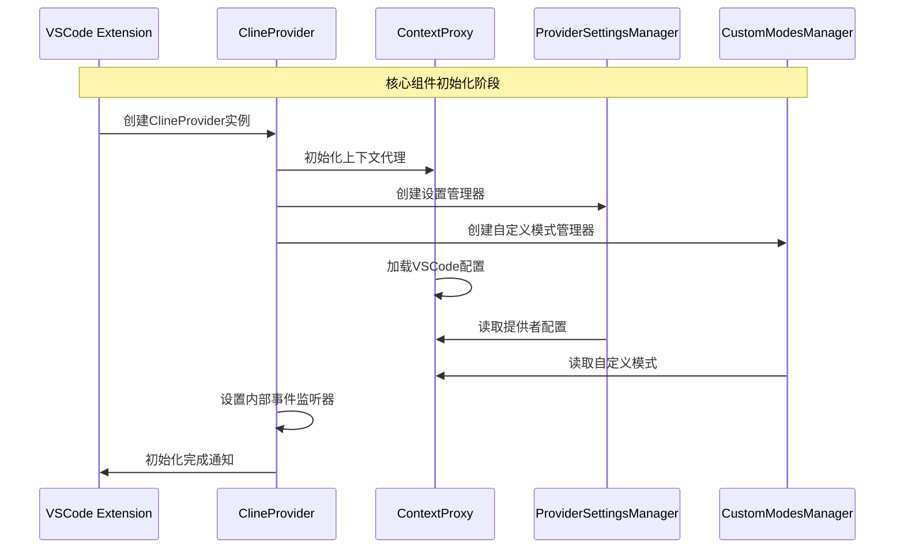

_系统初始化流程展示了 ClineProvider 启动时核心组件的创建和配置加载过程。_

### 2. 服务集成初始化流程

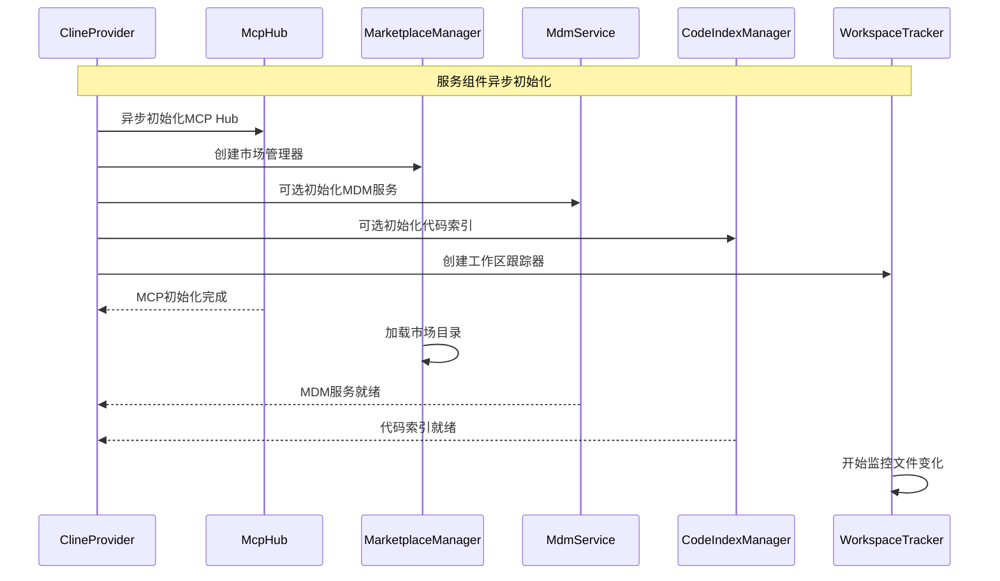

_服务集成初始化流程展示了各种服务组件的异步初始化过程。_

### 3. 任务创建和管理流程

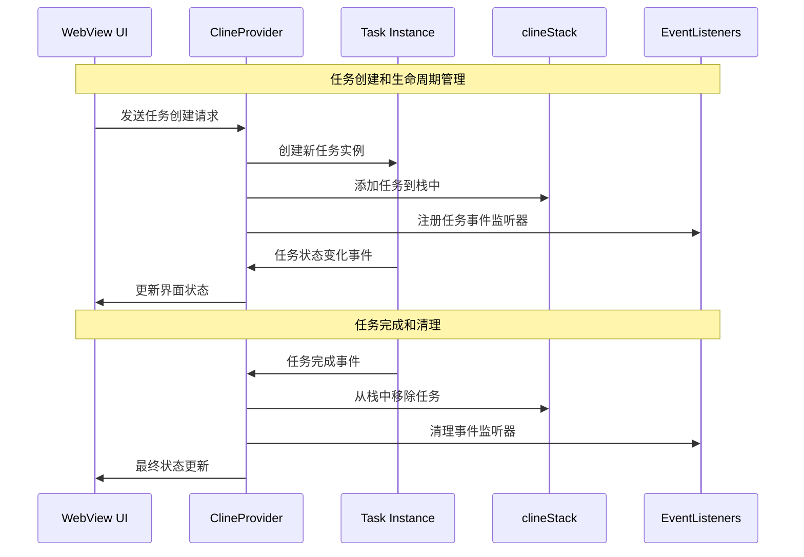

_任务管理流程展示了任务从创建到销毁的完整生命周期管理。_

### 4. 消息通信流程

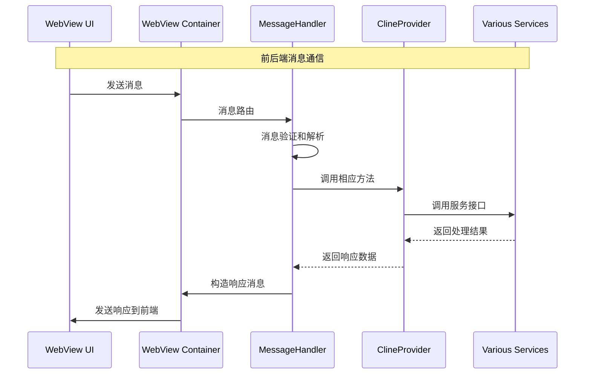

_消息通信流程展示了前后端之间的双向消息传递机制。_

### 5. 配置同步详细流程

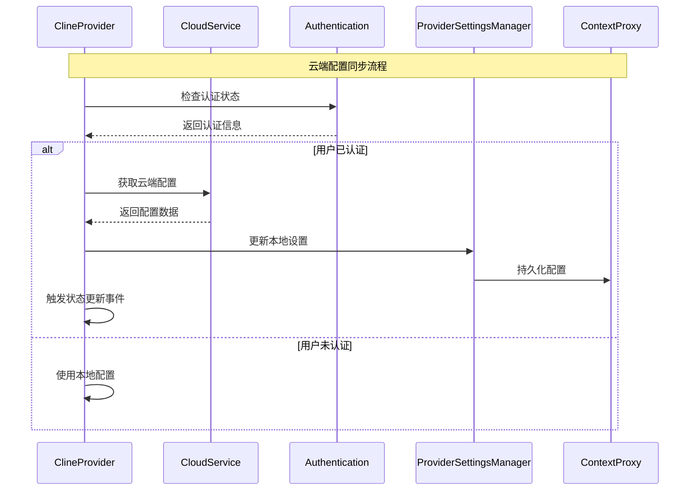

_配置同步流程展示了本地配置与云端配置的同步机制。_

### 6. MCP 工具集成流程

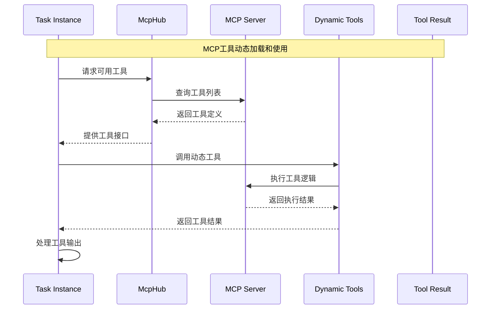

_MCP 工具集成流程展示了动态工具的加载和使用过程。_

## 🎯 核心协作模式

### 1. 观察者模式 (Observer Pattern)

- **应用场景**: 任务状态变化、配置更新、文件系统事件

- **实现方式**: EventEmitter 继承和事件监听器

- **优势**: 松耦合的组件通信，支持一对多的事件通知

### 2. 单例模式 (Singleton Pattern)

- **应用场景**: McpServerManager、CloudService、TelemetryService

- **实现方式**: 静态实例管理和懒加载

- **优势**: 确保全局唯一性，避免资源重复创建

### 3. 代理模式 (Proxy Pattern)

- **应用场景**: ContextProxy 配置访问

- **实现方式**: 统一接口封装底层实现

- **优势**: 提供透明的访问控制和缓存机制

### 4. 工厂模式 (Factory Pattern)

- **应用场景**: Task 实例创建、API Handler 构建

- **实现方式**: 工厂方法和参数化构造

- **优势**: 封装对象创建逻辑，支持多态创建

### 5. 策略模式 (Strategy Pattern)

- **应用场景**: 不同 AI 提供者的处理策略

- **实现方式**: 可插拔的处理器接口

- **优势**: 支持运行时策略切换，易于扩展

## 📊 数据流分析

### 1. 用户输入数据流

```
WebView UI → ClineProvider → Task → AI Provider → Response → Task → ClineProvider → WebView UI
```

### 2. 配置数据流

```
User Settings → ContextProxy → ProviderSettingsManager → ClineProvider → Task Execution
```

### 3. 文件系统数据流

```
File Changes → WorkspaceTracker → CodeIndexManager → Task Context → AI Processing
```

### 4. 云同步数据流

```
Local Config → CloudService → Remote API → Cloud Storage → Sync Response → Local Update
```

## 🔧 对象生命周期管理

### 1. ClineProvider 生命周期

- **创建**: 扩展激活时通过构造函数初始化

- **运行**: 管理所有子对象和服务

- **销毁**: 扩展停用时清理所有资源

### 2. Task 对象生命周期

- **创建**: 用户发起任务时动态创建

- **执行**: 在 clineStack 中管理执行状态

- **完成**: 任务结束后清理资源和事件监听器

### 3. 服务对象生命周期

- **初始化**: 在 ClineProvider 构造过程中创建

- **运行**: 提供持续的服务支持

- **清理**: 在 dispose 方法中统一清理

## 🛡️ 错误处理和恢复机制

### 1. 任务级错误处理

- 任务执行失败时的自动重试机制

- 流式传输失败时的任务重新水化

- 用户取消操作的优雅处理

### 2. 服务级错误处理

- MCP 服务器连接失败的降级处理

- 云服务不可用时的离线模式

- 配置损坏时的默认值恢复

### 3. 系统级错误处理

- 未捕获异常的全局处理

- 资源泄漏的防护机制

- 错误日志的统一收集

## 🚀 性能优化策略

### 1. 懒加载机制

- 服务对象的按需初始化

- 大型配置数据的延迟加载

- UI 组件的动态渲染

### 2. 缓存策略

- 任务历史的内存缓存

- API 响应的临时缓存

- 配置数据的多级缓存

### 3. 异步处理

- 非阻塞的服务初始化

- 并发的任务执行

- 异步的状态更新

## 🔮 扩展性设计

### 1. 插件架构

- MCP 协议的动态工具加载

- 自定义模式的热插拔

- 第三方服务的集成接口

### 2. 配置驱动

- 功能开关的配置化控制

- 行为策略的参数化配置

- UI 布局的自定义配置

### 3. 事件驱动

- 松耦合的组件通信

- 可扩展的事件类型

- 插件化的事件处理器

## 📝 总结

ClineProvider 作为整个系统的核心协调器，通过精心设计的对象协作机制，实现了：

1. **高内聚低耦合**: 每个对象职责明确，通过接口和事件进行通信
2. **可扩展性**: 支持插件化架构和动态功能加载
3. **容错性**: 多层次的错误处理和恢复机制
4. **性能优化**: 懒加载、缓存和异步处理策略
5. **维护性**: 清晰的分层架构和标准化的设计模式

这种设计使得系统能够灵活应对复杂的 AI 辅助编程场景，同时保持良好的可维护性和扩展性。
