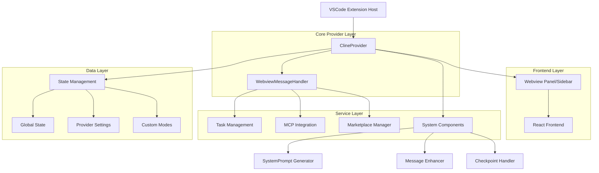
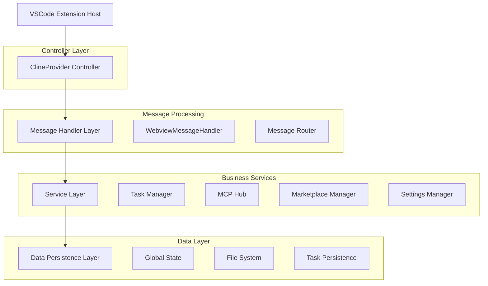
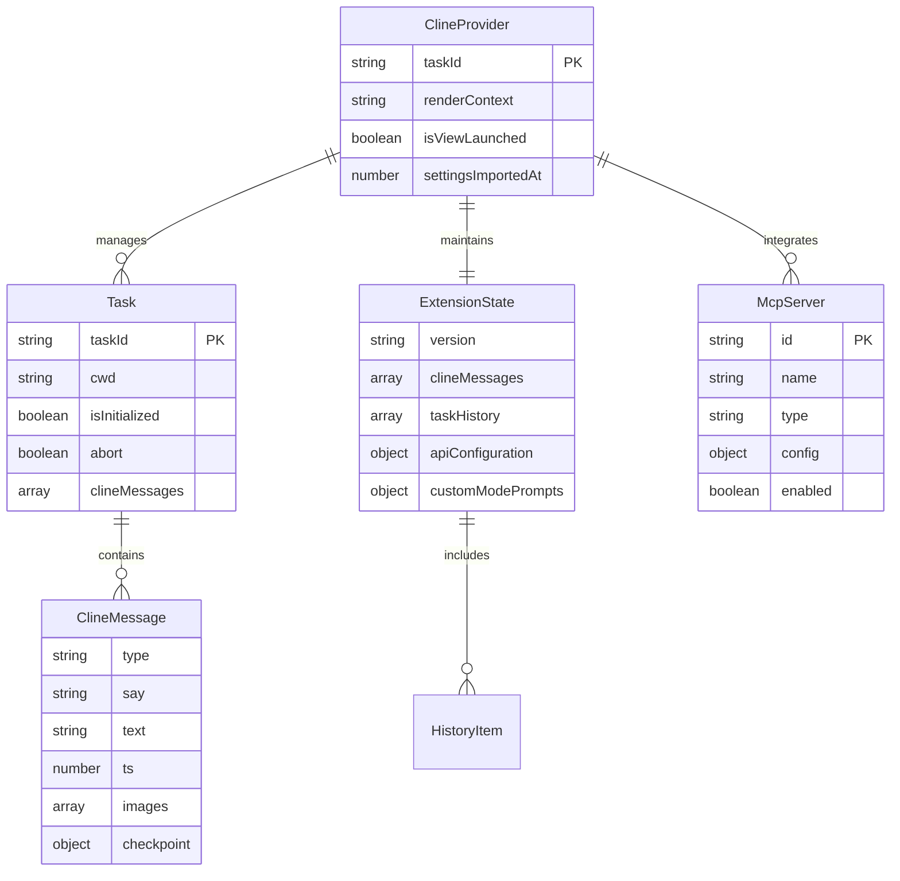

# Kilocode Core/Webview 模块技术架构文档

## 1. 架构设计



## 2. 技术描述

- **Frontend**: React + TypeScript + VSCode Webview API
- **Backend**: Node.js + VSCode Extension API
- **状态管理**: VSCode GlobalState + 内存状态管理
- **通信协议**: 基于消息的双向通信 (ExtensionMessage/WebviewMessage)
- **AI集成**: Anthropic Claude + OpenAI + 多种 LLM 提供商
- **插件系统**: Model Context Protocol (MCP)

## 3. 核心组件

### 3.1 ClineProvider (主要提供者类)

**职责**: VSCode Webview 生命周期管理和核心业务逻辑协调

**核心功能**:

- Webview 创建和销毁管理
- 任务 (Task) 生命周期管理
- 状态同步和持久化
- MCP 服务器集成
- 市场插件管理

**关键方法**:

```typescript
class ClineProvider implements vscode.WebviewViewProvider, TaskProviderLike {
	// Webview 生命周期
	resolveWebviewView(webviewView: vscode.WebviewView): void

	// 任务管理
	createTask(prompt: string): Promise<Task>
	getCurrentTask(): Task | undefined

	// 状态管理
	getState(): Promise<ExtensionState>
	postStateToWebview(): Promise<void>

	// 消息处理
	postMessageToWebview(message: ExtensionMessage): Promise<void>
}
```

### 3.2 WebviewMessageHandler (消息处理器)

**职责**: 处理前端与后端之间的所有消息通信

**消息类型**:

- **任务操作**: `newTask`, `clearTask`, `askResponse`
- **设置管理**: API 配置、模式切换、参数调整
- **文件操作**: `selectImages`, `exportCurrentTask`
- **MCP 操作**: 服务器管理、工具配置
- **检查点操作**: `checkpointRestore`, `deleteMessage`, `editMessage`

**核心处理流程**:

```typescript
export async function webviewMessageHandler(
	provider: ClineProvider,
	message: WebviewMessage,
	marketplaceManager: MarketplaceManager,
): Promise<void>
```

### 3.3 SystemPrompt Generator (系统提示生成器)

**职责**: 根据当前配置和模式生成 AI 系统提示

**生成要素**:

- 当前工作模式 (Mode)
- 自定义指令和提示
- 工具可用性 (浏览器工具、MCP 工具)
- 实验性功能配置
- 语言和本地化设置

### 3.4 Message Enhancer (消息增强器)

**职责**: 使用 AI 增强用户输入的提示内容

**功能特性**:

- 支持多种 AI 提供商
- 可选包含任务历史上下文
- 自定义增强提示模板
- 错误处理和回退机制

### 3.5 Checkpoint Restore Handler (检查点恢复处理器)

**职责**: 管理任务检查点的创建、恢复和相关操作

**操作类型**:

- **删除操作**: 删除消息并恢复到检查点
- **编辑操作**: 编辑消息并从检查点重新执行
- **恢复验证**: 确保检查点完整性

## 4. 路由定义

| 消息类型            | 处理器方法                | 功能描述                 |
| ------------------- | ------------------------- | ------------------------ |
| `newTask`           | `handleNewTask`           | 创建新的 AI 任务         |
| `askResponse`       | `handleAskResponse`       | 处理用户对 AI 询问的回应 |
| `clearTask`         | `handleClearTask`         | 清除当前任务             |
| `apiConfiguration`  | `handleApiConfiguration`  | 更新 API 配置            |
| `mode`              | `handleModeChange`        | 切换工作模式             |
| `editMessage`       | `handleEditMessage`       | 编辑历史消息             |
| `deleteMessage`     | `handleDeleteMessage`     | 删除历史消息             |
| `checkpointRestore` | `handleCheckpointRestore` | 恢复检查点               |
| `enhancePrompt`     | `handleEnhancePrompt`     | 增强用户提示             |
| `mcpServerToggle`   | `handleMcpServerToggle`   | 切换 MCP 服务器状态      |

## 5. API 定义

### 5.1 核心消息接口

**WebviewMessage (前端 → 后端)**:

```typescript
interface WebviewMessage {
	type: string
	text?: string
	images?: string[]
	// 特定消息类型的附加字段
}
```

**ExtensionMessage (后端 → 前端)**:

```typescript
interface ExtensionMessage {
  type: "action" | "state" | "selectedImages" | ...
  action?: string
  // 状态数据或操作参数
}
```

### 5.2 状态管理接口

**ExtensionState**:

```typescript
interface ExtensionState {
	version: string
	clineMessages: ClineMessage[]
	taskHistory: HistoryItem[]
	shouldShowAnnouncement: boolean
	apiConfiguration?: ProviderSettings
	customModePrompts: Record<string, string>
	// ... 更多状态字段
}
```

### 5.3 任务管理接口

**Task 生命周期**:

```typescript
interface TaskProviderLike {
	createTask(prompt: string, options?: CreateTaskOptions): Promise<Task>
	getCurrentTask(): Task | undefined
	getTaskWithId(id: string): Promise<{ historyItem: HistoryItem }>
}
```

## 6. 服务器架构图



## 7. 数据模型

### 7.1 数据模型定义



### 7.2 核心数据结构

**ClineMessage 结构**:

```typescript
interface ClineMessage {
  type: "ask" | "say"
  say?: "text" | "user_feedback" | "checkpoint_saved" | ...
  text?: string
  images?: string[]
  ts?: number
  checkpoint?: CheckpointData
}
```

**HistoryItem 结构**:

```typescript
interface HistoryItem {
	id: string
	ts: number
	task: string
	tokensIn: number
	tokensOut: number
	cacheWrites?: number
	cacheReads?: number
}
```

**ProviderSettings 结构**:

```typescript
interface ProviderSettings {
	apiProvider: ProviderName
	apiModelId?: string
	apiKey?: string
	apiBaseUrl?: string
	// 提供商特定配置
}
```

## 8. 安全考虑

### 8.1 内容安全策略 (CSP)

- **Nonce 验证**: 所有内联脚本使用动态生成的 nonce
- **资源限制**: 仅允许加载扩展内部资源和工作区文件
- **脚本执行**: 启用脚本但限制外部资源访问

### 8.2 API 密钥管理

- **安全存储**: API 密钥存储在 VSCode SecretStorage 中
- **传输加密**: 敏感数据在传输过程中加密
- **访问控制**: 基于用户权限的 API 访问控制

### 8.3 文件系统安全

- **路径验证**: 严格验证文件路径，防止目录遍历攻击
- **权限检查**: 确保只能访问工作区内的文件
- **内容过滤**: 对用户输入进行适当的清理和验证

## 9. 性能优化

### 9.1 消息处理优化

- **批量处理**: 合并相似的状态更新消息
- **防抖机制**: 对频繁的配置更改进行防抖处理
- **异步处理**: 所有 I/O 操作使用异步模式

### 9.2 内存管理

- **任务清理**: 自动清理已完成的任务资源
- **消息限制**: 限制历史消息的数量和大小
- **缓存策略**: 智能缓存常用的配置和状态数据

### 9.3 UI 响应性

- **增量更新**: 仅更新变化的 UI 部分
- **虚拟滚动**: 对长消息列表使用虚拟滚动
- **懒加载**: 按需加载历史任务和消息

## 10. 扩展性设计

### 10.1 插件架构

- **MCP 协议**: 支持标准的 Model Context Protocol
- **工具注册**: 动态注册和管理 AI 工具
- **提供商扩展**: 支持新的 AI 服务提供商

### 10.2 模式系统

- **自定义模式**: 用户可定义工作模式和提示
- **模式继承**: 支持模式间的继承和组合
- **动态切换**: 运行时动态切换工作模式

### 10.3 国际化支持

- **多语言**: 支持多种界面语言
- **本地化**: 根据用户区域设置调整行为
- **动态加载**: 按需加载语言资源文件
