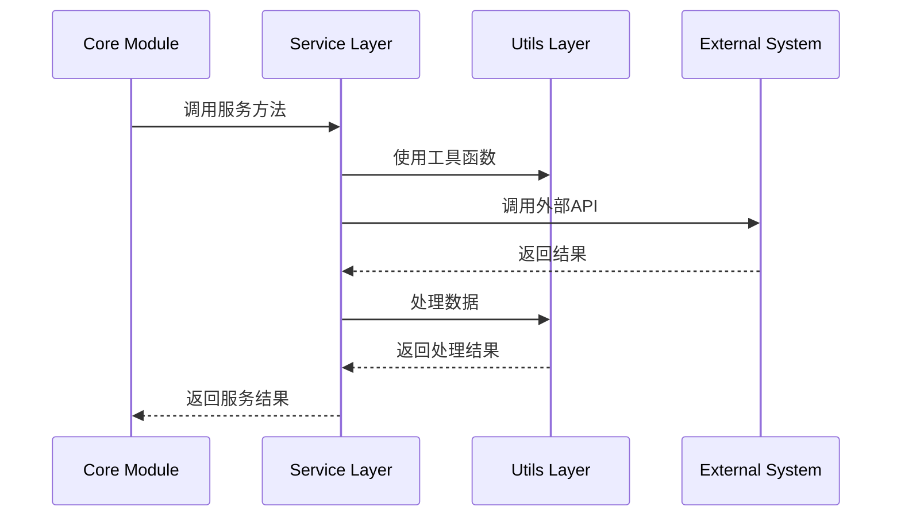
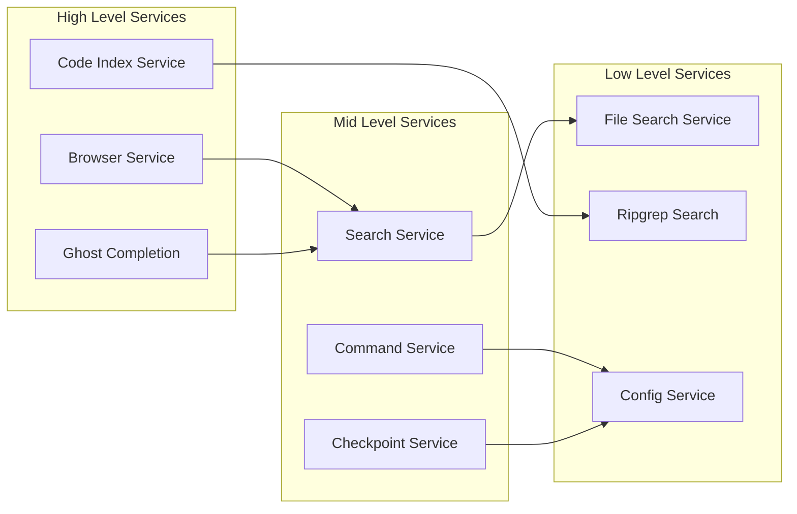

# Services 模块架构文档

## 1. 模块概述

Services 层是 Kilocode 项目的专业服务模块层，位于 `src/services/` 目录下。该层提供各种专业化的服务功能，支持核心业务逻辑的实现，包括浏览器集成、代码索引、搜索服务、配置管理等关键功能。

### 设计原则

- **单一职责**: 每个服务专注于特定的功能领域
- **松耦合**: 服务之间保持低耦合，便于独立开发和测试
- **可扩展**: 支持新服务的添加和现有服务的扩展
- **高内聚**: 相关功能集中在同一服务内

## 2. 服务架构

```mermaid
graph TB
    subgraph "Core Layer"
        CORE[Core Module]
    end

    subgraph "Services Layer"
        subgraph "Development Services"
            BROWSER[Browser Service]
            CODEINDEX[Code Index Service]
            GHOST[Ghost Completion]
            TREESITTER[Tree-sitter Parser]
        end

        subgraph "System Services"
            CHECKPOINT[Checkpoint Service]
            COMMAND[Command Service]
            SEARCH[Search Service]
            RIPGREP[Ripgrep Search]
        end

        subgraph "Integration Services"
            MARKET[Marketplace Service]
            MCP[MCP Protocol Service]
            MDM[MDM Service]
            TERMINAL[Terminal Welcome]
        end

        subgraph "Utility Services"
            COMMIT[Commit Message Service]
            GLOB[File Search Service]
            MOCK[Mocking Service]
            ROOCONFIG[Roo Config Service]
        end
    end

    subgraph "Utils Layer"
        UTILS[Utils Module]
    end

    CORE --> BROWSER
    CORE --> CODEINDEX
    CORE --> GHOST
    CORE --> TREESITTER
    CORE --> CHECKPOINT
    CORE --> COMMAND
    CORE --> SEARCH
    CORE --> RIPGREP
    CORE --> MARKET
    CORE --> MCP
    CORE --> MDM
    CORE --> TERMINAL
    CORE --> COMMIT
    CORE --> GLOB
    CORE --> MOCK
    CORE --> ROOCONFIG

    BROWSER --> UTILS
    CODEINDEX --> UTILS
    SEARCH --> UTILS
    RIPGREP --> UTILS
```

## 3. 服务分类

### 3.1 Development Services (开发服务)

#### Browser Service (浏览器服务)

- **位置**: `src/services/browser/`
- **功能**: 提供浏览器集成功能，支持网页操作和浏览器自动化
- **核心特性**:
    - 网页内容抓取
    - 浏览器自动化操作
    - 网页元素交互

#### Code Index Service (代码索引服务)

- **位置**: `src/services/code-index/`
- **功能**: 构建和维护代码索引，支持快速代码搜索和导航
- **核心特性**:
    - 代码符号索引
    - 快速搜索功能
    - 代码关系分析

#### Ghost Completion (智能补全服务)

- **位置**: `src/services/ghost/`
- **功能**: 提供 AI 驱动的代码补全功能
- **核心特性**:
    - 智能代码建议
    - 上下文感知补全
    - 多语言支持

#### Tree-sitter Parser (语法解析服务)

- **位置**: `src/services/tree-sitter/`
- **功能**: 使用 Tree-sitter 进行代码语法解析
- **核心特性**:
    - 多语言语法解析
    - AST 生成和分析
    - 语法高亮支持

### 3.2 System Services (系统服务)

#### Checkpoint Service (检查点服务)

- **位置**: `src/services/checkpoints/`
- **功能**: 管理代码检查点和版本控制
- **核心特性**:
    - 代码快照管理
    - 版本回滚功能
    - 变更追踪

#### Command Service (命令服务)

- **位置**: `src/services/command/`
- **功能**: 处理系统命令的执行和管理
- **核心特性**:
    - 命令解析和执行
    - 权限控制
    - 结果处理

#### Search Service (搜索服务)

- **位置**: `src/services/search/`
- **功能**: 提供通用搜索功能
- **核心特性**:
    - 全文搜索
    - 模糊匹配
    - 搜索结果排序

#### Ripgrep Search (高性能搜索)

- **位置**: `src/services/ripgrep/`
- **功能**: 基于 ripgrep 的高性能文本搜索
- **核心特性**:
    - 快速文本搜索
    - 正则表达式支持
    - 大文件处理

### 3.3 Integration Services (集成服务)

#### Marketplace Service (市场服务)

- **位置**: `src/services/marketplace/`
- **功能**: 与扩展市场的集成功能
- **核心特性**:
    - 扩展发布
    - 版本管理
    - 用户反馈

#### MCP Protocol Service (MCP 协议服务)

- **位置**: `src/services/mcp/`
- **功能**: 支持 MCP (Model Context Protocol) 协议
- **核心特性**:
    - 协议实现
    - 消息处理
    - 连接管理

#### MDM Service (MDM 服务)

- **位置**: `src/services/mdm/`
- **功能**: 移动设备管理相关功能
- **核心特性**:
    - 设备管理
    - 策略配置
    - 安全控制

#### Terminal Welcome (终端欢迎服务)

- **位置**: `src/services/terminal-welcome/`
- **功能**: 终端欢迎界面和初始化
- **核心特性**:
    - 欢迎信息显示
    - 初始化配置
    - 用户引导

### 3.4 Utility Services (实用服务)

#### Commit Message Service (提交消息服务)

- **位置**: `src/services/commit-message/`
- **功能**: 自动生成 Git 提交消息
- **核心特性**:
    - 智能消息生成
    - 提交规范检查
    - 历史分析

#### File Search Service (文件搜索服务)

- **位置**: `src/services/glob/`
- **功能**: 基于 glob 模式的文件搜索
- **核心特性**:
    - 模式匹配
    - 文件过滤
    - 路径处理

#### Mocking Service (模拟服务)

- **位置**: `src/services/mocking/`
- **功能**: 提供测试模拟功能
- **核心特性**:
    - 数据模拟
    - API 模拟
    - 测试支持

#### Roo Config Service (配置服务)

- **位置**: `src/services/roo-config/`
- **功能**: 专门的配置管理服务
- **核心特性**:
    - 配置文件管理
    - 动态配置更新
    - 配置验证

## 4. 服务交互模式

### 4.1 服务调用流程

### 4.2 服务依赖关系

## 5. 扩展指南

### 5.1 添加新服务

1. **创建服务目录**: 在 `src/services/` 下创建新的服务目录
2. **实现服务接口**: 定义服务的公共接口和实现
3. **添加测试**: 为新服务编写单元测试
4. **更新文档**: 更新相关文档和架构图

### 5.2 服务开发规范

- **命名规范**: 使用描述性的服务名称
- **接口设计**: 定义清晰的服务接口
- **错误处理**: 实现完善的错误处理机制
- **日志记录**: 添加适当的日志记录
- **性能优化**: 考虑服务的性能影响

## 6. 监控和维护

### 6.1 服务监控

- 服务调用频率统计
- 错误率监控
- 性能指标追踪

### 6.2 维护策略

- 定期代码审查
- 性能优化
- 安全更新
- 依赖管理
