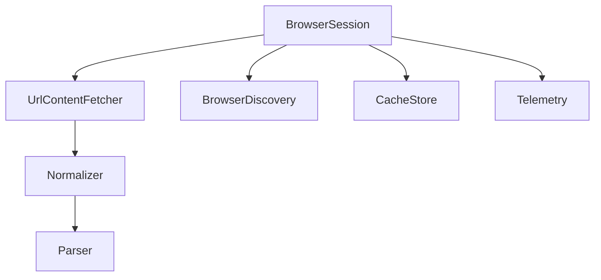
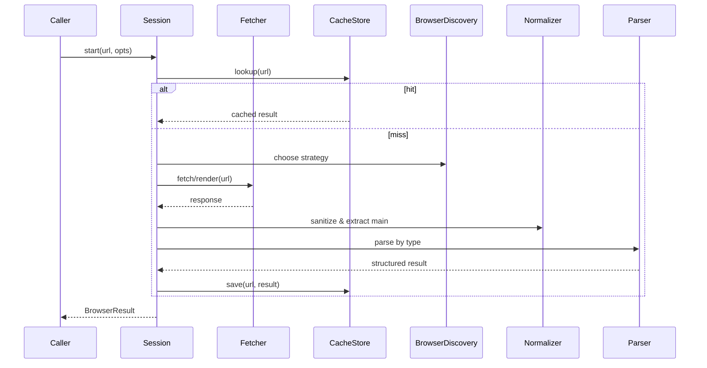

# services/browser — 技术架构（增强版）

## 目标与范围

* 从 URL 抓取可用上下文（正文、代码片段、元信息），为检索、分析与生成提供输入。

* 支持静态页面与常见动态站点的可见 DOM 内容获取；统一解析与规范化输出。

## 非目标

* 不实现完整浏览器交互自动化（点击/表单/脚本执行的复杂流程）。

* 不绕过付费墙、登录态和受限资源；遵守站点 robots 与速率限制。

## 运行环境与依赖

* 优先使用轻量 HTTP 客户端；检测需求时切换到“轻量 Headless”渲染（可插拔）。

* 依赖公共工具：`utils/logging`、`utils/errors`、`shared/modes`；可选缓存后端。

## 组件与职责



## 组件详细设计

### BrowserSession

* 职责：统一入口；维护会话配置、缓存/重试策略、指标上报与错误分类。

* 关键点：

  * 策略组合：缓存优先（命中直接返回），未命中按 `BrowserDiscovery` 决策抓取。

  * 退化链路：Headless 不可用或耗时过长时退化为纯 HTTP 获取并按 `Normalizer` 做最小清洗。

  * 事件钩子：`onStart(url)`、`onFetch(response)`、`onParse(result)`、`onError(err)`。

* 接口示例：

```ts
export interface BrowserOptions {
  timeoutMs?: number
  maxBytes?: number
  userAgent?: string
  headers?: Record<string, string>
  allowHeadless?: boolean
  respectRobots?: boolean
  rateLimit?: { maxConcurrent: number; perHost?: number }
}

export interface BrowserResult {
  url: string
  status: number
  contentType: string
  text?: string
  bytes?: Uint8Array
  title?: string
  excerpt?: string
  codeBlocks?: Array<{ lang?: string; content: string }>
  links?: Array<{ href: string; text?: string }>
  meta?: Record<string, string>
  cache?: { hit: boolean }
}

export interface BrowserSession {
  configure(opts: BrowserOptions): void
  start(url: string, opts?: BrowserOptions): Promise<BrowserResult>
}
```

### BrowserDiscovery

* 输入：`url`、可选 `headers`、历史抓取信息（是否频繁脚本渲染、是否需要登录）。

* 输出：`strategy: 'http' | 'headless' | 'file' | 'data'`。

* 决策要点：

  * 规则表：域名白/黑名单；路径模式（如 `*/docs/*` 偏静态）。

  * 线索特征：首包含大量脚本、CSR 标记（如 `id="__next"`、`data-reactroot`）。

  * 成本控制：页面体积超阈值或渲染耗时过长时回退 HTTP。

* 伪代码：

```ts
function chooseStrategy(url: string, hint?: { allowHeadless?: boolean }): 'http'|'headless'|'file'|'data' {
  if (url.startsWith('data:')) return 'data'
  if (url.startsWith('file:')) return 'file'
  if (!hint?.allowHeadless) return 'http'
  if (isCSRDomain(url) || looksDynamic(url)) return 'headless'
  return 'http'
}
```

### UrlContentFetcher

* HTTP 模式：

  * 支持重定向（最多 N 次）、GZIP/BR 解压、内容长度与读取分块限制、字符编码探测（`charset`/BOM/启发式）。

  * 条件请求：带上 `If-None-Match` 与 `If-Modified-Since`。

* Headless 模式：

  * 轻量渲染：阻止第三方资源加载（广告/跟踪），等待网络空闲或关键选择器稳定。

  * 提取可见 DOM（去除 `display:none`/`visibility:hidden` 元素）。

* 接口示例：

```ts
export interface Fetcher {
  fetch(url: string, opts: BrowserOptions): Promise<{
    finalUrl: string
    status: number
    headers: Record<string, string>
    body: Uint8Array
  }>
  render?(url: string, opts: BrowserOptions): Promise<{
    finalUrl: string
    status: number
    html: string
    headers: Record<string, string>
  }>
}
```

* 流式抓取要点：首包到达立刻增量解析，避免一次性载入超大响应。

### Normalizer

* 目标：清理噪声、提取主体、统一格式。

* 步骤：

  * 删除：`script/style/noscript/iframe` 等；移除跟踪与可视外节点。

  * 主体提取：基于语义标签与密度评分（文本长度/链接比例/节点深度）。

  * 标题与摘要：`title/h1/h2` 优先；首段作为摘要。

  * 代码块：提取 `pre>code` 与具有 `data-lang` 的片段。

* 接口示例：

```ts
export interface Normalizer {
  sanitizeHtml(html: string): string
  extractMain(html: string): { title?: string; excerpt?: string; body: string }
}
```

### Parser

* 按类型分派：

  * HTML：DOM 解析后生成规范化文本，保留标题/段落/代码/链接。

  * Markdown：保留结构，折叠过深标题；提取代码块与元信息。

  * JSON：格式化与摘要（键数量、示例路径、字段类型统计）。

  * Text：分段与空白归一化。

* 接口示例：

```ts
export interface Parser {
  parse(input: { contentType: string; text: string }): BrowserResult
}
```

### CacheStore

* 键：`url + variant(userAgent, accept)`；值：`BrowserResult`；元信息：`etag`、`last-modified`、`ttl`。

* 策略：

  * 条件命中：若存在有效 `etag/last-modified`，优先发起条件请求。

  * 写入：仅当解析完整或达到最低可用阈值（标题+正文摘要）时。

* 接口示例：

```ts
export interface CacheStore {
  get(url: string): Promise<BrowserResult | undefined>
  set(url: string, result: BrowserResult): Promise<void>
}
```

### Telemetry

* 指标：时延（抓取/解析/总计）、响应大小、缓存命中率、错误类别分布、重试次数。

* 事件：`browser.fetch.start/success/error`、`browser.parse.success/error`、`browser.cache.hit/miss`。

* 接口示例：

```ts
export interface Telemetry {
  record(event: string, props?: Record<string, number|string|boolean>): void
}
```

## 关键算法摘要

* 主体密度评分：`score = textLen * w1 - linkRatio * w2 - depth * w3`，选择得分最高的候选块。

* 动态判定：若首屏脚本节点占比>阈值或存在 CSR 容器，则倾向 Headless。

* 流式解析：按分块大小增量拼接并及时触发 `Normalizer.extractMain` 预判。

## 失败与降级示例

* 超时：HTTP 尝试 2 次退避重试；Headless 降级为 HTTP 并提示“动态内容可能不完整”。

* 类型未知：当 `content-type` 缺失时尝试按文本解析并保留原始字节。

* 体积超限：截断文本到 `maxBytes` 并返回部分结果与警告。

## 支持协议与类型

* 协议：`http`、`https`；文件：`data:`/`file:` 仅在受控模式启用。

* 类型：`text/html`、`text/markdown`、`text/plain`、`application/json`、常见代码片段。

## 核心流程



## 解析与规范化

* 主体提取：优先基于可见 DOM/语义标签（`main/article/h1/h2`）与密度评分。

* 清洗：移除脚本/样式/跟踪节点，压缩空白，统一编码与换行。

* 片段：保留标题、摘要、正文段落、代码块、链接与元信息（语言/charset）。

## 配置项

* `timeoutMs`、`maxBytes`、`maxDomNodes`、`userAgent`、`headers`、`allowHeadless`、`respectRobots`、`rateLimit`。

## 错误处理与降级

* NetworkError（超时/连接/解析）：重试退避；超过阈值返回精简错误与部分缓存。

* UnsupportedType：返回原始字节/文本与提示；允许上层选择继续处理。

* ParseError：降级为纯文本提取；保留原响应以便审计。

## 性能优化

* 连接复用与有限并发；首包到达即流式解析；分块限速避免内存尖峰。

* 缓存优先与条件请求；对大型 DOM 使用节点截断与延迟解析。

## 安全与合规

* 禁止执行任意脚本与外部资源加载；严格来源策略与内容大小上限。

* 记录并尊重 `robots.txt`/`noindex`；遵守组织允许域名单。

## 集成点

* 与 `services/search` 联动：解析后的正文作为检索索引源。

* 与 `services/tree-sitter`：对代码块做语言识别与结构抽取。

* 与 `utils/git`：在提交信息生成时引用抓取的上下文摘要。

## 测试矩阵

* 响应：200/3xx/4xx/5xx、GZIP/BR、不同编码（UTF-8/GBK/Shift-JIS）。

* 内容：长文/短文、含大量脚本样式、代码密集页、JSON/Markdown。

* 行为：缓存命中/条件请求、超时与重试、尊重 robots、限流与并发控制。

