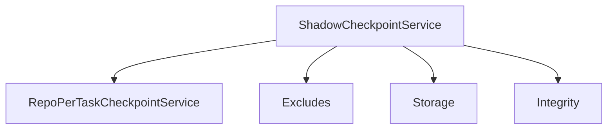
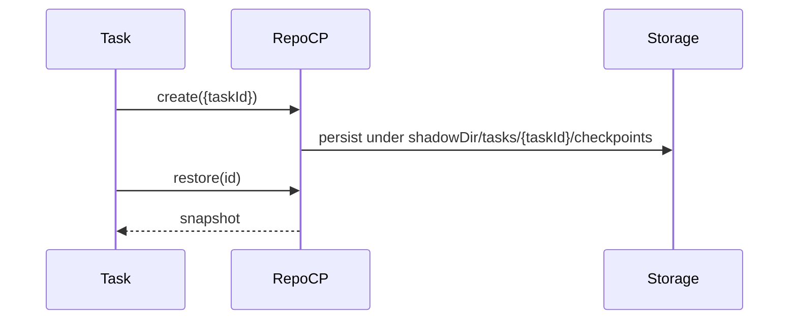

# services/checkpoints — 技术架构与设计

## 目标
- 提供任务/仓库级检查点：影子目录快照、恢复与比较。

## 组件架构


## 数据模型
- Checkpoint: { id, ts, snapshotPath, integrity }
- Options: { taskId, workspaceDir, shadowDir }

## 公共 API
```ts
interface ShadowCheckpointService {
  create(snapshot: unknown): Promise<string> // returns checkpoint id
  restore(id: string): Promise<unknown>
  list(): Promise<string[]>
}
```

## 典型流程


## 错误分类
- IntegrityError: 校验失败
- StorageError: 读写异常

## 测试
- 创建/恢复路径；排除规则；跨任务隔离；完整性校验。