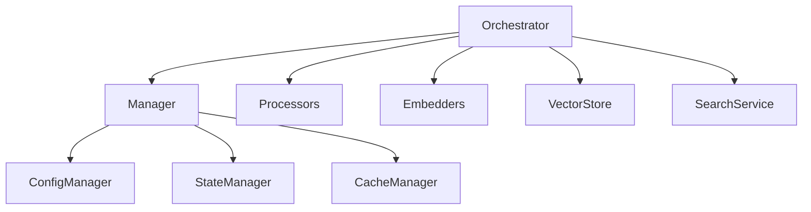
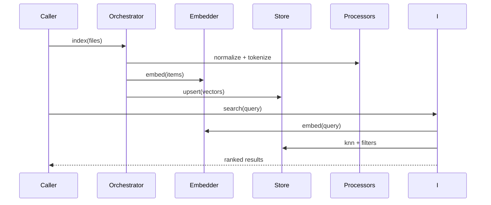

# services/code-index — 技术架构与设计

## 目标
- 建立代码索引（嵌入向量 + 元数据），支持语义与符号搜索。

## 组件架构


## 数据模型
- IndexItem: { path, content, language, embedding[], metadata }
- Config: { provider, dimensions, minScore, maxResults }

## 公共 API
```ts
interface CodeIndexSearchService {
  search(query: string, opts?: { maxResults?: number }): Promise<SearchResult[]>
}
```

## 典型流程


## 错误分类
- EmbedError: 向量化失败
- StoreError: 存储/查询异常
- ConfigError: 配置缺失或非法

## 性能
- 批量嵌入；向量压缩；缓存命中；并发限流；

## 测试
- 维度与阈值配置；搜索排序；增量更新；异常降级。