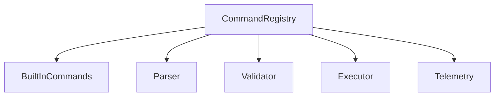
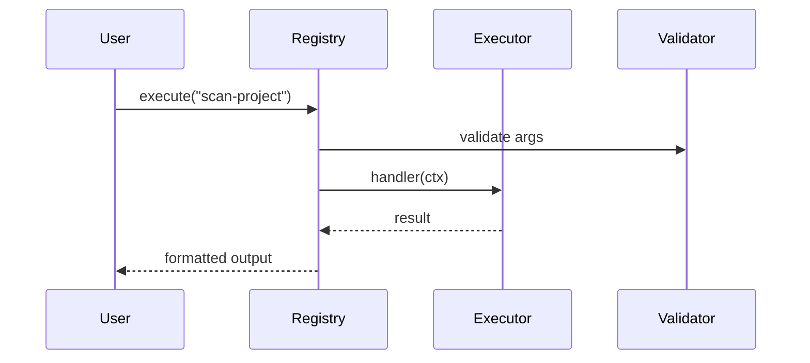

# services/command — 技术架构与设计

## 目标
- 管理内置命令注册与执行，从项目结构提炼关键命令与模式。

## 组件架构


## 数据模型
- Command: { id, description, argsSchema, handler }
- ExecutionContext: { workspace, env, config }

## 公共 API
```ts
interface CommandRegistry {
  register(cmd: Command): void
  execute(id: string, args: unknown, ctx?: ExecutionContext): Promise<unknown>
}
```

## 流程


## 错误分类
- ValidationError: 参数非法
- ExecutionError: 执行失败

## 测试
- 多命令注册与覆盖；参数解析边界；结果格式化；异常路径。