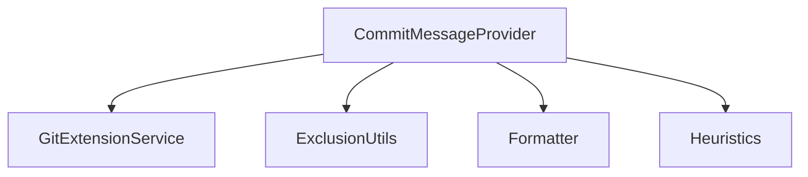
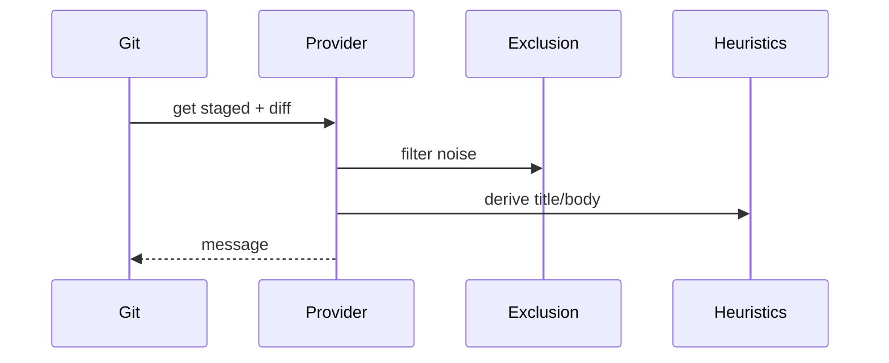

# services/commit-message — 技术架构与设计

## 目标
- 生成高质量的提交信息，结合 Git 扩展与排除策略。

## 组件架构


## 数据模型
- CommitInput: { stagedFiles[], diffSummary, context }
- CommitMessage: { title, body, footers }

## 公共 API
```ts
interface CommitMessageProvider {
  build(input: CommitInput): Promise<CommitMessage>
}
```

## 流程


## 错误分类
- GitError: 扩展不可用或查询失败
- FormatError: 消息生成失败

## 测试
- 多文件/多类型变更；排除规则；标题/正文质量；异常降级。