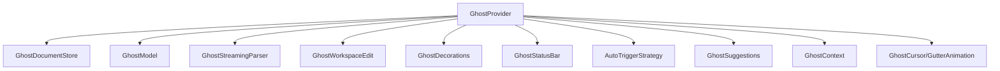
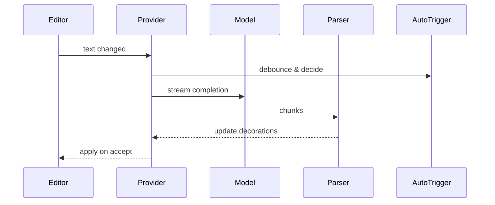

# services/ghost — 技术架构与设计

## 目标
- 提供智能补全（Ghost）能力：文档存储、流式解析、UI 装饰与状态栏集成。

## 组件架构


## 关键协作
- Provider 作为协调器，管理请求生命周期与取消；
- Model 通过 `ApiHandler` 与 ProviderSettings 选择合适模型；
- StreamingParser 增量解析，驱动 UI 流式呈现；
- WorkspaceEdit 应用接受的补全；Decorations 负责样式与光标动画；

## 数据模型
- Suggestion: { range, text, confidence, cost }
- GhostState: { enabled, isProcessing, lastChangeTs }

## 公共 API
```ts
class GhostProvider {
  static create(): Promise<GhostProvider>
  requestSuggestions(editor: vscode.TextEditor, ctx: GhostSuggestionContext): Promise<void>
  acceptSuggestion(): Promise<void>
  cancel(): void
}
```

## 流程


## 环境与配置
- 结合 `ContextProxy`、`ProviderSettingsManager` 选择模型与参数；
- `RooIgnoreController` 提供文件过滤；

## 错误分类
- RequestCanceled: 用户取消或编辑器切换
- ProviderError: 模型或 API 调用失败
- ParseError: 流解析异常

## 测试
- 自动触发策略、取消路径、装饰更新、接受编辑生效；成本统计与状态栏更新。