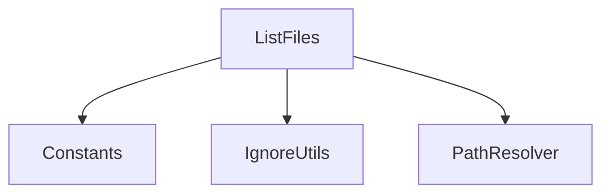
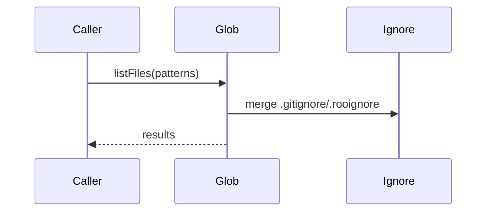

# services/glob — 技术架构与设计

## 目标
- 基于模式匹配列出文件，结合忽略规则与性能优化。

## 组件架构


## 数据模型
- GlobQuery: { patterns[], cwd, followSymlinks?, includeHidden? }
- Result: { path, size?, mtime? }

## 公共 API
```ts
interface GlobService {
  listFiles(query: GlobQuery): Promise<Result[]>
}
```

## 流程


## 错误分类
- PatternError: 模式非法
- FSAccessError: 文件系统权限问题

## 性能
- 大目录分层扫描；忽略规则预编译；结果分页；

## 测试
- 多模式组合；忽略边界；符号链接；性能基准。