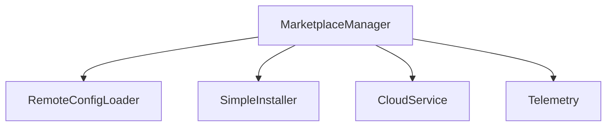
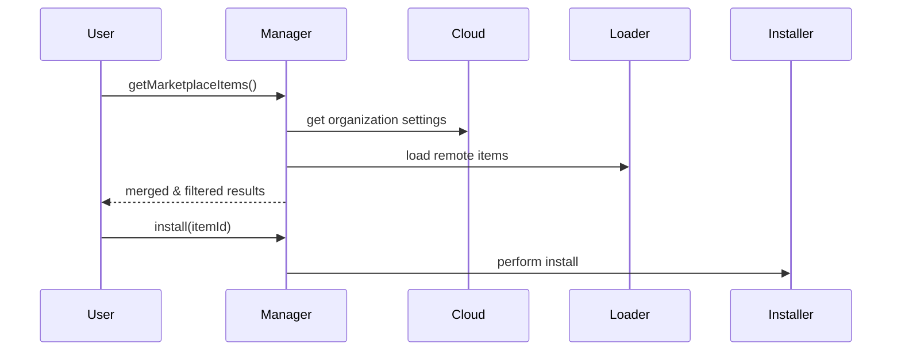

# services/marketplace — 技术架构与设计

## 目标
- 统一拉取与安装 Marketplace 项目（尤其 MCP），融合组织设置与远程配置。

## 组件架构


## 数据模型
- MarketplaceItem: { id, name, type, url, content }
- OrganizationSettings: { mcps[], hiddenMcps[], allowList, defaultSettings }

## 公共 API
```ts
interface MarketplaceManager {
  getMarketplaceItems(): Promise<{marketplaceItems: MarketplaceItem[], organizationMcps: MarketplaceItem[], errors?: string[]}>
  install(itemId: string): Promise<void>
}
```

## 流程


## 错误分类
- CloudError: 云服务不可用或未认证
- LoaderError: 远程配置拉取失败
- InstallError: 安装失败

## 测试
- 组织 MCP 合并与隐藏项过滤；安装流程；错误路径与提示。