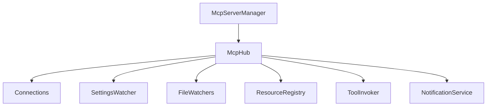
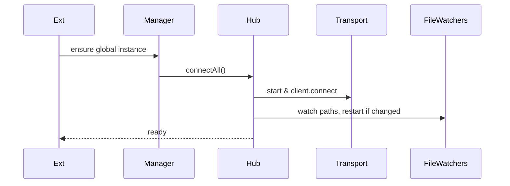

# services/mcp — 技术架构与设计

## 目标
- 连接并管理 MCP 服务器（stdio / sse / streamable-http），暴露资源与工具调用。

## 组件架构


## 数据模型
- McpServer: { name, type, config, status }
- McpConnection: connected | disconnected { client, transport }
- Settings: { mcpServers: Record<string,ServerConfig> }

## 公共 API
```ts
class McpHub {
  connectAll(): Promise<void>
  disconnectAll(): Promise<void>
  callTool(server: string, tool: string, args: unknown): Promise<unknown>
  listResources(server: string): Promise<McpResource[]>
}
```

## 流程


## 配置与校验
- 使用 `zod` 进行服务器配置 schema 校验；
- `alwaysAllow`/`disabledTools` 控制权限与禁用集；

## 错误分类
- TransportError: 传输层失败
- ConnectionError: 连接/重连异常
- ToolError: 工具调用失败

## 测试
- 三种传输类型覆盖；禁用原因追踪；配置变更重启；资源/工具列表交互。