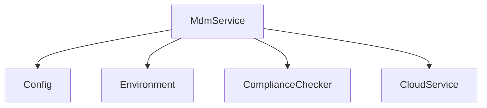
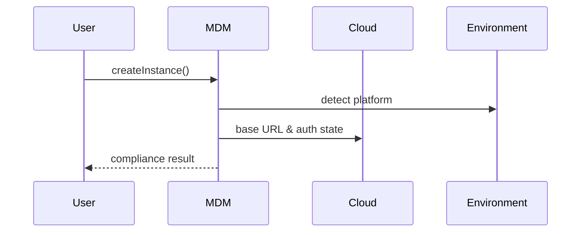

# services/mdm — 技术架构与设计

## 目标
- 设备/组织管理（MDM）相关校验与合规：根据配置与环境判定是否需要云认证。

## 组件架构


## 数据模型
- MdmConfig: { requireCloudAuth: boolean, organizationId?: string }
- ComplianceResult: { compliant: true } | { compliant: false, reason }

## 公共 API
```ts
class MdmService {
  static createInstance(): Promise<MdmService>
  static resetInstance(): void
  loadConfig(): Promise<MdmConfig>
  checkCompliance(): Promise<ComplianceResult>
}
```

## 流程


## 错误分类
- ConfigError: 配置读取/校验失败
- CloudError: 云服务不可用

## 测试
- 不同平台与配置组合；云认证状态影响；合规原因输出；单例复位。