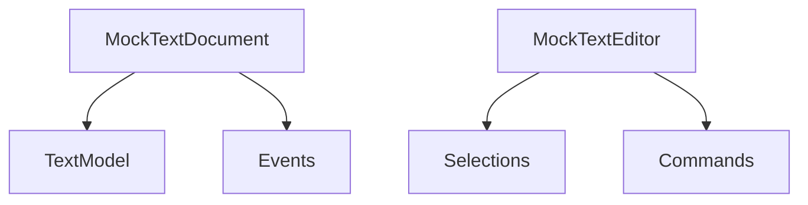
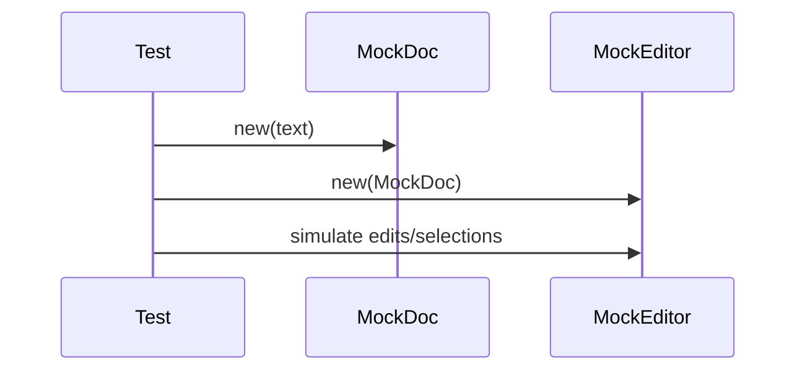

# services/mocking — 技术架构与设计

## 目标
- 为测试提供 VSCode 文档与编辑器的模拟对象，隔离外部依赖。

## 组件架构


## 数据模型
- MockTextDocument: { uri, languageId, version, text }
- MockTextEditor: { document, selections[], options }

## 公共 API
```ts
class MockTextDocument { constructor(text: string, languageId?: string) }
class MockTextEditor { constructor(doc: MockTextDocument) }
```

## 流程


## 错误分类
- InvalidOperation: 非法编辑操作

## 测试
- 多语言文本；选择/编辑行为；事件触发；与真实扩展交互替代。