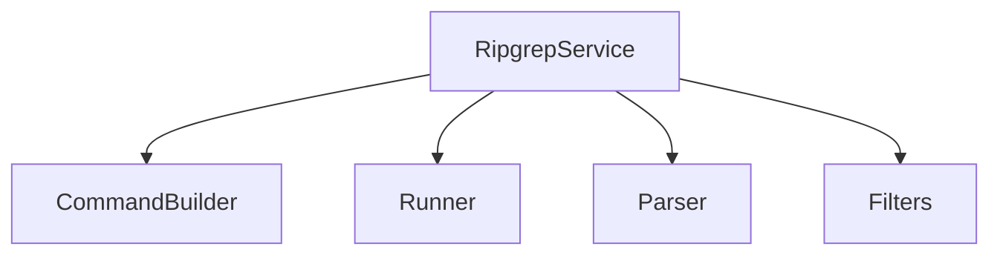
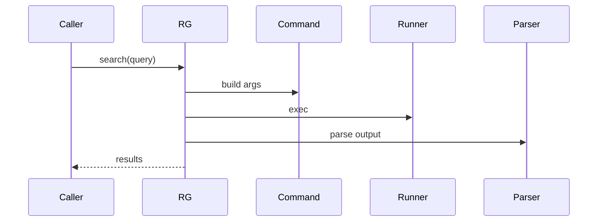

# services/ripgrep — 技术架构与设计

## 目标
- 封装 ripgrep 的快速文本搜索能力，提供可编程接口与结果格式化。

## 组件架构


## 数据模型
- SearchQuery: { pattern, cwd, includes[], excludes[], options }
- SearchResult: { file, line, col, preview }

## 公共 API
```ts
interface RipgrepService {
  search(q: SearchQuery): Promise<SearchResult[]>
}
```

## 流程


## 错误分类
- ExecError: 命令执行失败
- ParseError: 输出解析失败

## 测试
- 正则/通配符覆盖；包含/排除规则；大仓库性能；错误输出路径。